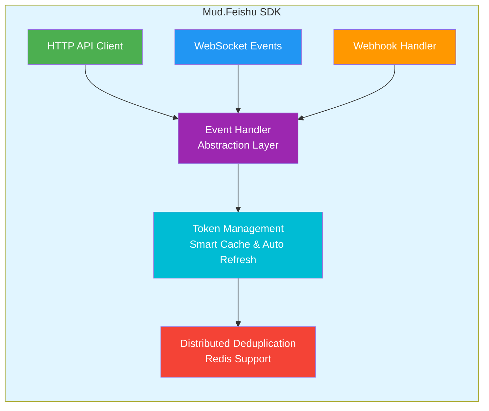

# MudFeishu

<div align="center">


**Modern .NET SDK for Feishu (Lark) API Integration**

Minimal API · Type Safety · Enterprise Features · Event-Driven

[Quick Start](#quick-start) · [Documentation](https://www.mudtools.cn/documents/guides/feishu/) · [Examples](#example-projects) · [Contributing](#contributing-guidelines)

</div>

---

## 📖 Introduction

MudFeishu is a modern enterprise-grade .NET SDK for Feishu (Lark) API integration, providing complete HTTP API calls, WebSocket real-time event subscription, and Webhook event processing capabilities. The SDK is designed using Strategy and Factory patterns with built-in automatic token management, intelligent retry mechanisms, and high-performance caching.

### ✨ Core Features

- **Minimal API** - One-line service registration
- **Type Safety** - Complete strongly-typed data models with compile-time checking
- **Automatic Token Management** - Smart caching and auto-refresh mechanism
- **Enterprise Stability** - Unified exception handling, intelligent retry, high-performance caching
- **Event-Driven Architecture** - WebSocket + Webhook dual-mode support
- **Multi-Framework Support** - .NET Standard 2.0 / .NET 6.0 / .NET 8.0 / .NET 10.0
- **Distributed Support** - Redis distributed deduplication, multi-instance deployment
- **Security Enhancement** - Signature verification, timestamp validation, IP whitelist

---

## 🏗️ Architecture Overview



---

## 📦 Modules

| Module | NuGet Package | Description |
|--------|---------------|-------------|
| **Mud.Feishu.Abstractions** | `Mud.Feishu.Abstractions` | Event processing abstraction layer with unified handler interfaces and data models |
| **Mud.Feishu** | `Mud.Feishu` | HTTP API client core, supporting organization, messaging, approval, tasks, documents, wiki, drive, attendance |
| **Mud.Feishu.WebSocket** | `Mud.Feishu.WebSocket` | Real-time event subscription with auto-reconnect, heartbeat, message queue |
| **Mud.Feishu.Webhook** | `Mud.Feishu.Webhook` | HTTP callback event handling with signature verification, encryption/decryption |
| **Mud.Feishu.Redis** | `Mud.Feishu.Redis` | Distributed deduplication extension for multi-instance deployment |

### Feature Coverage Matrix

```
Module            │ HTTP API │ WebSocket │ Webhook │ Redis Extension
─────────────────┼──────────┼──────────┼─────────┼────────────────
Authentication    │    ✅     │    ✅     │    ✅    │     ✅
Organization      │    ✅     │    ✅     │    ✅    │     ✅
User Management   │    ✅     │    ✅     │    ✅    │     ✅
Department        │    ✅     │    ✅     │    ✅    │     ✅
Messaging         │    ✅     │    ✅     │    ✅    │     ✅
Chat Groups       │    ✅     │    ✅     │    ✅    │     ✅
Approvals         │    ✅     │    ✅     │    ✅    │     ✅
Tasks             │    ✅     │    ✅     │    ✅    │     ✅
Cards             │    ✅     │    ✅     │    ✅    │     ✅
Documents         │    ✅     │    -      │    -     │     -
Wiki              │    ✅     │    -      │    -     │     -
Drive             │    ✅     │    -      │    -     │     -
Attendance        │    ✅     │    -      │    -     │     -
```

---

## 🚀 Quick Start

### Installation

You can install MudFeishu via NuGet:

```bash
dotnet add package Mud.Feishu --version 1.0.2
```

### Configure Dependency Injection (ASP.NET Core)

Register services in `Program.cs`:

#### 🚀 One-click Complete Registration (Recommended for Beginners)

```csharp
using Mud.Feishu;

var builder = WebApplication.CreateBuilder(args);

// Register all Feishu API services with one line of code (Lazy mode)
builder.Services.AddFeishuServices(builder.Configuration);

var app = builder.Build();
```

#### 🔧 Builder Pattern (Recommended for Advanced Users)

```csharp
// Register services flexibly as needed (using configuration file)
builder.Services.CreateFeishuServicesBuilder(builder.Configuration)
    .AddOrganizationApi()                 // Organization structure
    .AddMessageApi()                      // Message service
    .AddChatGroupApi()                    // Group service
    .AddApprovalApi()                     // Approval service
    .AddTaskApi()                         // Task service
    .AddCardApi()                         // Card service
    .Build();

// Register services flexibly as needed (using code configuration)
builder.Services.CreateFeishuServicesBuilder(options =>
{
    options.AppId = "your_app_id";
    options.AppSecret = "your_app_secret";
    options.BaseUrl = "https://open.feishu.cn";
    options.TimeOut = 30;
    options.RetryCount = 3;
})
    .AddOrganizationApi()
    .AddMessageApi()
    .Build();
```

#### ⚡ Quick Single Module Registration

```csharp
// Register only the services you need
builder.Services.CreateFeishuServicesBuilder(builder.Configuration)
    .AddOrganizationApi()                 // Organization structure
    .AddMessageApi()                      // Message service
    .Build();
```

#### 📦 Modular Registration

```csharp
// Register only services you need
builder.Services.AddFeishuServices(builder.Configuration, new[]
{
    FeishuModule.Organization,      // Organization structure
    FeishuModule.Message,          // Message service
    FeishuModule.ChatGroup         // Group service
});
```

### Controller Injection Example

```csharp
using Microsoft.AspNetCore.Mvc;
using Mud.Feishu;

[ApiController]
[Route("api/[controller]")]
public class FeishuController : ControllerBase
{
    private readonly IFeishuTenantV3User _userApi;
    private readonly IFeishuTenantV3Departments _departmentsApi;
    private readonly IFeishuTenantV3UserGroup _userGroupApi;
    private readonly IFeishuTenantV3EmployeeType _employeeTypeApi;
    private readonly IFeishuTenantV3JobLevel _jobLevelApi;
    private readonly IFeishuTenantV3JobFamilies _jobFamiliesApi;
    private readonly IFeishuTenantV1Message _messageApi;

    public FeishuController(
        IFeishuTenantV3User userApi,
        IFeishuTenantV3Departments departmentsApi,
        IFeishuTenantV3UserGroup userGroupApi,
        IFeishuTenantV3EmployeeType employeeTypeApi,
        IFeishuTenantV3JobLevel jobLevelApi,
        IFeishuTenantV3JobFamilies jobFamiliesApi,
        IFeishuTenantV1Message messageApi)
    {
        _userApi = userApi;
        _departmentsApi = departmentsApi;
        _userGroupApi = userGroupApi;
        _employeeTypeApi = employeeTypeApi;
        _jobLevelApi = jobLevelApi;
        _jobFamiliesApi = jobFamiliesApi;
        _messageApi = messageApi;
    }
}
```

## Usage Examples

### 🚀 Quick Start

Mud.Feishu provides two main usage methods:

#### Automatic Token Management (Recommended)

Use interfaces with `[HttpClientApi]` attribute for automatic token management:

```csharp
public class UserController : ControllerBase
{
    private readonly IFeishuTenantV3User _userApi;
    private readonly IFeishuTenantV3Departments _deptApi;

    public UserController(
        IFeishuTenantV3User userApi,
        IFeishuTenantV3Departments deptApi)
    {
        _userApi = userApi;
        _deptApi = deptApi;
    }

    [HttpPost("users")]
    public async Task<IActionResult> CreateUser([FromBody] CreateUserRequest request)
    {
        // Token automatically handled, no need to manually obtain
        var result = await _userApi.CreateUserAsync(request);

        if (result.Code == 0)
        {
            return Ok(new { success = true, userId = result.Data?.User?.UserId });
        }
        return BadRequest(new { error = result.Msg });
    }

    [HttpGet("departments/{departmentId}/users")]
    public async Task<IActionResult> GetDepartmentUsers(string departmentId)
    {
        var result = await _deptApi.GetUserByDepartmentIdAsync(departmentId);
        return Ok(result.Data);
    }
}
```

### 📋 Business Scenario Examples

#### Scenario 1: User Lifecycle Management

```csharp
public class UserManagementService
{
    private readonly IFeishuTenantV3User _userApi;
    private readonly IFeishuTenantV3Departments _deptApi;
    private readonly IFeishuTenantV3UserGroup _groupApi;

    public UserManagementService(
        IFeishuTenantV3User userApi,
        IFeishuTenantV3Departments deptApi,
        IFeishuTenantV3UserGroup groupApi)
    {
        _userApi = userApi;
        _deptApi = deptApi;
        _groupApi = groupApi;
    }

    // Create new employee and add to specified department and user groups
    public async Task<string> OnboardNewEmployeeAsync(CreateUserRequest userRequest, string departmentId, string[] groupIds)
    {
        try
        {
            // 1. Create user
            var userResult = await _userApi.CreateUserAsync(userRequest);
            if (userResult.Code != 0)
                throw new Exception($"Failed to create user: {userResult.Msg}");

            var userId = userResult.Data!.User!.UserId;

            // 2. Get department information for verification
            var deptResult = await _deptApi.GetDepartmentInfoByIdAsync(departmentId);
            if (deptResult.Code != 0)
                throw new Exception($"Department does not exist: {deptResult.Msg}");

            // 3. Add user to user groups
            foreach (var groupId in groupIds)
            {
                var addMemberResult = await _groupApi.AddUserGroupMemberAsync(new AddUserGroupMemberRequest
                {
                    UserGroupId = groupId,
                    UserIds = new[] { userId }
                });
                
                if (addMemberResult.Code != 0)
                {
                    // Log warning but don't interrupt the process
                    Console.WriteLine($"Failed to add to user group {groupId}: {addMemberResult.Msg}");
                }
            }

            return userId;
        }
        catch (FeishuException ex)
        {
            // Log Feishu API error
            throw new Exception($"Feishu API call failed (Error code: {ex.ErrorCode}): {ex.Message}");
        }
    }
}
```

#### Scenario 2: Batch Message Sending

```csharp
public class NotificationService
{
    private readonly IFeishuTenantV1BatchMessage _batchMessageApi;

    public NotificationService(IFeishuTenantV1BatchMessage batchMessageApi)
    {
        _batchMessageApi = batchMessageApi;
    }

    // Send system notification to multiple departments
    public async Task<string> SendSystemNotificationAsync(string[] departmentIds, string title, string content)
    {
        var request = new BatchSenderTextMessageRequest
        {
            DeptIds = departmentIds,
            Content = new TextContent
            {
                Text = $"📢 {title}-{content}"
            }
        };

        var result = await _batchMessageApi.BatchSendTextMessageAsync(request);
        
        if (result.Code == 0)
        {
            var messageId = result.Data!.MessageId;
            Console.WriteLine($"Batch message sent successfully, task ID: {messageId}");
            
            // Can asynchronously query sending progress
            _ = Task.Run(async () => await MonitorProgressAsync(messageId));
            
            return messageId;
        }
        
        throw new Exception($"Failed to send: {result.Msg}");
    }

    private async Task MonitorProgressAsync(string messageId)
    {
        var delay = TimeSpan.FromSeconds(5);
        var maxAttempts = 20; // Maximum wait 100 seconds
        
        for (int i = 0; i < maxAttempts; i++)
        {
            var progress = await _batchMessageApi.GetBatchMessageProgressAsync(messageId);
            
            if (progress.Code == 0)
            {
                var progressData = progress.Data!;
                Console.WriteLine($"Sending progress: {progressData.SentCount}/{progressData.TotalCount}");
                
                if (progressData.IsFinished)
                {
                    Console.WriteLine($"Sending completed! Success: {progressData.SentCount}, Failed: {progressData.FailedCount}");
                    break;
                }
            }
            
            await Task.Delay(delay);
        }
    }
}
```

#### Scenario 3: Organization Structure Synchronization

```csharp
public class OrganizationSyncService
{
    private readonly IFeishuTenantV3Departments _deptApi;
    private readonly IFeishuTenantV3User _userApi;

    public OrganizationSyncService(
        IFeishuTenantV3Departments deptApi,
        IFeishuTenantV3User userApi)
    {
        _deptApi = deptApi;
        _userApi = userApi;
    }

    // Synchronize organization structure data to local system
    public async Task SyncOrganizationAsync()
    {
        try
        {
            // 1. Get root department
            var rootDeptResult = await _deptApi.GetDepartmentsByParentIdAsync("0");
            if (rootDeptResult.Code != 0)
                throw new Exception($"Failed to get root department: {rootDeptResult.Msg}");

            var allDepartments = new List<DepartmentInfo>();
            var allUsers = new List<UserInfo>();

            // 2. Recursively get all departments
            foreach (var rootDept in rootDeptResult.Data!.Items!)
            {
                await LoadDepartmentTreeAsync(rootDept.DepartmentId!, allDepartments);
            }

            // 3. Get all users
            foreach (var dept in allDepartments)
            {
                var usersResult = await _userApi.GetUserByDepartmentIdAsync(dept.DepartmentId!);
                if (usersResult.Code == 0 && usersResult.Data?.Items != null)
                {
                    allUsers.AddRange(usersResult.Data.Items);
                }
            }

            Console.WriteLine($"Synchronization completed: {allDepartments.Count} departments, {allUsers.Count} users");
            
            // TODO: Save to database
        }
        catch (Exception ex)
        {
            Console.WriteLine($"Organization structure synchronization failed: {ex.Message}");
            throw;
        }
    }

    private async Task LoadDepartmentTreeAsync(string departmentId, List<DepartmentInfo> departments)
    {
        var result = await _deptApi.GetDepartmentsByParentIdAsync(departmentId, fetch_child: true);
        
        if (result.Code == 0 && result.Data?.Items != null)
        {
            foreach (var dept in result.Data.Items)
            {
                departments.Add(dept);
                await LoadDepartmentTreeAsync(dept.DepartmentId!, departments);
            }
        }
    }
}
```

## 🎯 Quick Reference for Common Operations

### 📧 Message Notifications

```csharp
// Send text message
var textContent = new MessageTextContent { Text = "Hello World!" };
await messageApi.SendMessageAsync(new SendMessageRequest
{
    ReceiveId = "user_123",
    MsgType = "text",
    Content = JsonSerializer.Serialize(textContent)
}, receive_id_type: "user_id");

// Send batch notifications
var batchContent = new MessageTextContent { Text = "System notification: Important update released" };
await batchMessageApi.BatchSendTextMessageAsync(new BatchSenderTextMessageRequest
{
    DeptIds = new[] { "dept_1", "dept_2" },
    Content = batchContent
});
```

### 👤 User Management

```csharp
// Create user
var userResult = await userApi.CreateUserAsync(new CreateUserRequest
{
    Name = "Zhang San",
    Mobile = "13800138000",
    DepartmentIds = new[] { "dept_1" },
    Emails = new[] { new EmailValue { Email = "zhangsan@company.com" } }
});

// Batch get user information
var users = await userApi.GetUserByIdsAsync(new[] { "user_1", "user_2", "user_3" });
```

### 🏢 Organization Structure

```csharp
// Get department tree
var departments = await deptApi.GetDepartmentsByParentIdAsync("0", fetch_child: true);

// Get users under department
var users = await deptApi.GetUserByDepartmentIdAsync("dept_123");

// Create sub-department
var newDept = await deptApi.CreateDepartmentAsync(new DepartmentCreateRequest
{
    Name = "New Department",
    ParentDepartmentId = "parent_dept_123"
});
```

### 🛠️ Token Management

```csharp
// Get valid token directly (automatically handles refresh)
var token = await tokenManager.GetTokenAsync();

// Monitor token cache status
var (total, expired) = tokenManager.GetCacheStatistics();
logger.LogInformation("Token cache status: Total {Total}, Expired {Expired}", total, expired);

// Clean expired tokens
tokenManager.CleanExpiredTokens();
```

### 🔧 Complete Configuration Example

#### appsettings.json

```json
{
  "Logging": {
    "LogLevel": {
      "Default": "Information",
      "Microsoft.AspNetCore": "Warning",
      "Mud.Feishu": "Debug"
    }
  },
  "AllowedHosts": "*",
  "Feishu": {
    "AppId": "your_feishu_app_id",
    "AppSecret": "your_feishu_app_secret",
    "BaseUrl": "https://open.feishu.cn",
    "TimeOut": 30,
    "RetryCount": 3,
    "EnableLogging": true
  }
}
```

#### Program.cs Complete Configuration

```csharp
using Mud.Feishu;

var builder = WebApplication.CreateBuilder(args);

// Choose registration method
builder.Services.AddFeishuServices(builder.Configuration);

var app = builder.Build();

app.UseSwagger();
app.UseSwaggerUI();
app.MapControllers();
app.Run();
```

## ⚙️ Configuration Options

### FeishuAppConfig Configuration Items

| Option | Type | Default | Description |
|--------|------|---------|-------------|
| `AppKey` | string | - | Application unique identifier (required), used to reference this app in code |
| `AppId` | string | - | Feishu application unique identifier (required) |
| `AppSecret` | string | - | Feishu application secret (required) |
| `BaseUrl` | string | "https://open.feishu.cn" | Feishu API base URL |
| `TimeOut` | int | 30 | HTTP request timeout (seconds), range: 1-300 |
| `RetryCount` | int | 3 | Retry count on failure, range: 0-10 |
| `RetryDelayMs` | int | 1000 | Retry delay (milliseconds), range: 100-60000 |
| `TokenRefreshThreshold` | int | 300 | Token refresh threshold (seconds), range: 60-3600 |
| `EnableLogging` | bool | true | Enable logging |
| `IsDefault` | bool | false | Whether it's the default app (supports auto-inference) |

### Configuration Validation

`FeishuAppConfig` provides a `Validate()` method for validating configuration items:

- `TimeOut` must be between 1-300 seconds
- `RetryCount` must be between 0-10 times
- `RetryDelayMs` must be between 100-60000 milliseconds
- `TokenRefreshThreshold` must be between 60-3600 seconds
- `BaseUrl` must be a valid HTTP/HTTPS URL format
- `AppId` must start with `cli_` or `app_` and be at least 20 characters
- `AppSecret` must be at least 16 characters

### Security Recommendations

- `AppId` and `AppSecret` are the credentials for your Feishu application, please keep them safe
- Recommend using environment variables or secure configuration management systems to store sensitive information
- Do not hardcode sensitive information in your code
- In production environments, recommend using HTTPS protocol to ensure communication security

## 🔄 Error Handling Best Practices

### Unified Error Handling

```csharp
public class FeishuServiceBase
{
    protected async Task<T> ExecuteWithErrorHandling<T>(Func<Task<T>> operation, string operationName)
    {
        try
        {
            var result = await operation();
            
            if (result.Code != 0)
            {
                throw new FeishuServiceException(
                    $"Feishu API call failed: {operationName}",
                    result.Code,
                    result.Msg);
            }
            
            return result.Data!;
        }
        catch (FeishuException ex)
        {
            // Feishu API error
            logger.LogError(ex, "Feishu API error (code: {ErrorCode}): {Message}", ex.ErrorCode, ex.Message);
            throw;
        }
        catch (HttpRequestException ex)
        {
            // Network error
            logger.LogError(ex, "Network request failed: {Message}", ex.Message);
            throw new FeishuServiceException($"Network connection failed: {operationName}", -1, ex.Message);
        }
    }
}

// Usage example
public async Task<UserInfo> GetUserSafelyAsync(string userId)
{
    return await ExecuteWithErrorHandling(
        () => userApi.GetUserInfoByIdAsync(userId),
        "Get user information");
}
```

### Pagination Handling

```csharp
public async Task<List<T>> GetAllItemsAsync<T>(Func<string?, Task<FeishuApiPageListResult<T>>> pageFetcher)
{
    var allItems = new List<T>();
    string? pageToken = null;
    const int pageSize = 50;

    do
    {
        var result = await pageFetcher(pageToken);
        
        if (result.Code == 0 && result.Data?.Items != null)
        {
            allItems.AddRange(result.Data.Items);
            pageToken = result.Data.PageToken;
        }
        else
        {
            break;
        }
        
    } while (!string.IsNullOrEmpty(pageToken));

    return allItems;
}

// Usage example
var allUsers = await GetAllItemsAsync(pageToken => 
    userApi.GetUserByDepartmentIdAsync("dept_123", page_size: 50, page_token: pageToken));
```

---

## 📋 API Module Details

### 📄 Document Management (Docx)

Feishu document API interfaces supporting document creation, editing, block operations, etc.

| Interface | Version | Description |
|-----------|---------|-------------|
| `IFeishuV1Docx` | V1 | Document basic operations |
| `IFeishuV1DocxBlocks` | V1 | Document block operations |
| `IFeishuV1Docx_Tenant` | V1 | Tenant-level document operations |
| `IFeishuV1Docx_User` | V1 | User-level document operations |

### 📚 Wiki

Knowledge space and node management API interfaces.

| Interface | Version | Description |
|-----------|---------|-------------|
| `IFeishuV2Wiki` | V2 | Knowledge space management |
| `IFeishuV2WikiNodes` | V2 | Knowledge node management |
| `IFeishuV2Wiki_Tenant` | V2 | Tenant-level wiki operations |
| `IFeishuV2Wiki_User` | V2 | User-level wiki operations |

### ☁️ Drive Management

Cloud storage file and folder management API interfaces.

| Interface | Version | Description |
|-----------|---------|-------------|
| `IFeishuV1DriveFiles` | V1 | File operations |
| `IFeishuV1DriveFolder` | V1 | Folder operations |
| `IFeishuV1DriveFilesVersions` | V1 | File version management |
| `IFeishuV1DriveMedia` | V1 | Media file operations |

### ⏰ Attendance Management

Complete enterprise attendance management API interfaces.

| Interface | Version | Description |
|-----------|---------|-------------|
| `IFeishuV1AttendanceGroups` | V1 | Attendance group management |
| `IFeishuV1AttendanceUserFlows` | V1 | Check-in records |
| `IFeishuV1AttendanceStats` | V1 | Attendance statistics |
| `IFeishuV1AttendanceShifts` | V1 | Shift management |
| `IFeishuV1AttendanceLeave` | V1 | Leave management |
| `IFeishuV1AttendanceRemedys` | V1 | Remediation management |
| `IFeishuV1AttendanceArchives` | V1 | Archive reports |
| `IFeishuV1AttendanceApprovals` | V1 | Approval management |

### 📋 Approval Workflow

Complete enterprise approval workflow API interfaces.

| Interface | Version | Description |
|-----------|---------|-------------|
| `IFeishuV4Approval` | V4 | Approval definitions and instances |
| `IFeishuV4ApprovalTask` | V4 | Approval task management |
| `IFeishuV4ApprovalComments` | V4 | Approval comments |
| `IFeishuV4ApprovalQuery` | V4 | Approval queries |
| `IFeishuV4ApprovalExternal` | V4 | Third-party approvals |
| `IFeishuV1ApprovalMessage` | V1 | Approval messages |

### 📝 Task Management

Complete Feishu task API interfaces.

| Interface | Version | Description |
|-----------|---------|-------------|
| `IFeishuV2Task` | V2 | Task management |
| `IFeishuV2TaskList` | V2 | Task lists |
| `IFeishuV2TaskSections` | V2 | Task sections |
| `IFeishuV2TaskComments` | V2 | Task comments |
| `IFeishuV2TaskAttachments` | V2 | Task attachments |
| `IFeishuV2TaskCustomFields` | V2 | Custom fields |
| `IFeishuV2TaskActivitySubscriptions` | V2 | Activity subscriptions |

### 👥 Organization

Complete organization management API interfaces.

| Interface | Version | Description |
|-----------|---------|-------------|
| `IFeishuTenantV3User` | V3 | User management |
| `IFeishuTenantV3Departments` | V3 | Department management |
| `IFeishuTenantV3UserGroup` | V3 | User group management |
| `IFeishuTenantV3JobLevel` | V3 | Job level management |
| `IFeishuTenantV3JobFamilies` | V3 | Job family management |
| `IFeishuTenantV3EmployeeType` | V3 | Employee type |
| `IFeishuTenantV3Role` | V3 | Role management |

---

## 📁 Example Projects

### Mud.Feishu.Test

Complete HTTP API functional testing with demo code for all modules:

- **Organization**: Users, departments, employees, user groups, positions, job levels
- **Messaging**: Message sending, batch messages
- **Chat Groups**: Groups, members, menus, session tabs
- **Approvals**: Approval instances, tasks, comments
- **Tasks**: Tasks, task lists, comments, custom fields
- **Cards**: Card management, elements, message stream cards
- **Documents**: Feishu docs, block operations, content conversion
- **Wiki**: Knowledge space management, node operations, document moves
- **Drive**: File upload/download, folder management, version control
- **Attendance**: Attendance groups, check-in records, leave approvals, statistics

### FeishuWikiManager

Feishu Wiki Management Demo (Vue3 + .NET), demonstrating:

- Feishu OAuth 2.0 login integration
- Knowledge space browsing and management
- Document search and favorites
- User information and permission management

---

## ⚙️ Configuration Options

### FeishuAppConfig Configuration Items

| Option | Type | Default | Description |
|--------|------|---------|-------------|
| `AppKey` | string | - | Application unique identifier (required), used to reference this app in code |
| `AppId` | string | - | Feishu application unique identifier (required) |
| `AppSecret` | string | - | Feishu application secret (required) |
| `BaseUrl` | string | "https://open.feishu.cn" | Feishu API base URL |
| `TimeOut` | int | 30 | HTTP request timeout (seconds), range: 1-300 |
| `RetryCount` | int | 3 | Retry count on failure, range: 0-10 |
| `RetryDelayMs` | int | 1000 | Retry delay (milliseconds), range: 100-60000 |
| `TokenRefreshThreshold` | int | 300 | Token refresh threshold (seconds), range: 60-3600 |
| `EnableLogging` | bool | true | Enable logging |
| `IsDefault` | bool | false | Whether it's the default app (supports auto-inference) |

### Configuration Validation

`FeishuAppConfig` provides a `Validate()` method for validating configuration items:

- `TimeOut` must be between 1-300 seconds
- `RetryCount` must be between 0-10 times
- `RetryDelayMs` must be between 100-60000 milliseconds
- `TokenRefreshThreshold` must be between 60-3600 seconds
- `BaseUrl` must be a valid HTTP/HTTPS URL format
- `AppId` must start with `cli_` or `app_` and be at least 20 characters
- `AppSecret` must be at least 16 characters

### Security Recommendations

- `AppId` and `AppSecret` are the credentials for your Feishu application, please keep them safe
- Recommend using environment variables or secure configuration management systems to store sensitive information
- Do not hardcode sensitive information in your code
- In production environments, recommend using HTTPS protocol to ensure communication security
- Production environment must enable signature verification and timestamp validation

---

## 📚 Supported .NET Versions

| .NET Version | Status | Description |
|--------------|--------|-------------|
| .NET Standard 2.0 | ✅ | Compatibility version |
| .NET 6.0 | ✅ LTS | Long-term support version |
| .NET 7.0 | ✅ | Stable version |
| .NET 8.0 | ✅ LTS | Long-term support version |
| .NET 9.0 | ✅ | Stable version |
| .NET 10.0 | ✅ LTS | Long-term support version |

---

## 🤝 Contributing Guidelines

1. **Fork the project** and create a feature branch
2. **Write code** and add corresponding unit tests
3. **Ensure code quality**: Follow project coding standards, code coverage not less than 80%
4. **Submit Pull Request**: Describe changes and test results in detail

### Code Standards

- Use C# 13.0 language features
- Follow Microsoft coding standards
- All public APIs must include XML documentation comments
- Async method naming should end with `Async`
- All interfaces must specify Feishu API original documentation URL

### Testing Requirements

- New features must add demo code in the `Mud.Feishu.Test` project
- Ensure Controller examples work properly
- Add corresponding Swagger documentation comments

## License

MudFeishu follows the [MIT License](LICENSE).

## Related Links

- [Project Gitee Homepage](https://gitee.com/mudtools/MudFeishu)
- [Project GitHub Homepage](https://github.com/mudtools/MudFeishu)
- [NuGet Package](https://www.nuget.org/packages/Mud.Feishu/)
- [Documentation Site](https://www.mudtools.cn/documents/guides/feishu/)
- [Feishu Open Platform](https://open.feishu.cn/document/)
- [Issue Tracker](https://gitee.com/mudtools/MudFeishu/issues)

---

<div align="center">

**Made with ❤️ by MudTools**

If you find this project helpful, please give us a ⭐️ Star!

</div>
