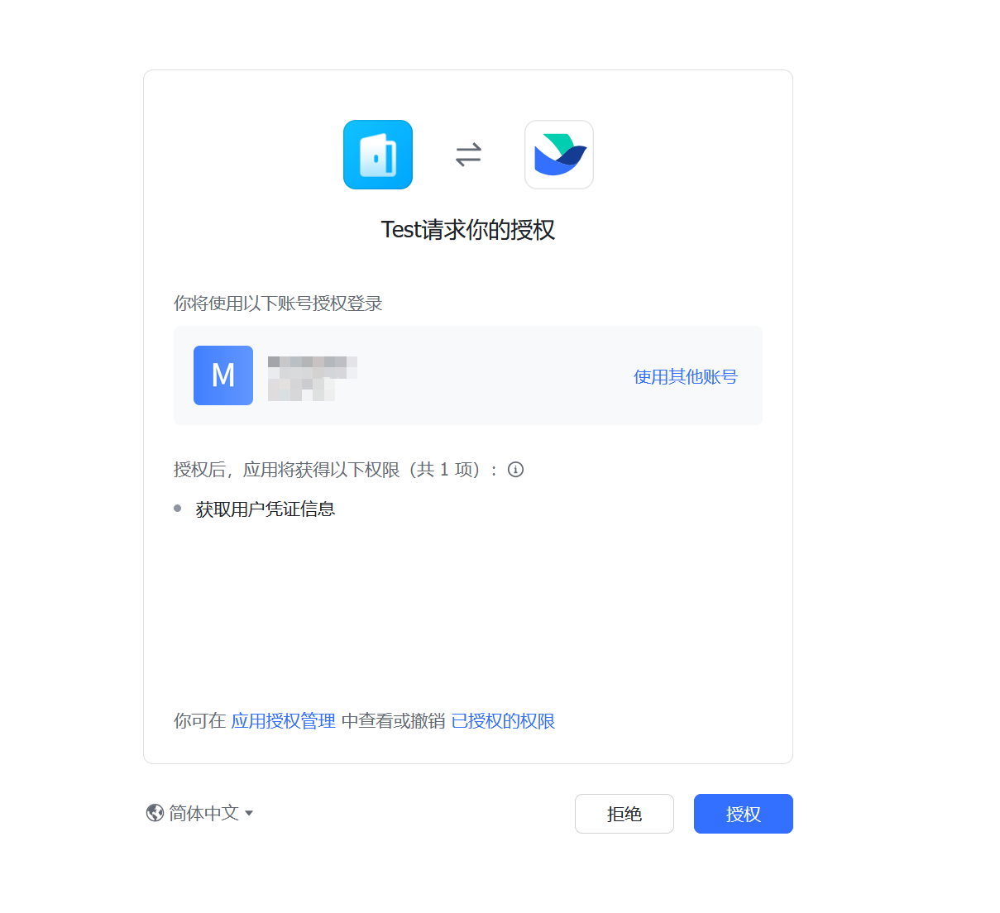
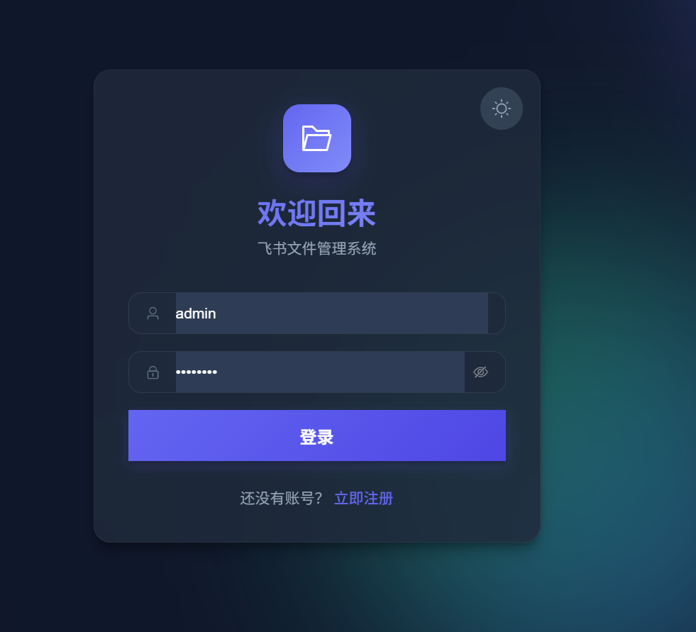
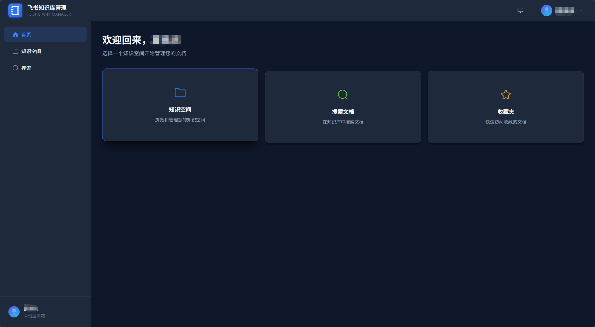
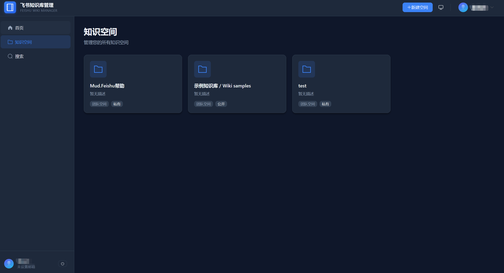
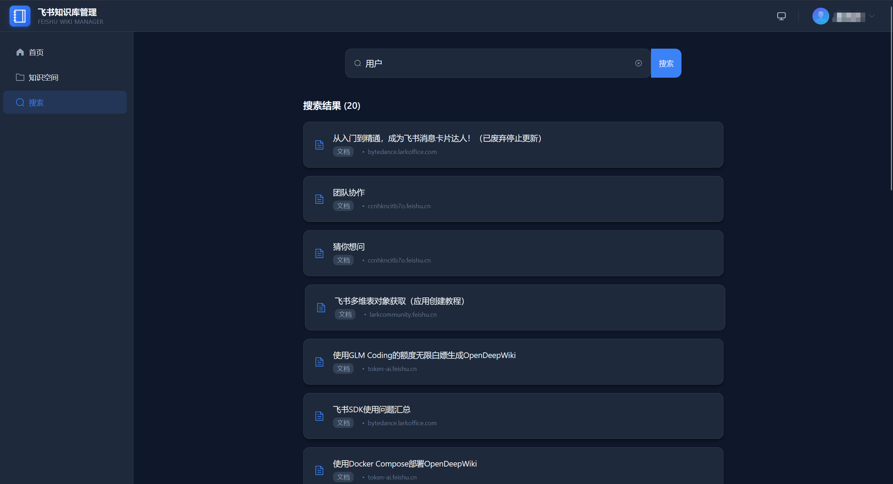
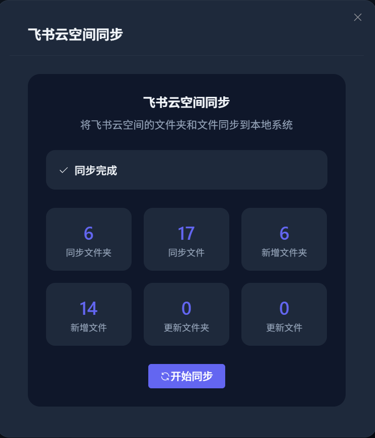
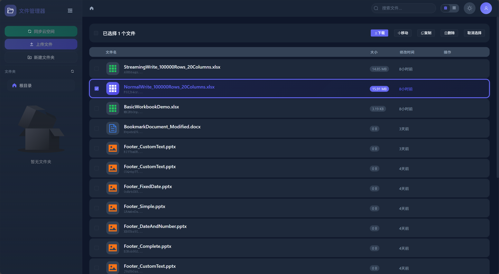
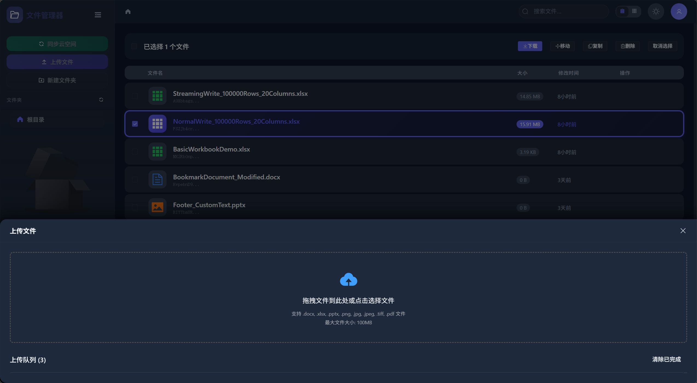

# MudFeishu

<div align="center">


企业级 .NET 飞书 API 集成 SDK

[](LICENSE)
[](https://www.nuget.org/packages/Mud.Feishu/ "Mud.Feishu") [](https://www.nuget.org/packages/Mud.Feishu/ "downloads")
[](https://www.nuget.org/packages/Mud.Feishu.WebSocket/ "Mud.Feishu.WebSocket") [](https://www.nuget.org/packages/Mud.Feishu.WebSocket/ "downloads")
[](https://www.nuget.org/packages/Mud.Feishu.Webhook/ "Mud.Feishu.Webhook") [](https://www.nuget.org/packages/Mud.Feishu.Webhook/ "downloads")
[](https://www.nuget.org/packages/Mud.Feishu.Abstractions/ "Mud.Feishu.Abstractions") [](https://www.nuget.org/packages/Mud.Feishu.Abstractions/ "downloads")
[](https://www.nuget.org/packages/Mud.Feishu.Authentication/ "Mud.Feishu.Authentication") [](https://www.nuget.org/packages/Mud.Feishu.Authentication/ "downloads")
[](https://www.nuget.org/packages/Mud.Feishu.EventCallback/ "Mud.Feishu.EventCallback") [](https://www.nuget.org/packages/Mud.Feishu.EventCallback/ "downloads")
[](https://www.nuget.org/packages/Mud.Feishu.Redis/ "Mud.Feishu.Redis") [](https://www.nuget.org/packages/Mud.Feishu.Redis/ "downloads")

**完整的 HTTP API、WebSocket 实时事件订阅和 Webhook 事件处理解决方案**

[快速开始](#-快速开始) • [API 模块](#-api-模块) • [使用示例](#-使用示例) • [文档](#-详细文档)

</div>

---

## 📖 项目简介

MudFeishu 是一套现代化的企业级 .NET 飞书 API 集成 SDK，提供完整的 HTTP API 调用、WebSocket 实时事件订阅和 Webhook 事件处理能力。SDK 采用策略模式和工厂模式设计，内置自动令牌管理、智能重试、高性能缓存等企业级特性，大幅简化飞书应用的开发难度。

### ✨ 核心优势

- 🚀 **极简 API** - 一行代码完成服务注册，开箱即用
- 🏗️ **类型安全** - 强类型数据模型，编译时类型检查
- 🔄 **自动令牌管理** - 智能缓存和刷新，无需手动维护
- 🛡️ **企业级稳定** - 统一异常处理、智能重试、详细日志
- 🎯 **事件驱动** - 策略模式事件处理，灵活扩展
- 📊 **多框架支持** - .NET Standard 2.0、.NET 6.0、.NET 8.0、.NET 10.0
- 🔒 **安全防护** - SSRF 防护、URL 白名单验证、签名验证、加密解密
- 📈 **可观测性** - 内置 FeishuMetrics 指标收集，支持 OpenTelemetry 集成

---

## 📦 项目概览

| 组件                          | 描述                                                                                             | NuGet                                                                                                                               | 下载                                                                    |
| ----------------------------- | ------------------------------------------------------------------------------------------------ | ----------------------------------------------------------------------------------------------------------------------------------- | ----------------------------------------------------------------------- |
| **Mud.Feishu.Abstractions**   | 事件订阅抽象层，提供策略模式和工厂模式的事件处理架构，内置 FeishuMetrics 指标收集和事件去重      | [](https://www.nuget.org/packages/Mud.Feishu.Abstractions/)     |    |
| **Mud.Feishu**                | 核心 HTTP API 客户端库，支持组织架构、消息、群聊、云文档、画板、电子表格、多维表格等完整飞书功能 | [](https://www.nuget.org/packages/Mud.Feishu/)                               |                 |
| **Mud.Feishu.Authentication** | 飞书用户认证中间件，基于 AsyncLocal 实现线程安全的用户上下文管理                                 | [](https://www.nuget.org/packages/Mud.Feishu.Authentication/) |  |
| **Mud.Feishu.EventCallback**  | 飞书事件回调强类型数据模型，支持源代码生成器自动生成事件处理器                                   | [](https://www.nuget.org/packages/Mud.Feishu.EventCallback/)   |   |
| **Mud.Feishu.WebSocket**      | 飞书 WebSocket 客户端，支持实时事件订阅、事件去重、消息序号验证和智能重连                        | [](https://www.nuget.org/packages/Mud.Feishu.WebSocket/)           |       |
| **Mud.Feishu.Webhook**        | 飞书 Webhook 事件处理组件，支持自定义验证器、频率限制、多应用模式和健康检查                      | [](https://www.nuget.org/packages/Mud.Feishu.Webhook/)               |         |
| **Mud.Feishu.Redis**          | Redis 分布式去重扩展，支持事件/Nonce/SeqID 去重、降级策略和多应用隔离                            | [](https://www.nuget.org/packages/Mud.Feishu.Redis/)                   |           |

---

## 🚀 快速开始

### 1️⃣ 安装 NuGet 包

```bash
# HTTP API 客户端 (核心模块)
dotnet add package Mud.Feishu

# 事件处理抽象层 (核心模块，Mud.Feishu/WebSocket/Webhook 依赖)
dotnet add package Mud.Feishu.Abstractions

# WebSocket 实时事件订阅 (可选)
dotnet add package Mud.Feishu.WebSocket

# Webhook HTTP 回调事件处理 (可选)
dotnet add package Mud.Feishu.Webhook

# 用户认证中间件 (可选)
dotnet add package Mud.Feishu.Authentication

# 事件回调强类型数据模型 (可选)
dotnet add package Mud.Feishu.EventCallback

# Redis 分布式去重扩展 (可选)
dotnet add package Mud.Feishu.Redis
```

> 💡 **提示**：根据实际需求安装对应包，`Mud.Feishu` 是核心包，`Mud.Feishu.Abstractions` 已作为 Mud.Feishu\WebSocket\Webhook 的依赖自动安装。

### 2️⃣ 配置文件 (appsettings.json)

```json
{
  "Logging": {
    "LogLevel": {
      "Default": "Information",
      "Mud.Feishu": "Debug"
    }
  },
  "FeishuApps": [
    {
      "AppKey": "default",
      "AppId": "your_feishu_app_id",
      "AppSecret": "your_feishu_app_secret",
      "BaseUrl": "https://open.feishu.cn",
      "AllowCustomBaseUrl": false,
      "TimeOut": 30,
      "RetryCount": 3,
      "RetryDelayMs": 1000,
      "CircuitBreakerEnabled": true,
      "CircuitBreakerFailureThreshold": 20,
      "CircuitBreakerSamplingDurationSeconds": 60,
      "CircuitBreakerBreakDurationSeconds": 60,
      "CircuitBreakerMinimumThroughput": 10,
      "TokenRefreshThreshold": 300,
      "EnableLogging": true,
      "IsDefault": true
    }
  ],
  "FeishuWebSocket": {
    "AutoReconnect": true,
    "MaxReconnectAttempts": 5,
    "ReconnectDelayMs": 5000,
    "MaxReconnectDelayMs": 30000,
    "MaxTotalReconnectTime": "00:30:00",
    "ReconnectCooldownTime": "00:00:05",
    "EnableReconnectMetrics": true,
    "HeartbeatIntervalMs": 25000,
    "EnableLogging": true,
    "ConnectionTimeoutMs": 10000,
    "HealthCheckIntervalMs": 60000,
    "InitialReceiveBufferSize": 4096,
    "MessageHandlerTimeoutMs": 30000,
    "ValidateServerCertificate": true,
    "AllowSelfSignedCertificates": false,
    "AllowInsecureWebSocket": false,
    "SequenceGapThreshold": 0,
    "MessageSizeLimits": {
      "MaxTextMessageSize": 1048576,
      "MaxBinaryMessageSize": 10485760
    },
    "EventDeduplication": {
      "Mode": "InMemory",
      "CacheExpiration": "2.00:00:00",
      "CleanupInterval": "00:05:00",
      "ProcessingTimeout": "00:10:00",
      "MaxCacheSize": 100000
    }
  },
  "FeishuWebhook": {
    "GlobalRoutePrefix": "feishu",
    "EnableRequestLogging": true,
    "MaxConcurrentEvents": 10,
    "EnforceHeaderSignatureValidation": true,
    "TimestampToleranceSeconds": 30,
    "EventHandlingTimeoutMs": 30000,
    "MaxRequestBodySize": 10485760,
    "Apps": {
      "app1": {
        "AppKey": "cli_a1b2c3d4e5f6g7h8",
        "VerificationToken": "your_app1_verification_token",
        "EncryptKey": "your_app1_encrypt_key_32_bytes_long"
      },
      "app2": {
        "AppKey": "cli_h8g7f6e5d4c3b2a1",
        "VerificationToken": "your_app2_verification_token",
        "EncryptKey": "your_app2_encrypt_key_32_bytes_long"
      }
    },
    "Retry": {
      "EnableRetry": false,
      "MaxRetryCount": 3,
      "InitialRetryDelaySeconds": 10,
      "RetryDelayMultiplier": 2.0,
      "MaxRetryDelaySeconds": 300,
      "RetryPollIntervalSeconds": 30,
      "MaxRetryPerPoll": 10
    },
    "RateLimit": {
      "EnableRateLimit": false,
      "WindowSizeSeconds": 60,
      "MaxRequestsPerWindow": 100,
      "EnableIpRateLimit": true,
      "TooManyRequestsStatusCode": 429,
      "TooManyRequestsMessage": "请求过于频繁，请稍后再试"
    }
  }
}
```

<details>
<summary>📋 WebSocket 高级配置参考</summary>

| 配置项                        | 类型     | 默认值  | 说明                                                               |
| ----------------------------- | -------- | ------- | ------------------------------------------------------------------ |
| `MaxReconnectDelayMs`         | int      | 30000   | 最大重连延迟时间（毫秒）                                           |
| `MaxTotalReconnectTime`       | TimeSpan | 30 分钟 | 最大重连总时间                                                     |
| `ReconnectCooldownTime`       | TimeSpan | 5 秒    | 两次重连之间的冷却时间                                             |
| `EnableReconnectMetrics`      | bool     | true    | 是否启用重连指标收集                                               |
| `ConnectionTimeoutMs`         | int      | 10000   | 连接超时时间（毫秒）                                               |
| `InitialReceiveBufferSize`    | int      | 4096    | 初始接收缓冲区大小（字节）                                         |
| `ValidateServerCertificate`   | bool     | true    | 是否验证 SSL 证书                                                  |
| `AllowSelfSignedCertificates` | bool     | false   | 是否允许自签名证书                                                 |
| `AllowInsecureWebSocket`      | bool     | false   | 是否允许 ws:// 不安全连接（仅开发/测试）                           |
| `HealthCheckIntervalMs`       | int      | 60000   | 健康检查间隔（毫秒）                                               |
| `MessageHandlerTimeoutMs`     | int      | 30000   | 单条消息处理超时（毫秒），0 表示不限制                             |
| `SequenceGapThreshold`        | ulong    | 0       | 消息序号跳跃阈值，0 表示禁用跳跃检测                               |
| `MessageSizeLimits`           | object   | 见下方  | 消息大小限制配置                                                   |
| `EventDeduplication`          | object   | 见下方  | 事件去重配置                                                       |

> ℹ️ **迁移提示**：旧版本的 `TokenRefreshInterval` / `TokenRefreshAhead` 配置已移除。令牌刷新现由 `FeishuAppConfig.TokenRefreshThreshold`（HTTP 层）统一控制，WebSocket 连接复用同一应用的令牌管理器，无需单独配置。

**MessageSizeLimits 子配置：**

| 配置项                 | 类型 | 默认值 | 说明                       |
| ---------------------- | ---- | ------ | -------------------------- |
| `MaxTextMessageSize`   | int  | 1MB    | 最大文本消息大小（字符数） |
| `MaxBinaryMessageSize` | long | 10MB   | 最大二进制消息大小（字节） |

**EventDeduplication 子配置：**

| 配置项              | 类型     | 默认值   | 说明                                                                                     |
| ------------------- | -------- | -------- | ---------------------------------------------------------------------------------------- |
| `Mode`              | enum     | InMemory | 去重模式：None（禁用）/ InMemory（内存）/ Distributed（需注入 IFeishuEventDeduplicator） |
| `CacheExpiration`   | TimeSpan | 48 小时  | 缓存过期时间（最小 60 秒）。建议与飞书事件重试窗口一致                                   |
| `CleanupInterval`   | TimeSpan | 5 分钟   | 缓存清理间隔（最小 60 秒）                                                               |
| `ProcessingTimeout` | TimeSpan | 10 分钟  | 处理中超时时间（最小 10 秒），超时后允许重新处理事件                                     |
| `MaxCacheSize`      | int      | 100000   | 内存缓存最大条目数，0 表示不限制                                                         |

> 🔧 **Mode 实现说明**：
>
> - `None`：注册 `NoopFeishuEventDeduplicator` 空实现，所有去重方法均不执行实际操作（`TryMarkAsProcessingAsync` 直接返回 Success、`IsProcessedAsync` 返回 false、`GetStatusAsync` 返回 Pending），事件直接处理不抛异常，输出 Debug 日志便于观测。适用于调试场景或对去重不敏感的事件流。
> - `InMemory`：注册 `FeishuEventDeduplicator` 内存实现，进程内缓存事件 ID，重启后失效。
> - `Distributed`：需通过 `services.AddSingleton<IFeishuEventDeduplicator, RedisFeishuEventDistributedDeduplicator>()` 手动注册分布式实现。若未注册，SDK 将记录警告并降级为内存实现（不抛异常以保证启动可用性）。

> 💡 TimeSpan 配置说明：`Microsoft.Extensions.Configuration` 绑定 TimeSpan 时使用 `TypeDescriptor` 解析，"24:00:00" 会被解释为 **24 天** 而非 24 小时。请使用 `"d.hh:mm:ss"` 格式（如 `"2.00:00:00"` 表示 48 小时）或 `"hh:mm:ss"` 格式（如 `"00:30:00"` 表示 30 分钟）。

> 💡 更多配置详情请参考 [Mud.Feishu.WebSocket 详细文档](./Mud.Feishu.WebSocket/Readme.md)

</details>

<details>
<summary>📋 EnableLogging 多层级作用域说明</summary>

SDK 中存在多个 `EnableLogging` / `EnableRequestLogging` 开关，它们**作用范围相互独立、互不覆盖**，按模块分别控制各自日志输出：

| 配置项位置                           | 字段                     | 作用范围                                                               | 默认值 |
| ------------------------------------ | ------------------------ | ---------------------------------------------------------------------- | ------ |
| `FeishuApps[*].EnableLogging`        | `FeishuAppConfig`        | HTTP API 客户端层（`Mud.Feishu`）的请求/响应详细日志                   | true   |
| `FeishuWebSocket:EnableLogging`      | `FeishuWebSocketOptions` | WebSocket 模块（`Mud.Feishu.WebSocket`）的连接/心跳/Ping/Pong 调试日志 | true   |
| `FeishuWebhook:EnableRequestLogging` | `FeishuWebhookOptions`   | Webhook 模块（`Mud.Feishu.Webhook`）的入站请求日志                     | true   |

> 💡 **优先级说明**：
>
> - 三个开关**各自独立**，不存在覆盖或继承关系。例如设置 `FeishuApps[0].EnableLogging=false` 不会影响 WebSocket 模块的日志输出。
> - 如需全局关闭 SDK 日志，请同时将三个开关都设为 `false`，或通过 `ILoggerFactory` 过滤 `Mud.Feishu` 命名空间的日志级别。
> - 推荐生产环境保持 `EnableLogging=true` 以便问题排查，但将日志级别调整为 `Information` 或 `Warning` 以减少日志量。

</details>

<details>
<summary>📋 弹性策略配置参考（FeishuApps）</summary>

| 配置项                                  | 类型 | 默认值 | 说明                                 |
| --------------------------------------- | ---- | ------ | ------------------------------------ |
| `TimeOut`                               | int  | 30     | HTTP 请求超时时间（秒），范围 1-300  |
| `RetryCount`                            | int  | 3      | 重试次数，范围 0-10                  |
| `RetryDelayMs`                          | int  | 1000   | 重试延迟时间（毫秒），范围 100-60000 |
| `CircuitBreakerEnabled`                 | bool | true   | 是否启用熔断器                       |
| `CircuitBreakerFailureThreshold`        | int  | 20     | 熔断失败率阈值（百分比），范围 1-100 |
| `CircuitBreakerSamplingDurationSeconds` | int  | 60     | 熔断采样窗口时间（秒），范围 10-300  |
| `CircuitBreakerBreakDurationSeconds`    | int  | 60     | 熔断持续时间（秒），范围 10-300      |
| `CircuitBreakerMinimumThroughput`       | int  | 10     | 熔断最小吞吐量，范围 2-1000          |

> ⚠️ 多应用模式下，弹性策略为全局共享，仅默认应用（`IsDefault=true`）的配置生效。非默认应用的弹性策略配置将被忽略。

</details>

<details>
<summary>📋 Webhook 安全配置参考</summary>

| 配置项                             | 类型                  | 默认值 | 说明                                                         |
| ---------------------------------- | --------------------- | ------ | ------------------------------------------------------------ |
| `AllowedSourceIPs`                 | HashSet&lt;string&gt; | 空     | 允许的源 IP 白名单，支持 CIDR 格式。非空时自动启用 IP 验证   |
| `EnforceHeaderSignatureValidation` | bool                  | true   | 是否强制验证 X-Lark-Signature 请求头签名（生产环境必须启用） |
| `TimestampToleranceSeconds`        | int                   | 30     | 时间戳容差（秒），超过此时间视为无效请求                     |
| `MaxConcurrentEvents`              | int                   | 10     | 最大并发事件处理数                                           |
| `EnableRequestLogging`             | bool                  | true   | 是否启用请求日志                                             |
| `EnablePerformanceMonitoring`      | bool                  | false  | 是否启用性能监控（处理耗时、队列深度等指标）                 |
| `MaxRequestBodySize`               | long                  | 10MB   | 最大请求体大小（字节）                                       |
| `EventHandlingTimeoutMs`           | int                   | 30000  | 事件处理超时时间（毫秒）                                     |

> 🔒 生产环境强烈建议保持 `EnforceHeaderSignatureValidation=true`，配置 `AllowedSourceIPs` 限制来源 IP，并将 `TimestampToleranceSeconds` 设置为 30 秒或更短以减少重放攻击时间窗口。

</details>

<details>
<summary>📋 Redis 分布式去重配置参考（RedisOptions）</summary>

> 当引用 `Mud.Feishu.Redis` 包并启用分布式去重时，以下配置在 `FeishuRedis` 节点下生效。

| 配置项                 | 类型     | 默认值           | 说明                                                    |
| ---------------------- | -------- | ---------------- | ------------------------------------------------------- |
| `ServerAddress`        | string   | "localhost:6379" | Redis 连接地址，格式 `host:port` 或 `redis://host:port` |
| `Password`             | string   | 空               | Redis 密码                                              |
| `DefaultDatabase`      | int?     | null             | 默认数据库索引（null 表示使用服务端默认）               |
| `ClientName`           | string?  | null             | 客户端名称（便于在 Redis 端识别连接来源）               |
| `ConnectTimeout`       | int      | 5000             | 连接超时（毫秒），最小 1000                             |
| `SyncTimeout`          | int      | 5000             | 同步操作超时（毫秒），最小 1000                         |
| `Ssl`                  | bool     | false            | 是否启用 TLS/SSL                                        |
| `AbortOnConnectFail`   | bool     | true             | 连接失败时是否中止                                      |
| `AllowAdmin`           | bool     | false            | 是否允许管理员操作（如 FLUSHDB），生产环境应保持 false  |
| `ConnectRetry`         | int      | 3                | 连接重试次数，不能为负数                                |
| `EventKeyPrefix`       | string   | "feishu:event:"  | 事件去重键前缀（用于应用/环境隔离）                     |
| `NonceKeyPrefix`       | string   | "feishu:nonce:"  | Nonce 去重键前缀                                        |
| `SeqIdKeyPrefix`       | string   | "feishu:seqid:"  | SeqID 去重键前缀                                        |
| `EventCacheExpiration` | TimeSpan | "2.00:00:00"    | 事件去重缓存过期时间                                    |
| `NonceTtl`             | TimeSpan | "00:05:00"      | Nonce 有效期                                            |
| `SeqIdCacheExpiration` | TimeSpan | "2.00:00:00"    | SeqID 去重缓存过期时间                                  |

> ℹ️ **高级去重参数**：在 `FeishuRedis:Deduplication` 节点下可配置 `ProcessingTimeout`、`MaxRetryCount`、`AllowProcessingOnFallback` 等高级参数（类型 `DeduplicationOptions`）。注意：`CacheExpiration` 和 `KeyPrefix` 由上表中的 `EventCacheExpiration` / `EventKeyPrefix` 优先覆盖。

**配置示例：**

```json
{
  "FeishuRedis": {
    "ServerAddress": "redis://prod-redis.internal:6380",
    "Password": "your-password",
    "DefaultDatabase": 1,
    "ConnectTimeout": 5000,
    "SyncTimeout": 5000,
    "Ssl": true,
    "AbortOnConnectFail": true,
    "ConnectRetry": 3,
    "EventKeyPrefix": "prod:feishu:event:",
    "NonceKeyPrefix": "prod:feishu:nonce:",
    "SeqIdKeyPrefix": "prod:feishu:seqid:",
    "EventCacheExpiration": "2.00:00:00",
    "NonceTtl": "00:05:00",
    "SeqIdCacheExpiration": "2.00:00:00"
  }
}
```

> 🔒 生产环境建议启用 `Ssl=true`，配置独立 `Password`，并为多租户场景设置不同的键前缀（`EventKeyPrefix`/`NonceKeyPrefix`/`SeqIdKeyPrefix`）以实现隔离。

</details>

<details>
<summary>📋 用户认证配置参考（FeishuUserAuthenticationOptions）</summary>

> 当引用 `Mud.Feishu.Authentication` 包并启用用户认证中间件时，以下配置在 `FeishuUserAuthentication` 节点下生效。

| 配置项                     | 类型   | 默认值                    | 说明                                                        |
| -------------------------- | ------ | ------------------------- | ----------------------------------------------------------- |
| `OpenIdClaimType`          | string | "open_id"                 | OpenId 的 Claim 类型名称                                    |
| `OpenIdFallbackClaimType`  | string | ClaimTypes.NameIdentifier | OpenId 的备用 Claim 类型名称                                |
| `UnionIdClaimType`         | string | "union_id"                | UnionId 的 Claim 类型名称                                   |
| `UserIdClaimType`          | string | "user_id"                 | UserId 的 Claim 类型名称                                    |
| `NameClaimType`            | string | ClaimTypes.Name           | 用户名称的 Claim 类型名称                                   |
| `EnableDistributedTracing` | bool   | true                      | 是否启用分布式追踪（创建 Activity 并设置用户相关标签）      |
| `EnableSensitiveLog`       | bool   | false                     | 是否在日志中记录敏感信息（如 OpenId），生产环境应保持 false |

**配置示例：**

```json
{
  "FeishuUserAuthentication": {
    "OpenIdClaimType": "open_id",
    "UnionIdClaimType": "union_id",
    "UserIdClaimType": "user_id",
    "EnableDistributedTracing": true,
    "EnableSensitiveLog": false
  }
}
```

**服务注册：**

```csharp
// 方式一：从 IConfiguration 绑定（推荐，与上方 appsettings.json 配合使用）
builder.Services.AddFeishuApp(builder.Configuration, "FeishuApps");
builder.Services.AddFeishuUserContext(builder.Configuration);

// 方式二：代码配置
builder.Services.AddFeishuUserContext(options =>
{
    options.OpenIdClaimType = "custom_open_id";
    options.EnableSensitiveLog = false;
});
```

> 🔒 生产环境强烈建议保持 `EnableSensitiveLog=false`，避免在日志中泄露用户 OpenId/UnionId 等敏感信息。

</details>

<details>
<summary>📋 失败事件重试配置参考（FailedEventRetryOptions）</summary>

> Webhook 模块支持失败事件的自动重试，以下配置在 `FeishuWebhook:Retry` 节点下生效。

| 配置项                     | 类型   | 默认值 | 说明                         |
| -------------------------- | ------ | ------ | ---------------------------- |
| `EnableRetry`              | bool   | false  | 是否启用失败事件重试         |
| `MaxRetryCount`            | int    | 3      | 最大重试次数                 |
| `InitialRetryDelaySeconds` | int    | 10     | 初始重试延迟（秒）           |
| `RetryDelayMultiplier`     | double | 2.0    | 重试延迟倍数（指数退避）     |
| `MaxRetryDelaySeconds`     | int    | 300    | 最大重试延迟（秒，5 分钟）   |
| `RetryPollIntervalSeconds` | int    | 30     | 重试轮询间隔（秒）           |
| `MaxRetryPerPoll`          | int    | 10     | 每次轮询处理的最大失败事件数 |

**配置示例：**

```json
{
  "FeishuWebhook": {
    "Retry": {
      "EnableRetry": true,
      "MaxRetryCount": 5,
      "InitialRetryDelaySeconds": 10,
      "RetryDelayMultiplier": 2.0,
      "MaxRetryDelaySeconds": 300,
      "RetryPollIntervalSeconds": 30,
      "MaxRetryPerPoll": 10
    }
  }
}
```

> ℹ️ 当 `EnableRetry=false` 时，子配置不会影响运行时行为，但仍会进行范围校验（如 `MaxRetryCount >= 0`），以确保配置值在启用时立即可用。无需强制保持默认值，便于热更新场景下动态切换。

</details>

<details>
<summary>📋 Webhook 应用级配置参考（FeishuAppWebhookOptions）</summary>

> 多应用模式下，每个应用在 `FeishuWebhook:Apps:{appKey}` 节点下独立配置。未显式设置的数值/布尔字段将自动继承全局 `FeishuWebhookOptions` 中对应的配置。

| 配置项                             | 类型   | 默认值 | 说明                                                                    |
| ---------------------------------- | ------ | ------ | ----------------------------------------------------------------------- |
| `AppKey`                           | string | 必填   | 飞书应用 AppId（如 `cli_xxx`）                                          |
| `VerificationToken`                | string | 必填   | 应用事件订阅 Verification Token                                         |
| `EncryptKey`                       | string | 必填   | 事件加密 Key（长度必须为 32 字符）                                      |
| `Description`                      | string | null   | 应用描述（可选）                                                        |
| `TimestampToleranceSeconds`        | int?   | null   | 时间戳容差（秒）。`null`/`-1`/`0` 继承全局，正整数覆盖全局              |
| `EventHandlingTimeoutMs`           | int?   | null   | 事件处理超时（毫秒）。`null`/`-1`/`0` 继承全局，正整数（≥1000）覆盖全局 |
| `EnforceHeaderSignatureValidation` | bool?  | null   | 是否强制验证请求头签名。`null` 继承全局                                 |
| `EnableExceptionHandling`          | bool?  | null   | 是否启用异常捕获。`null` 继承全局                                       |
| `EnablePerformanceMonitoring`      | bool?  | null   | 是否启用性能监控。`null` 继承全局                                       |

**配置示例：**

```json
{
  "FeishuWebhook": {
    "TimestampToleranceSeconds": 30,
    "EventHandlingTimeoutMs": 30000,
    "Apps": {
      "app1": {
        "AppKey": "cli_a1b2c3d4e5f6g7h8",
        "VerificationToken": "your_app1_verification_token",
        "EncryptKey": "your_app1_encrypt_key_32_bytes_long",
        "Description": "默认应用（继承全局配置）"
      },
      "app2": {
        "AppKey": "cli_h8g7f6e5d4c3b2a1",
        "VerificationToken": "your_app2_verification_token",
        "EncryptKey": "your_app2_encrypt_key_32_bytes_long",
        "TimestampToleranceSeconds": 60,
        "EventHandlingTimeoutMs": 60000,
        "EnforceHeaderSignatureValidation": false
      }
    }
  }
}
```

> 💡 **继承语义说明**：
>
> - 数值字段（`TimestampToleranceSeconds`、`EventHandlingTimeoutMs`）：推荐使用 `null` 表示继承全局；`-1` 与 `0` 为向后兼容值，仍被识别为继承。
> - 布尔字段：`null` 表示继承全局，`true`/`false` 表示覆盖全局。
> - 推荐统一使用 `null` 表示继承，以与其他可空字段保持一致。

</details>

<details>
<summary>📋 Webhook 频率限制配置参考（RateLimitOptions）</summary>

> 在 `FeishuWebhook:RateLimit` 节点下配置请求频率限制，防止异常客户端打垮 Webhook 端点。

| 配置项                      | 类型                  | 默认值                     | 说明                                         |
| --------------------------- | --------------------- | -------------------------- | -------------------------------------------- |
| `EnableRateLimit`           | bool                  | false                      | 是否启用频率限制                             |
| `WindowSizeSeconds`         | int                   | 60                         | 时间窗口大小（秒），最小 1                   |
| `MaxRequestsPerWindow`      | int                   | 100                        | 每个时间窗口内允许的最大请求数，最小 1       |
| `EnableIpRateLimit`         | bool                  | true                       | 是否基于 IP 维度限流（false 则基于全局维度） |
| `TooManyRequestsStatusCode` | int                   | 429                        | 超出限制时的 HTTP 状态码，范围 400-599       |
| `TooManyRequestsMessage`    | string                | "请求过于频繁，请稍后再试" | 超出限制时的响应消息                         |
| `WhitelistIPs`              | HashSet&lt;string&gt; | 空                         | 白名单 IP 列表（不参与限流），支持单个 IP    |

**配置示例：**

```json
{
  "FeishuWebhook": {
    "RateLimit": {
      "EnableRateLimit": true,
      "WindowSizeSeconds": 60,
      "MaxRequestsPerWindow": 100,
      "EnableIpRateLimit": true,
      "TooManyRequestsStatusCode": 429,
      "TooManyRequestsMessage": "请求过于频繁，请稍后再试",
      "WhitelistIPs": ["10.0.0.1", "10.0.0.2"]
    }
  }
}
```

> ℹ️ 当 `EnableRateLimit=false` 时，子配置不会影响运行时行为，但仍会进行范围校验（如 `WindowSizeSeconds >= 1`），以确保配置值在启用时立即可用。无需强制保持默认值，便于热更新场景下动态切换。

</details>

### 3️⃣ 服务注册 (Program.cs)

```csharp
using Mud.Feishu;
using Mud.Feishu.WebSocket;
using Mud.Feishu.Webhook;

var builder = WebApplication.CreateBuilder(args);

// 注册多应用模式（方式一：从配置文件加载）
builder.Services.AddFeishuApp(builder.Configuration);

// 注册多应用模式（方式二：代码配置）
builder.Services.AddFeishuApp(configure =>
{
    configure.AddDefaultApp("default", "cli_xxx", "dsk_xxx");
    configure.AddApp("hr-app", "cli_yyy", "dsk_yyy", opt =>
    {
        opt.TimeOut = 45;
        opt.RetryCount = 5;
        opt.RetryDelayMs = 2000; // 自定义重试延迟
        opt.TokenRefreshThreshold = 300; // Token 刷新阈值（秒）
    });
});

// 注册多应用模式（方式三：使用预构建的配置列表）
var configs = new List<FeishuAppConfig>
{
    new FeishuAppConfig { AppKey = "default", AppId = "cli_xxx", AppSecret = "dsk_xxx" }, // IsDefault 自动推断
    new FeishuAppConfig { AppKey = "hr-app", AppId = "cli_yyy", AppSecret = "dsk_yyy" }
};
builder.Services.AddFeishuApp(configs);

// 注册 HTTP API 服务（懒人模式 - 注册所有服务）
builder.Services.CreateFeishuServicesBuilder()
    .AddAllApis()
    .Build();

// 注册 HTTP API 服务（构造者模式 - 按需注册）
builder.Services.CreateFeishuServicesBuilder()
    .AddOrganizationApi()
    .AddMessageApi()
    .AddChatGroupApi()
    .AddApprovalApi()
    .AddTaskApi()
    .AddCardApi()
    .AddAttendanceApi()
    .AddDriveApi()
    .AddWikiApi()
    .AddDocxApi()
    .AddSpreadsheetsApi()
    .AddBiTableApi()
    .Build();

// 注册 HTTP API 服务（按模块注册）
builder.Services.AddFeishuServices(
    FeishuModule.Organization,
    FeishuModule.Message,
    FeishuModule.ChatGroup,
    FeishuModule.Spreadsheets,
    FeishuModule.Bitable
);

// 注册 WebSocket 事件订阅服务
builder.Services.CreateFeishuWebSocketServiceBuilder(builder.Configuration, "default")
    .AddHandler<MessageEventHandler>()
    .Build();

// 注册 Webhook HTTP 回调事件服务
builder.Services.CreateFeishuWebhookServiceBuilder(builder.Configuration)
    .AddHandler<MessageReceiveEventHandler>()
    .AddHandler<DepartmentCreatedEventHandler>()
    .Build();

var app = builder.Build();

// 添加 Webhook 中间件
app.UseFeishuWebhook();

app.Run();
```

### 4️⃣ 验证配置

```csharp
// 获取用户信息测试
public class TestController : ControllerBase
{
    private readonly IFeishuTenantV3User _userApi;

    public TestController(IFeishuTenantV3User userApi)
    {
        _userApi = userApi;
    }

    [HttpGet("test")]
    public async Task<IActionResult> TestConnection()
    {
        var result = await _userApi.GetUserInfoByIdAsync("test_user_id");
        return Ok(new { code = result.Code, message = result.Msg });
    }
}
```

---

## 🎯 API 模块

Mud.Feishu 提供完整的飞书 HTTP API 覆盖，支持以下模块：

### 📋 API 模块总览

| 模块分类        | API 版本 | 主要功能                                             |
| --------------- | -------- | ---------------------------------------------------- |
| **🔐 认证授权** | V3       | 应用令牌、租户令牌、用户令牌、OAuth 2.0、多应用管理  |
| **👥 组织架构** | V1/V3    | 用户、部门、员工、用户组、职级、职务、角色           |
| **💬 消息服务** | V1       | 文本/图片/卡片消息、批量发送、群聊管理               |
| **📋 审批流程** | V4       | 审批定义、审批实例、审批任务、审批消息、审批订阅     |
| **📝 任务管理** | V2       | 任务创建、更新、分组、附件、评论、自定义字段         |
| **📅 日程会议** | V4       | 日程事件、会议管理                                   |
| **📄 文档管理** | V1       | 飞书文档、文档块、内容转换                           |
| **📚 知识库**   | V2       | 知识空间、节点管理、节点复制移动                     |
| **☁️ 云盘管理** | V1       | 云空间、文件夹、文件上传、版本管理、权限、评论、订阅 |
| **🎨 画板管理** | V1       | 画板主题、缩略图、节点创建、语法解析                 |
| **📊 电子表格** | V2/V3    | 电子表格、区域操作、筛选、数据验证、条件格式         |
| **📋 多维表格** | V1/V2    | 数据表、记录、字段、视图、表单、仪表盘、角色、自动化 |
| **⏰ 考勤管理** | V1       | 考勤组、打卡记录、班次、请假审批、考勤统计、档案     |
| **🎴 卡片管理** | V1/V2    | 卡片管理、卡片元素、消息流卡片                       |

### 📄 文档管理 (Docx)

飞书文档 API，支持文档创建、编辑、块操作等。

```csharp
public interface IFeishuV1Docx
{
    // 文档基础操作
}

public interface IFeishuV1DocxBlocks
{
    // 文档块操作
}
```

**功能列表**：

- 文档创建和获取
- 文档块读取和更新
- 批量操作文档块
- 内容转换

### 📚 知识库 (Wiki)

知识空间和节点管理 API。

```csharp
public interface IFeishuV2Wiki
{
    // 知识空间管理
}

public interface IFeishuV2WikiNodes
{
    // 知识节点管理
}
```

**功能列表**：

- 知识空间创建和查询
- 节点树结构管理
- 节点复制和移动
- 文档导入知识库

### ☁️ 云盘管理 (Drive)

云空间文件和文件夹管理 API。

```csharp
public interface IFeishuV1DriveFiles
{
    // 文件操作
}

public interface IFeishuV1DriveFolder
{
    // 文件夹操作
}

public interface IFeishuV1DriveFilesVersions
{
    // 文件版本管理
}

public interface IFeishuV1DrivePermissions
{
    // 云文档权限管理
}

public interface IFeishuV1DriveSubscribe
{
    // 云文档事件订阅
}

public interface IFeishuV1Comments
{
    // 云文档评论管理
}
```

**功能列表**：

- 文件上传和下载
- 文件夹创建和管理
- 文件版本控制
- 媒体文件处理
- 云文档权限管理（协作者增删改查、所有者转移、权限设置）
- 云文档密码管理（启用、刷新、停用）
- 云文档评论管理（评论/回复增删改查、表情回应）
- 云文档事件订阅（文件/用户事件订阅管理）

### ⏰ 考勤管理 (Attendance)

企业考勤全流程管理 API。

```csharp
public interface IFeishuV1AttendanceGroups
{
    // 考勤组管理
}

public interface IFeishuV1AttendanceUserFlows
{
    // 打卡流水
}

public interface IFeishuV1AttendanceStats
{
    // 考勤统计
}
```

**功能列表**：

- 考勤组配置管理
- 打卡记录查询
- 班次管理
- 请假审批
- 补卡申请
- 考勤统计报表

### 📋 审批流程 (Approval)

企业审批全流程管理 API。

```csharp
public interface IFeishuV4Approval
{
    // 审批定义和实例
}

public interface IFeishuV4ApprovalTask
{
    // 审批任务管理
}
```

**功能列表**：

- 审批定义创建
- 审批实例发起
- 审批任务处理
- 审批评论
- 第三方审批集成

### 📝 任务管理 (Task)

飞书任务全功能 API。

```csharp
public interface IFeishuV2Task
{
    // 任务管理
}

public interface IFeishuV2TaskCustomFields
{
    // 自定义字段
}
```

**功能列表**：

- 任务创建和更新
- 任务列表管理
- 任务分组
- 任务评论和附件
- 自定义字段

### 👥 组织架构 (Organization)

完整的组织架构管理 API。

```csharp
public interface IFeishuTenantV3User
{
    // 用户管理
}

public interface IFeishuTenantV3Departments
{
    // 部门管理
}
```

**功能列表**：

- 用户 CRUD 操作
- 部门树管理
- 用户组管理
- 职级职务管理
- 角色权限管理

### 💬 消息服务 (Messages)

消息发送和批量消息 API。

```csharp
public interface IFeishuV1Message
{
    // 消息发送
}

public interface IFeishuV1BatchMessage
{
    // 批量消息
}
```

**功能列表**：

- 文本/图片/卡片消息
- 批量发送
- 消息撤回
- 已读状态查询

### 🎴 卡片管理 (Cards)

卡片和消息流卡片 API。

```csharp
public interface IFeishuV1Card
{
    // 卡片管理
}

public interface IFeishuV1CardElements
{
    // 卡片元素
}
```

**功能列表**：

- 卡片创建和更新
- 卡片元素管理
- 消息流卡片

### 🏢 群聊管理 (ChatGroup)

群组和会话管理 API。

```csharp
public interface IFeishuTenantV3ChatGroup
{
    // 群组管理
}
```

**功能列表**：

- 群组创建和管理
- 群成员管理
- 群公告
- 会话标签

### 🎨 画板管理 (Board)

飞书画板（白板）API，支持画板主题、节点管理和语法解析。

```csharp
public interface IFeishuV1Board
{
    // 画板管理
}
```

**功能列表**：

- 获取和更新画板主题
- 获取画板缩略图片
- 解析画板语法（PlantUML/Mermaid）
- 创建和管理画板节点

### 📊 电子表格 (Spreadsheets)

飞书电子表格 API，支持完整的电子表格操作。

```csharp
public interface IFeishuV3Spreadsheets
{
    // 电子表格基础操作
}

public interface IFeishuV3SpreadsheetRange
{
    // 区域操作
}

public interface IFeishuV3SpreadsheetData
{
    // 数据操作
}

public interface IFeishuV3SpreadsheetCell
{
    // 单元格操作
}

public interface IFeishuV3SpreadsheetFilter
{
    // 筛选操作
}
```

**功能列表**：

- 电子表格创建和获取
- 区域读写和格式化
- 数据查询和更新
- 单元格样式设置
- 筛选器和筛选视图
- 浮动图片管理
- 保护范围和数据验证
- 条件格式

### 📋 多维表格 (Bitable)

飞书多维表格 API，支持完整的多维表格数据管理。

```csharp
public interface IFeishuV1Bitable
{
    // 多维表格应用管理
}

public interface IFeishuV1BitableAppTable
{
    // 数据表管理
}

public interface IFeishuV1BitableRecord
{
    // 记录管理
}

public interface IFeishuV1BitableField
{
    // 字段管理
}

public interface IFeishuV1BitableView
{
    // 视图管理
}
```

**功能列表**：

- 多维表格应用管理
- 数据表 CRUD 操作
- 记录增删改查
- 字段类型管理
- 视图配置
- 表单管理
- 仪表盘统计
- 角色权限控制
- 自动化流程管理

---

## 🎯 核心功能

### 🏛️ Mud.Feishu.Abstractions - 事件处理抽象层

**统一的事件处理架构，WebSocket 和 Webhook 共享相同的处理器接口**

| 功能特性       | 说明                                                        |
| -------------- | ----------------------------------------------------------- |
| **策略模式**   | 可扩展的事件处理器架构                                      |
| **工厂模式**   | 动态注册和发现处理器                                        |
| **类型安全**   | 强类型数据模型，编译时检查                                  |
| **自动去重**   | 内置事件 ID 去重机制（内存/分布式）                         |
| **事件拦截器** | 支持事件处理前后的拦截逻辑                                  |
| **基类处理器** | 简化开发的专用基类                                          |
| **性能指标**   | 内置 FeishuMetrics 指标收集（Token、事件、HTTP、WebSocket） |
| **SSRF 防护**  | URL 白名单验证和私有 IP 检测                                |
| **SeqID 去重** | WebSocket 二进制消息序列号去重                              |

**核心工具类**：

- `FeishuMetrics` / `FeishuMetricsHelper` - 统一性能指标收集（Token 缓存、事件处理、HTTP 请求、WebSocket 连接）
- `FeishuEventDeduplicator` - 事件去重服务（支持内存和分布式模式）
- `FeishuSeqIDDeduplicator` - WebSocket 消息序列号去重
- `TokenUtils` - 令牌工具类
- `UrlValidator` - URL 白名单验证和 SSRF 防护（来自 Mud.HttpUtils）

### 🌐 Mud.Feishu - HTTP API 客户端

**企业级特性**：

- ✅ 自动令牌缓存和刷新
- ✅ 智能重试机制（可配置重试次数和延迟）
- ✅ 高性能缓存（解决缓存击穿）
- ✅ 统一异常处理
- ✅ 连接池管理
- ✅ 详细日志记录
- ✅ 多应用上下文切换支持
- ✅ 性能指标监控（内置 FeishuMetrics 指标收集）
- ✅ SSRF 防护（URL 白名单验证和私有 IP 检测）
- ✅ 自定义模块注册器（IFeishuModuleRegistrar 扩展）

> 💡 **提示**：[查看完整 API 文档](./Mud.Feishu/README.md)

### 🔌 Mud.Feishu.WebSocket - 实时事件订阅

**企业级 WebSocket 客户端**：

- ✅ 智能连接管理（自动重连、心跳检测、状态监控）
- ✅ 指数退避重连策略（可插拔 IReconnectStrategy，双重限制：次数和时间）
- ✅ 事件去重（InMemory/Distributed 模式，支持 Redis 分布式去重）
- ✅ 消息序号验证（重放攻击检测、消息丢失检测、序号回退检测）
- ✅ 会话管理（session_id 管理、断线恢复、24 小时有效期）
- ✅ 连接指标监控（FeishuMetrics 集成，实时统计吞吐量）
- ✅ SSL/TLS 证书验证（可配置验证策略、自定义验证回调）
- ✅ 访问令牌自动刷新（缓存和提前刷新避免过期）

> 💡 **提示**：[查看完整文档](./Mud.Feishu.WebSocket/Readme.md)

### 🪝 Mud.Feishu.Webhook - HTTP 回调事件处理

**企业级 Webhook 处理**：

- ✅ 安全验证（签名验证、时间戳验证、Nonce 验证、订阅验证）
- ✅ 加密解密（内置 AES-256-CBC 解密，自动处理飞书加密事件）
- ✅ 自定义验证器（ISignatureValidator、ITimestampValidator、INonceValidator、IEncryptKeyProvider）
- ✅ 请求频率限制（内置滑动窗口限流中间件）
- ✅ 多应用模式（独立路由、处理器、拦截器和配置）
- ✅ 应用级配置继承（全局配置自动继承到应用级）
- ✅ 后台处理模式（异步事件处理，不阻塞 HTTP 响应）
- ✅ 事件重试机制（可配置重试次数、延迟和策略）
- ✅ 健康检查（内置 FeishuWebhookHealthCheck）
- ✅ 性能监控（可选性能指标收集）

> 💡 **提示**：[查看完整文档](./Mud.Feishu.Webhook/README.md)

### 🔑 Mud.Feishu.Authentication - 用户认证中间件

- ✅ 基于 AsyncLocal 的线程安全用户上下文管理
- ✅ 从 JWT Claims 自动提取飞书用户信息
- ✅ 支持分布式追踪 (ActivitySource)
- ✅ 请求结束后自动清理用户上下文

> 💡 **提示**：[查看完整文档](./Mud.Feishu.Authentication/README.md)

### 📋 Mud.Feishu.EventCallback - 事件回调强类型模型

- ✅ 强类型数据模型（所有事件数据均有完整类型定义和 XML 文档注释）
- ✅ 源代码生成器（自动生成事件处理器基类）
- ✅ 完整事件覆盖（组织架构、即时通讯、审批、任务等主要业务场景）

> 💡 **提示**：[查看完整文档](./Mud.Feishu.EventCallback/README.md)

### 📦 Mud.Feishu.Redis - Redis 分布式去重

- ✅ 事件去重（Redis Hash + Lua 脚本状态机模式）
- ✅ Nonce 去重（SETNX + EXPIRE 防止重放攻击）
- ✅ SeqID 去重（Sorted Set 支持范围查询）
- ✅ 降级策略（Redis 故障时自动降级到内存去重）
- ✅ 多应用隔离（所有去重器支持 appKey 参数）
- ✅ 健康检查（内置 Redis 健康检查）

> 💡 **提示**：[查看完整文档](./Mud.Feishu.Redis/README.md)

---

## 💡 快速开始示例

### HTTP API 调用

```csharp
// 创建用户
[HttpPost("users")]
public async Task<IActionResult> CreateUser([FromBody] CreateUserRequest request)
{
    _userApi.UseApp("hr-app");// 多应用场景下切换应用
    var result = await _userApi.CreateUserAsync(request);
    _userApi.UseDefaultApp();
    return result.Code == 0 ? Ok(result.Data) : BadRequest(result.Msg);
}

// 多应用场景下使用 IFeishuAppManager
var tenantJobTitleApi = _feishuAppManager.GetFeishuApi<IFeishuTenantV3JobTitle>("hr-app");
var result = await tenantJobTitleApi.GetJobTitlesListAsync(10, null);

// 使用应用上下文切换器
var contextSwitcher = _feishuAppManager.GetAppContextSwitcher();
using (contextSwitcher.UseApp("hr-app"))
{
    var userApi = _feishuAppManager.GetFeishuApi<IFeishuTenantV3User>();
    var userResult = await userApi.GetUserInfoByIdAsync("user_123");
}
```

### 事件处理

```csharp
// WebSocket 实时事件订阅
builder.Services.CreateFeishuWebSocketServiceBuilder(builder.Configuration, "default")
    .AddHandler<MessageEventHandler>()
    .Build();

// Webhook HTTP 回调事件处理
builder.Services.CreateFeishuWebhookServiceBuilder(builder.Configuration)
    .AddHandler<DepartmentCreatedEventHandler>()
    .Build();

app.UseFeishuWebhook();
```

### 多应用事件处理

```csharp
// WebSocket 多应用事件订阅
builder.Services.CreateFeishuWebSocketServiceBuilder(builder.Configuration, "default")
    .AddHandler<DefaultAppEventHandler>()
    .Build();

builder.Services.CreateFeishuWebSocketServiceBuilder(builder.Configuration, "hr-app")
    .AddHandler<HrAppEventHandler>()
    .Build();

// Webhook 多应用事件处理（独立路由、处理器和拦截器）
builder.Services.CreateFeishuWebhookServiceBuilder(builder.Configuration)
    .AddHandler<App1Handler>("app1")
    .AddInterceptor<App1LoggingInterceptor>("app1")
    .AddHandler<App2Handler>("app2")
    .Build();
```

---

## 📸 演示界面展示

以下是 **FeishuWikiManager**（飞书知识库管理 Demo）的实际运行界面截图，展示了 SDK 在实际项目中的应用效果：

### 用户认证与登录

| 飞书 OAuth 授权                                    | 系统登录界面                                     |
| :------------------------------------------------- | :----------------------------------------------- |
|  |  |

### 知识库管理核心功能

| 主界面                                         | 知识空间                                   |
| :--------------------------------------------- | :----------------------------------------- |
|  |  |

| 搜索功能                                     | 云空间同步                                               |
| :------------------------------------------- | :------------------------------------------------------- |
|  |  |

### 云文档管理

| 文档管理主界面                                       | 文件上传                                             |
| :--------------------------------------------------- | :--------------------------------------------------- |
|  |  |

> 💡 **提示**：以上界面均基于 **Mud.Feishu** SDK 开发，完整展示了飞书 OAuth 认证、知识库管理、文档搜索、云空间同步等核心功能。[查看 Demo 源码](./Demos/FeishuWikiManager)

---

## 📖 详细文档

- [Mud.Feishu.Abstractions 详细文档](./Mud.Feishu.Abstractions/README.md) - 事件处理抽象层使用指南
- [Mud.Feishu 详细文档](./Mud.Feishu/README.md) - HTTP API 完整使用指南
- [Mud.Feishu.EventCallback 详细文档](./Mud.Feishu.EventCallback/README.md) - 飞书事件回调强类型数据模型使用指南
- [Mud.Feishu.WebSocket 详细文档](./Mud.Feishu.WebSocket/Readme.md) - WebSocket 实时事件订阅指南
- [Mud.Feishu.Webhook 详细文档](./Mud.Feishu.Webhook/README.md) - Webhook HTTP 回调事件处理指南
- [Mud.Feishu.Authentication 详细文档](./Mud.Feishu.Authentication/README.md) - 飞书用户认证中间件使用指南
- [Mud.Feishu.Redis 详细文档](./Mud.Feishu.Redis/README.md) - Redis 分布式去重扩展指南

---

## 🛠️ 技术栈

### 框架支持

- **.NET Standard 2.0** - 兼容 .NET Framework 4.6.1+
- **.NET 6.0** - LTS 长期支持版本
- **.NET 8.0** - LTS 长期支持版本（推荐）
- **.NET 10.0** - LTS 长期支持版本（推荐）

### 核心依赖

| 包                            | 版本             | 说明                                |
| ----------------------------- | ---------------- | ----------------------------------- |
| **Mud.HttpUtils**             | v2.0.0-preview4  | HTTP 客户端工具类（含源代码生成器） |
| **Mud.HttpUtils.Generator**   | v2.0.0-preview4  | HTTP 客户端代码生成器（编译时）     |
| **Mud.HttpUtils.Resilience**  | v2.0.0-preview4  | 弹性策略装饰器（重试/超时/熔断）    |
| **Microsoft.Extensions.Http** | v8.0.1 / v10.0.4 | HTTP 客户端工厂                     |

---

## 📄 许可证

本项目遵循 [MIT 许可证](./LICENSE)，允许商业和非商业用途。

---

## 🔗 相关链接

### 📖 官方文档

- [飞书开放平台文档](https://open.feishu.cn/document/) - 飞书 API 官方文档和最佳实践
- [NuGet 包管理器](https://www.nuget.org/) - .NET 包管理官方平台

### 📦 NuGet 包

- [Mud.Feishu.Abstractions](https://www.nuget.org/packages/Mud.Feishu.Abstractions/) - 事件处理抽象层
- [Mud.Feishu](https://www.nuget.org/packages/Mud.Feishu/) - 核心 HTTP API 客户端库
- [Mud.Feishu.WebSocket](https://www.nuget.org/packages/Mud.Feishu.WebSocket/) - WebSocket 实时事件订阅库
- [Mud.Feishu.Webhook](https://www.nuget.org/packages/Mud.Feishu.Webhook/) - Webhook HTTP 回调事件处理库
- [Mud.Feishu.Authentication](https://www.nuget.org/packages/Mud.Feishu.Authentication/) - 飞书用户认证中间件库
- [Mud.Feishu.EventCallback](https://www.nuget.org/packages/Mud.Feishu.EventCallback/) - 飞书事件回调强类型数据模型
- [Mud.Feishu.Redis](https://www.nuget.org/packages/Mud.Feishu.Redis/) - Redis 分布式去重扩展库

### 🛠️ 开发资源

- [项目仓库](https://gitee.com/mudtools/MudFeishu) - 源代码和开发文档
- [Mud.ServiceCodeGenerator](https://gitee.com/mudtools/mud-code-generator) - HTTP 客户端代码生成器
- [示例项目](./Demos) - 完整的使用示例和演示代码
  - [FeishuWikiManager](./Demos/FeishuWikiManager) - 飞书知识库管理 Demo（Vue3 + .NET）
  - [FeishuFileServer](./Demos/FeishuFileServer) - 飞书云文档文件服务 Demo（Vue3 + .NET）
  - [FeishuOAuthDemo](./Demos/FeishuOAuthDemo) - 飞书 OAuth 认证 Demo（Vue3 + .NET）
  - [TaskManageDemo](./Demos/TaskManageDemo) - 飞书任务管理 Demo（Vue3 + .NET）
  - [WebSocket Demo](./Demos/Mud.Feishu.WebSocket.Demo) - WebSocket 实时事件演示
- [测试项目](./Tests) - 完整的单元测试和集成测试

### 🤝 社区支持

- [问题反馈](https://gitee.com/mudtools/MudFeishu/issues) - Bug 报告和功能请求
- [贡献指南](./CONTRIBUTING.md) - 如何参与项目贡献
- [更新日志](./CHANGELOG.md) - 版本更新记录和变更说明

---

<div align="center">

**如果觉得 MudFeishu 对你有帮助，请给个 ⭐Star 支持一下！**

Made with ❤️ by MudTools

</div>
