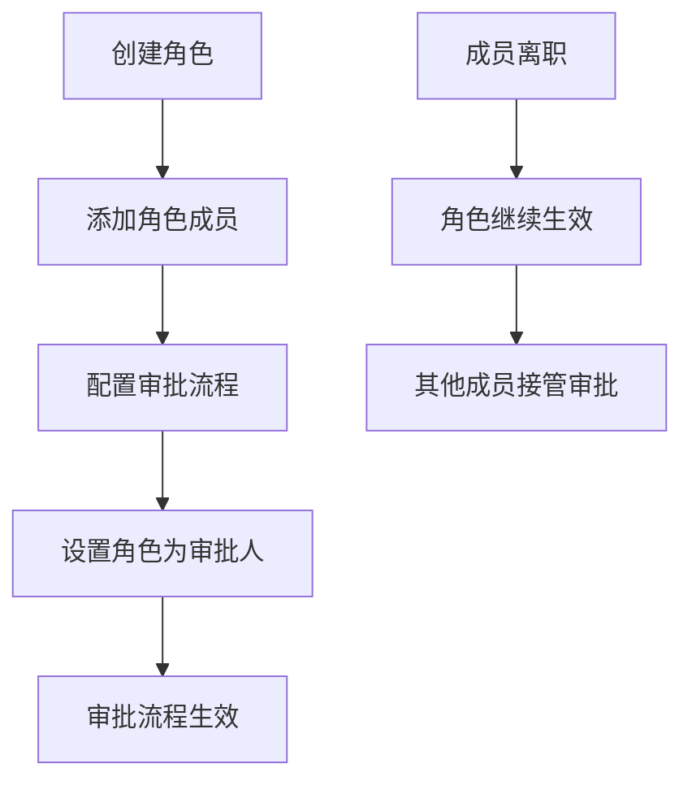

# IFeishuV3RoleApi API 文档

## 概述

`IFeishuV3RoleApi` 接口提供了飞书角色管理的功能。飞书角色指的是团队成员的专业分工类别，如人事、行政、财务等，一个角色可由一名或多名成员组成。

目前，角色主要用于应用审批场景。在审批管理后台，管理员可以选择某一角色作为审批人。例如，选择财务角色作为报销流程的审批人。这样做可以避免因成员离职变动导致的审批流失效的情况，角色内的其他成员可以继续完成审批，提高审批效率。

**接口详细文档**：[飞书角色资源介绍](https://open.feishu.cn/document/server-docs/contact-v3/functional_role/resource-introduction)

---

## 1. 创建角色

### 接口名称
创建角色

### 飞书接口URL
```
https://open.feishu.cn/open-apis/contact/v3/functional_roles
```

### 方法
POST

### 认证
**Tenant Access Token** (租户访问令牌)

### 参数

| 参数名 | 类型 | 必填 | 默认值 | 说明 |
|--------|------|------|--------|------|
| tenant_access_token | string | 是 | - | 应用访问凭证，用于身份鉴权 |
| roleRequest | RoleRequest | 是 | - | 创建角色请求体 |

#### RoleRequest 参数结构

| 参数名 | 类型 | 必填 | 说明 |
|--------|------|------|------|
| role_name | string | 是 | 角色名称，在同一租户下角色名称唯一 |

### 请求示例

#### JSON 请求体
```json
{
  "role_name": "财务专员"
}
```

#### C# 调用示例
```csharp
var roleRequest = new RoleRequest
{
    RoleName = "财务专员"
};

var response = await feishuApi.CreateRoleAsync(tenant_access_token, roleRequest);
```

### 响应

#### 成功响应示例
```json
{
  "code": 0,
  "msg": "success",
  "data": {
    "role_id": "6983456743213456789"
  }
}
```

#### 错误响应示例
```json
{
  "code": 2100057,
  "msg": "角色名称已存在",
  "data": {}
}
```

### 说明
- 角色名称在同一租户下必须唯一，不能重复创建
- 创建成功后返回新创建角色的 `role_id`
- 角色创建后为空角色，需要通过角色成员管理接口添加成员

---

## 2. 修改角色

### 接口名称
修改角色名称

### 飞书接口URL
```
https://open.feishu.cn/open-apis/contact/v3/functional_roles/{role_id}
```

### 方法
PUT

### 认证
**Tenant Access Token** (租户访问令牌)

### 参数

| 参数名 | 类型 | 必填 | 默认值 | 说明 |
|--------|------|------|--------|------|
| tenant_access_token | string | 是 | - | 应用访问凭证，用于身份鉴权 |
| role_id | string | 是 | - | 角色ID，路径参数 |
| roleRequest | RoleRequest | 是 | - | 修改角色请求体 |

#### RoleRequest 参数结构

| 参数名 | 类型 | 必填 | 说明 |
|--------|------|------|------|
| role_name | string | 是 | 新的角色名称 |

### 请求示例

#### JSON 请求体
```json
{
  "role_name": "高级财务专员"
}
```

#### URL 示例
```
PUT https://open.feishu.cn/open-apis/contact/v3/functional_roles/6983456743213456789
```

### 响应

#### 成功响应示例
```json
{
  "code": 0,
  "msg": "success",
  "data": {}
}
```

#### 错误响应示例
```json
{
  "code": 2100058,
  "msg": "角色不存在",
  "data": {}
}
```

### 说明
- 该接口只能修改角色的名称，不能修改角色的成员
- `role_id` 为路径参数，需要在URL中直接替换
- 修改角色名称不会影响角色的成员配置

---

## 3. 删除角色

### 接口名称
删除角色

### 飞书接口URL
```
https://open.feishu.cn/open-apis/contact/v3/functional_roles/{role_id}
```

### 方法
DELETE

### 认证
**Tenant Access Token** (租户访问令牌)

### 参数

| 参数名 | 类型 | 必填 | 默认值 | 说明 |
|--------|------|------|--------|------|
| tenant_access_token | string | 是 | - | 应用访问凭证，用于身份鉴权 |
| role_id | string | 是 | - | 角色ID，路径参数 |

### 请求示例

#### URL 示例
```
DELETE https://open.feishu.cn/open-apis/contact/v3/functional_roles/6983456743213456789
```

#### C# 调用示例
```csharp
var response = await feishuApi.DeleteRoleByIdAsync(tenant_access_token, "6983456743213456789");
```

### 响应

#### 成功响应示例
```json
{
  "code": 0,
  "msg": "success",
  "data": {}
}
```

#### 错误响应示例
```json
{
  "code": 2100058,
  "msg": "角色不存在",
  "data": {}
}
```

### 说明
- 删除角色是不可逆操作，请谨慎执行
- 角色删除后，相关的审批配置可能需要重新设置
- 如果角色正在被使用，建议先移除相关依赖再删除

---

## 数据模型

### RoleRequest（角色请求体）

| 属性 | 类型 | 必填 | 说明 |
|------|------|------|------|
| role_name | string | 是 | 角色名称，在同一租户下唯一 |

### RoleCreateResult（角色创建结果）

| 属性 | 类型 | 说明 |
|------|------|------|
| role_id | string | 创建成功后返回的角色ID |

---

## 常见错误码

| 错误码 | 说明 | 解决方案 |
|--------|------|----------|
| 99991663 | token not found | 检查访问令牌是否正确或已过期 |
| 2100057 | 角色名称已存在 | 使用其他角色名称，或检查是否已存在相同角色 |
| 2100058 | 角色不存在 | 确认角色ID是否正确，角色是否已被删除 |
| 99991400 | 参数错误 | 检查请求参数格式，确保role_name不为空 |
| 99991668 | 无权限访问 | 检查应用权限配置，确保具备角色管理权限 |

---

## 最佳实践

### 1. 角色创建与命名规范
```csharp
// 推荐的角色命名规范
var roleNamingPatterns = new[] {
    "{部门名}专员",      // 如：财务专员
    "{职能名}管理员",    // 如：系统管理员
    "{业务名}负责人",    // 如：产品负责人
    "{层级}{职能}"       // 如：高级工程师
};

// 创建角色的最佳实践
public async Task<string> CreateRoleWithValidation(IFeishuV3RoleApi api, string token, string roleName) {
    // 1. 参数验证
    if (string.IsNullOrWhiteSpace(roleName)) {
        throw new ArgumentException("角色名称不能为空");
    }
    
    if (roleName.Length > 50) {
        throw new ArgumentException("角色名称长度不能超过50个字符");
    }
    
    // 2. 创建请求
    var request = new RoleRequest { RoleName = roleName };
    
    try {
        var response = await api.CreateRoleAsync(token, request);
        return response.Data.RoleId;
    } catch (FeishuApiException ex) when (ex.Code == 2100057) {
        throw new InvalidOperationException($"角色 '{roleName}' 已存在", ex);
    }
}
```

### 2. 角色更新策略
```csharp
// 角色更新的安全策略
public async Task<bool> UpdateRoleSafely(IFeishuV3RoleApi api, string token, string roleId, string newName) {
    // 1. 检查角色是否存在（通过尝试获取信息）
    // 2. 验证新名称的合法性
    // 3. 执行更新操作
    
    try {
        var request = new RoleRequest { RoleName = newName };
        var response = await api.UpdateRoleAsync(token, roleId, request);
        return response.Code == 0;
    } catch (FeishuApiException ex) when (ex.Code == 2100058) {
        throw new InvalidOperationException($"角色ID '{roleId}' 不存在", ex);
    }
}
```

### 3. 角色删除前的依赖检查
```csharp
// 删除角色前的安全检查
public async Task<bool> SafeDeleteRole(IFeishuV3RoleApi api, string token, string roleId) {
    // 1. 检查角色是否存在
    // 2. 检查角色是否有关联的审批流程
    // 3. 检查角色是否还有成员
    // 4. 执行删除操作
    
    try {
        // 建议先获取角色成员信息
        // var members = await roleMemberApi.GetRoleMembersAsync(token, roleId);
        // if (members.Any()) {
        //     throw new InvalidOperationException("请先移除角色成员再删除角色");
        // }
        
        var response = await api.DeleteRoleByIdAsync(token, roleId);
        return response.Code == 0;
    } catch (FeishuApiException ex) when (ex.Code == 2100058) {
        throw new InvalidOperationException($"角色ID '{roleId}' 不存在", ex);
    }
}
```

### 4. 错误处理和重试机制
```csharp
// 统一的错误处理策略
public class RoleManager {
    private readonly IFeishuV3RoleApi _api;
    private readonly ILogger _logger;
    
    public async Task<string> CreateRoleWithRetry(string token, string roleName, int maxRetries = 3) {
        for (int attempt = 1; attempt <= maxRetries; attempt++) {
            try {
                var request = new RoleRequest { RoleName = roleName };
                var response = await _api.CreateRoleAsync(token, request);
                
                _logger.LogInformation($"角色 '{roleName}' 创建成功，ID: {response.Data.RoleId}");
                return response.Data.RoleId;
                
            } catch (FeishuApiException ex) when (ex.Code == 2100057) {
                // 角色已存在，不重试
                throw new InvalidOperationException($"角色 '{roleName}' 已存在", ex);
                
            } catch (HttpRequestException ex) when (attempt < maxRetries) {
                _logger.LogWarning($"角色创建失败，第 {attempt} 次尝试，{maxRetries - attempt} 次重试剩余");
                await Task.Delay(TimeSpan.FromSeconds(Math.Pow(2, attempt))); // 指数退避
                continue;
            }
        }
        
        throw new InvalidOperationException($"角色 '{roleName}' 创建失败，已达到最大重试次数");
    }
}
```

### 5. 角色名称管理
```csharp
// 角色名称冲突处理
public class RoleNameGenerator {
    private readonly IFeishuV3RoleApi _api;
    
    public async Task<string> GenerateUniqueRoleName(string token, string baseName) {
        var originalName = baseName;
        var suffix = 1;
        
        while (true) {
            var candidateName = suffix == 1 ? originalName : $"{originalName}_{suffix}";
            
            try {
                var request = new RoleRequest { RoleName = candidateName };
                await _api.CreateRoleAsync(token, request);
                
                // 如果创建成功，说明名称可用，需要删除这个测试创建的角色
                await _api.DeleteRoleByIdAsync(token, response.Data.RoleId);
                return candidateName;
                
            } catch (FeishuApiException ex) when (ex.Code == 2100057) {
                // 名称已存在，尝试下一个
                suffix++;
                continue;
            }
        }
    }
}
```

---

## 使用场景和业务流程

### 1. 审批流程中的角色配置


### 2. 角色生命周期管理
```csharp
// 完整的角色生命周期管理示例
public class RoleLifecycleManager {
    public async Task<RoleLifecycleResult> ManageRoleLifecycle(string token, string roleName) {
        // 1. 创建角色
        var roleId = await CreateRole(token, roleName);
        
        // 2. 更新角色信息
        await UpdateRole(token, roleId, $"{roleName}_Updated");
        
        // 3. （在实际场景中）管理角色成员
        // await AddMembersToRole(token, roleId, memberIds);
        
        // 4. 在适当时机删除角色
        // await DeleteRole(token, roleId);
        
        return new RoleLifecycleResult {
            RoleId = roleId,
            Status = "Completed"
        };
    }
}
```

---

## 更新记录

| 版本 | 日期 | 更新内容 |
|------|------|----------|
| v1.0.0 | 2025-11-20 | 初始版本，包含角色创建、更新、删除接口文档 |

---

## 相关文档

- [飞书角色 API 官方文档](https://open.feishu.cn/document/server-docs/contact-v3/functional_role/resource-introduction)
- [认证和权限管理文档](../Authentication-API-Documentation.md)
- [角色成员管理 API](../IFeishuV3RoleMemberApi.md) - 管理角色成员的接口
- [员工管理 API 文档](../IFeishuV1EmployeesApi.md)
- [部门管理 API 文档](../IFeishuV3DepartmentsApi.md)