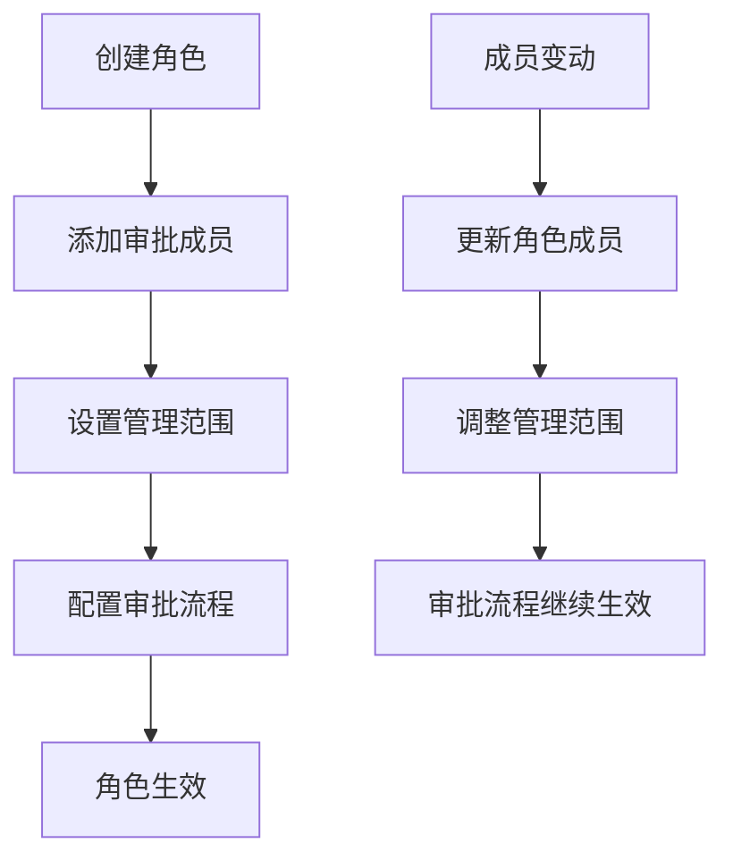
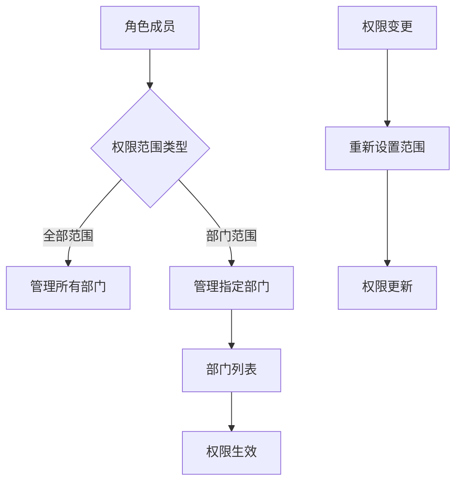

# 飞书角色成员管理 API 文档

## 概述

`IFeishuV3RoleMemberApi` 接口提供了飞书角色成员管理的功能。角色成员是指角色内添加的一个或多个用户。

可以将角色设置为审批流程的审批人，这样该角色内的成员均可处理审批。同时，每一个角色成员都可以设置管理范围，以便指定不同成员管理不同的部门。

**接口详细文档**：[飞书角色成员资源介绍](https://open.feishu.cn/document/server-docs/contact-v3/functional_role-member/resource-introduction)

---

## 1. 批量添加角色成员

### 接口名称
批量添加角色成员

### 飞书接口URL
```
https://open.feishu.cn/open-apis/contact/v3/functional_roles/{role_id}/members/batch_create
```

### 方法
POST

### 认证
**Tenant Access Token** (租户访问令牌)

### 参数

| 参数名 | 类型 | 必填 | 默认值 | 说明 |
|--------|------|------|--------|------|
| tenant_access_token | string | 是 | - | 应用访问凭证，用于身份鉴权 |
| role_id | string | 是 | - | 角色ID，路径参数 |
| roleMembersRequest | RoleMembersRequest | 是 | - | 角色成员的用户ID列表请求体 |
| user_id_type | string | 否 | open_id | 用户ID类型 |

#### RoleMembersRequest 参数结构

| 参数名 | 类型 | 必填 | 说明 |
|--------|------|------|------|
| members | List&lt;string&gt; | 是 | 待添加为角色成员的用户ID列表 |

### 请求示例

#### JSON 请求体
```json
{
  "members": [
    "ou_7d8a6e9d3c2c1b882487c7398e9d8f7",
    "ou_8e9f7a2b1c4d3e9f7c3d8e7a0b9f6c"
  ]
}
```

#### URL 示例
```
POST https://open.feishu.cn/open-apis/contact/v3/functional_roles/6983456743213456789/members/batch_create?user_id_type=open_id
```

### 响应

#### 成功响应示例
```json
{
  "code": 0,
  "msg": "success",
  "data": {
    "results": [
      {
        "user_id": "ou_7d8a6e9d3c2c1b882487c7398e9d8f7",
        "reason": 0
      },
      {
        "user_id": "ou_8e9f7a2b1c4d3e9f7c3d8e7a0b9f6c",
        "reason": 0
      }
    ]
  }
}
```

#### 错误响应示例
```json
{
  "code": 2100058,
  "msg": "角色不存在",
  "data": {}
}
```

### 说明
- `reason` 字段说明：0 表示成功，1 表示用户已存在，其他值表示失败
- 支持批量操作，一次最多可添加多个成员
- 用户ID类型需要与 `user_id_type` 参数保持一致

---

## 2. 批量设置成员管理范围

### 接口名称
批量设置成员管理范围

### 飞书接口URL
```
https://open.feishu.cn/open-apis/contact/v3/functional_roles/{role_id}/members/scopes
```

### 方法
POST

### 认证
**Tenant Access Token** (租户访问令牌)

### 参数

| 参数名 | 类型 | 必填 | 默认值 | 说明 |
|--------|------|------|--------|------|
| tenant_access_token | string | 是 | - | 应用访问凭证，用于身份鉴权 |
| role_id | string | 是 | - | 角色ID，路径参数 |
| membersScopeRequest | RoleMembersScopeRequest | 是 | - | 角色成员管理范围请求体 |
| user_id_type | string | 否 | open_id | 用户ID类型 |
| department_id_type | string | 否 | open_department_id | 部门ID类型 |

#### RoleMembersScopeRequest 参数结构

| 参数名 | 类型 | 必填 | 说明 |
|--------|------|------|------|
| members | List&lt;string&gt; | 是 | 角色成员的用户ID列表 |
| departments | List&lt;string&gt; | 是 | 设置角色成员可管理的部门ID列表 |

### 请求示例

#### JSON 请求体
```json
{
  "members": [
    "ou_7d8a6e9d3c2c1b882487c7398e9d8f7",
    "ou_8e9f7a2b1c4d3e9f7c3d8e7a0b9f6c"
  ],
  "departments": [
    "od-4e6789c92a3c8e02dbe89d3f9b87c",
    "od-8f9a2b1c4d3e9f7c3d8e7a0b9f6c"
  ]
}
```

#### URL 示例
```
POST https://open.feishu.cn/open-apis/contact/v3/functional_roles/6983456743213456789/members/scopes?user_id_type=open_id&department_id_type=open_department_id
```

### 响应

#### 成功响应示例
```json
{
  "code": 0,
  "msg": "success",
  "data": {
    "results": [
      {
        "user_id": "ou_7d8a6e9d3c2c1b882487c7398e9d8f7",
        "reason": 0
      },
      {
        "user_id": "ou_8e9f7a2b1c4d3e9f7c3d8e7a0b9f6c",
        "reason": 0
      }
    ]
  }
}
```

### 说明
- 管理范围是指角色成员可以管理的部门范围
- 可以同时为多个成员设置相同的部门管理范围
- 部门ID类型需要与 `department_id_type` 参数保持一致

---

## 3. 查询指定成员管理范围

### 接口名称
查询指定成员管理范围

### 飞书接口URL
```
https://open.feishu.cn/open-apis/contact/v3/functional_roles/{role_id}/members/{member_id}
```

### 方法
GET

### 认证
**Tenant Access Token** (租户访问令牌)

### 参数

| 参数名 | 类型 | 必填 | 默认值 | 说明 |
|--------|------|------|--------|------|
| tenant_access_token | string | 是 | - | 应用访问凭证，用于身份鉴权 |
| role_id | string | 是 | - | 角色ID，路径参数 |
| member_id | string | 是 | - | 角色成员的用户ID，路径参数 |
| user_id_type | string | 否 | open_id | 用户ID类型 |
| department_id_type | string | 否 | open_department_id | 部门ID类型 |

### 请求示例

#### URL 示例
```
GET https://open.feishu.cn/open-apis/contact/v3/functional_roles/6983456743213456789/members/ou_7d8a6e9d3c2c1b882487c7398e9d8f7?user_id_type=open_id&department_id_type=open_department_id
```

### 响应

#### 成功响应示例
```json
{
  "code": 0,
  "msg": "success",
  "data": {
    "member": {
      "user_id": "ou_7d8a6e9d3c2c1b882487c7398e9d8f7",
      "scope_type": "department",
      "department_ids": [
        "od-4e6789c92a3c8e02dbe89d3f9b87c",
        "od-8f9a2b1c4d3e9f7c3d8e7a0b9f6c"
      ]
    }
  }
}
```

#### 错误响应示例
```json
{
  "code": 2100060,
  "msg": "用户不在角色中",
  "data": {}
}
```

### 说明
- `scope_type` 为 "department" 表示部门范围，"all" 表示全部范围
- `member_id` 需要与 `user_id_type` 参数保持一致
- 如果用户不在该角色中，会返回相应的错误码

---

## 4. 查询角色所有成员

### 接口名称
查询角色所有成员

### 飞书接口URL
```
https://open.feishu.cn/open-apis/contact/v3/functional_roles/{role_id}/members
```

### 方法
GET

### 认证
**Tenant Access Token** (租户访问令牌)

### 参数

| 参数名 | 类型 | 必填 | 默认值 | 说明 |
|--------|------|------|--------|------|
| tenant_access_token | string | 是 | - | 应用访问凭证，用于身份鉴权 |
| role_id | string | 是 | - | 角色ID，路径参数 |
| page_size | int | 否 | 10 | 分页大小 |
| page_token | string | 否 | null | 分页标记 |
| user_id_type | string | 否 | open_id | 用户ID类型 |
| department_id_type | string | 否 | open_department_id | 部门ID类型 |

### 请求示例

#### URL 示例
```
GET https://open.feishu.cn/open-apis/contact/v3/functional_roles/6983456743213456789/members?page_size=50&user_id_type=open_id&department_id_type=open_department_id
```

### 响应

#### 成功响应示例
```json
{
  "code": 0,
  "msg": "success",
  "data": {
    "member": {
      "user_id": "ou_7d8a6e9d3c2c1b882487c7398e9d8f7",
      "scope_type": "department",
      "department_ids": [
        "od-4e6789c92a3c8e02dbe89d3f9b87c"
      ]
    },
    "page_token": "next_page_token_value",
    "has_more": true
  }
}
```

### 说明
- 该接口支持分页查询，通过 `page_token` 实现分页遍历
- 返回的数据结构与单个成员查询略有不同，需要注意区分
- 建议使用合理的分页大小以提高查询效率

---

## 5. 批量删除角色成员

### 接口名称
批量删除角色成员

### 飞书接口URL
```
https://open.feishu.cn/open-apis/contact/v3/functional_roles/{role_id}/members/batch_delete
```

### 方法
DELETE

### 认证
**Tenant Access Token** (租户访问令牌)

### 参数

| 参数名 | 类型 | 必填 | 默认值 | 说明 |
|--------|------|------|--------|------|
| tenant_access_token | string | 是 | - | 应用访问凭证，用于身份鉴权 |
| role_id | string | 是 | - | 角色ID，路径参数 |
| roleMembersRequest | RoleMembersRequest | 是 | - | 需删除的角色成员的用户ID列表请求体 |
| user_id_type | string | 否 | open_id | 用户ID类型 |

#### RoleMembersRequest 参数结构

| 参数名 | 类型 | 必填 | 说明 |
|--------|------|------|------|
| members | List&lt;string&gt; | 是 | 待删除的角色成员的用户ID列表 |

### 请求示例

#### JSON 请求体
```json
{
  "members": [
    "ou_7d8a6e9d3c2c1b882487c7398e9d8f7",
    "ou_8e9f7a2b1c4d3e9f7c3d8e7a0b9f6c"
  ]
}
```

#### URL 示例
```
DELETE https://open.feishu.cn/open-apis/contact/v3/functional_roles/6983456743213456789/members/batch_delete?user_id_type=open_id
```

### 响应

#### 成功响应示例
```json
{
  "code": 0,
  "msg": "success",
  "data": {
    "results": [
      {
        "user_id": "ou_7d8a6e9d3c2c1b882487c7398e9d8f7",
        "reason": 0
      },
      {
        "user_id": "ou_8e9f7a2b1c4d3e9f7c3d8e7a0b9f6c",
        "reason": 0
      }
    ]
  }
}
```

### 说明
- 删除成员会同时删除其管理范围设置
- `reason` 字段说明：0 表示成功，其他值表示失败原因
- 删除操作不可逆，请谨慎执行

---

## 数据模型

### RoleMembersRequest（角色成员请求体）

| 属性 | 类型 | 必填 | 说明 |
|------|------|------|------|
| members | List&lt;string&gt; | 是 | 用户ID列表 |

### RoleMembersScopeRequest（角色成员管理范围请求体）

| 属性 | 类型 | 必填 | 说明 |
|------|------|------|------|
| members | List&lt;string&gt; | 是 | 角色成员的用户ID列表 |
| departments | List&lt;string&gt; | 是 | 可管理的部门ID列表 |

### RoleAssignmentResult（角色分配结果）

| 属性 | 类型 | 说明 |
|------|------|------|
| results | List&lt;RoleAssignmentInfo&gt; | 角色分配结果列表 |

### RoleAssignmentInfo（角色分配信息）

| 属性 | 类型 | 说明 |
|------|------|------|
| user_id | string | 用户ID |
| reason | int | 分配原因代码（0=成功，1=已存在，其他=失败） |

### RoleMemberScopeResult（角色成员权限范围结果）

| 属性 | 类型 | 说明 |
|------|------|------|
| member | RoleMemberScopeInfo | 角色成员权限范围信息 |

### RoleMemberScopeInfo（角色成员权限范围信息）

| 属性 | 类型 | 说明 |
|------|------|------|
| user_id | string | 用户ID |
| scope_type | string | 权限范围类型（"department"/"all"） |
| department_ids | List&lt;string&gt; | 部门ID列表 |

---

## 常见错误码

| 错误码 | 说明 | 解决方案 |
|--------|------|----------|
| 99991663 | token not found | 检查访问令牌是否正确或已过期 |
| 2100058 | 角色不存在 | 确认角色ID是否正确，角色是否已被删除 |
| 2100060 | 用户不在角色中 | 确认用户是否为该角色的成员 |
| 2100061 | 用户已在角色中 | 添加成员时用户已存在，无需重复添加 |
| 99991400 | 参数错误 | 检查请求参数格式和必填参数 |
| 99991668 | 无权限访问 | 检查应用权限配置，确保具备角色成员管理权限 |

---

## 最佳实践

### 1. 批量操作的错误处理
```csharp
// 批量添加成员的最佳实践
public async Task<Dictionary<string, bool>> BatchAddMembersWithValidation(
    IFeishuV3RoleMemberApi api, 
    string token, 
    string roleId, 
    List<string> userIds) {
    
    var request = new RoleMembersRequest { Members = userIds };
    var response = await api.BatchAddMemberAsync(token, roleId, request);
    
    var results = new Dictionary<string, bool>();
    foreach (var result in response.Data.Results) {
        results[result.UserId] = result.Reason == 0;
        
        if (result.Reason != 0) {
            _logger.LogWarning($"用户 {result.UserId} 添加失败，原因代码：{result.Reason}");
        }
    }
    
    return results;
}
```

### 2. 分页查询角色成员
```csharp
// 分页查询所有角色成员
public async Task<List<RoleMemberScopeInfo>> GetAllRoleMembers(
    IFeishuV3RoleMemberApi api, 
    string token, 
    string roleId) {
    
    var allMembers = new List<RoleMemberScopeInfo>();
    var pageSize = 50;
    var pageToken = "";
    
    do {
        var response = await api.GetMembersAsync(
            token, roleId, 
            page_size: pageSize, 
            page_token: string.IsNullOrEmpty(pageToken) ? null : pageToken
        );
        
        allMembers.Add(response.Data.Member);
        pageToken = response.Data.PageToken;
        
    } while (!string.IsNullOrEmpty(pageToken));
    
    return allMembers;
}
```

### 3. 管理范围设置的完整性检查
```csharp
// 设置管理范围前的完整性检查
public async Task<bool> SetMemberScopeWithValidation(
    IFeishuV3RoleMemberApi api,
    string token,
    string roleId,
    List<string> userIds,
    List<string> departmentIds) {
    
    // 1. 验证用户是否在角色中
    foreach (var userId in userIds) {
        try {
            await api.GetMembersSopesAsync(token, roleId, userId);
        } catch (FeishuApiException ex) when (ex.Code == 2100060) {
            throw new InvalidOperationException($"用户 {userId} 不在角色 {roleId} 中");
        }
    }
    
    // 2. 设置管理范围
    var request = new RoleMembersScopeRequest {
        Members = userIds,
        Departments = departmentIds
    };
    
    var response = await api.BatchAddMembersSopesAsync(token, roleId, request);
    
    // 3. 验证设置结果
    return response.Data.Results.All(r => r.Reason == 0);
}
```

### 4. 角色成员生命周期管理
```csharp
// 完整的角色成员管理流程
public class RoleMemberLifecycleManager {
    private readonly IFeishuV3RoleMemberApi _api;
    private readonly ILogger _logger;
    
    public async Task ManageRoleMemberLifecycle(string token, string roleId, List<string> userIds) {
        try {
            // 1. 批量添加成员
            var addRequest = new RoleMembersRequest { Members = userIds };
            var addResult = await _api.BatchAddMemberAsync(token, roleId, addRequest);
            
            var successfullyAdded = addResult.Data.Results
                .Where(r => r.Reason == 0)
                .Select(r => r.UserId)
                .ToList();
            
            _logger.LogInformation($"成功添加 {successfullyAdded.Count} 个成员到角色 {roleId}");
            
            // 2. 设置管理范围（可选）
            if (successfullyAdded.Any()) {
                var scopeRequest = new RoleMembersScopeRequest {
                    Members = successfullyAdded,
                    Departments = ["default_department_id"] // 根据业务需求设置
                };
                
                var scopeResult = await _api.BatchAddMembersSopesAsync(token, roleId, scopeRequest);
                _logger.LogInformation($"为 {scopeResult.Data.Results.Count(r => r.Reason == 0)} 个成员设置了管理范围");
            }
            
            // 3. 查询最终结果
            var allMembers = await GetAllRoleMembers(_api, token, roleId);
            _logger.LogInformation($"角色 {roleId} 当前共有 {allMembers.Count} 个成员");
            
        } catch (Exception ex) {
            _logger.LogError(ex, $"角色成员管理失败：{ex.Message}");
            throw;
        }
    }
}
```

### 5. 错误重试和幂等性处理
```csharp
// 带重试机制的操作
public async Task<bool> ExecuteOperationWithRetry<T>(
    Func<T> operation,
    int maxRetries = 3,
    TimeSpan? delay = null) where T : Task<FeishuApiResult<object>> {
    
    var retryDelay = delay ?? TimeSpan.FromSeconds(1);
    
    for (int attempt = 1; attempt <= maxRetries; attempt++) {
        try {
            var result = await operation();
            return result.Code == 0;
            
        } catch (HttpRequestException ex) when (attempt < maxRetries) {
            _logger.LogWarning($"操作失败，第 {attempt} 次重试，{maxRetries - attempt} 次剩余");
            await Task.Delay(retryDelay);
            retryDelay = TimeSpan.FromSeconds(retryDelay.TotalSeconds * 2); // 指数退避
            continue;
            
        } catch (FeishuApiException ex) {
            // 业务异常不重试
            _logger.LogError($"业务错误：{ex.Code} - {ex.Message}");
            throw;
        }
    }
    
    throw new InvalidOperationException("操作失败，已达到最大重试次数");
}
```

---

## 业务场景和流程

### 1. 审批角色配置流程


### 2. 权限范围管理


---

## 更新记录

| 版本 | 日期 | 更新内容 |
|------|------|----------|
| v1.0.0 | 2025-11-20 | 初始版本，包含角色成员管理的完整接口文档 |

---

## 相关文档

- [飞书角色成员 API 官方文档](https://open.feishu.cn/document/server-docs/contact-v3/functional_role-member/resource-introduction)
- [认证和权限管理文档](../Authentication-API-Documentation.md)
- [角色管理 API 文档](../IFeishuV3RoleApi.md)
- [员工管理 API 文档](../IFeishuV1EmployeesApi.md)
- [部门管理 API 文档](../IFeishuV3DepartmentsApi.md)