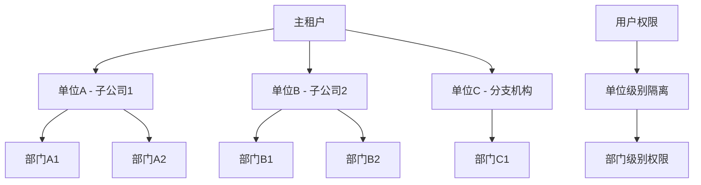
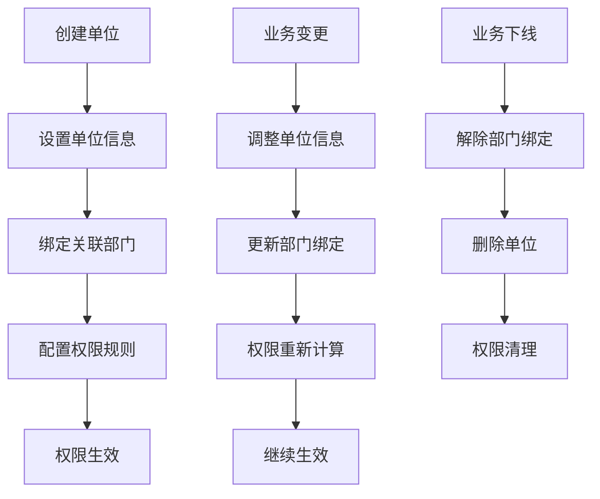

# IFeishuV3UnitApi API 文档

## 概述

`IFeishuV3UnitApi` 接口提供了飞书通讯录单位管理的功能。通讯录的单位用于代表企业中的"子公司"、"分支机构"这类组织实体。

例如，你的企业下存在负责不同业务的两家子公司，那么你可以在同一个租户内，为两家子公司分别创建对应的单位资源。目前单位资源的主要作用是在部分用户权限上实现"子公司"级别的权限隔离。

**接口详细文档**：[飞书单位资源概述](https://open.feishu.cn/document/server-docs/contact-v3/unit/overview)

---

## 1. 创建单位

### 接口名称
创建单位

### 飞书接口URL
```
https://open.feishu.cn/open-apis/contact/v3/unit
```

### 方法
POST

### 认证
**Tenant Access Token** (租户访问令牌)

### 参数

| 参数名 | 类型 | 必填 | 默认值 | 说明 |
|--------|------|------|--------|------|
| tenant_access_token | string | 是 | - | 应用访问凭证，用于身份鉴权 |
| unitInfoRequest | UnitInfoRequest | 是 | - | 单位信息请求体 |

#### UnitInfoRequest 参数结构

| 参数名 | 类型 | 必填 | 默认值 | 说明 |
|--------|------|------|--------|------|
| unit_id | string | 否 | 系统生成 | 自定义单位ID，租户内唯一，创建后不可修改 |
| name | string | 是 | - | 单位名字 |
| unit_type | string | 是 | - | 自定义单位类型，创建后不可修改 |

### 请求示例

#### JSON 请求体
```json
{
  "unit_id": "BU121",
  "name": "消费者事业部",
  "unit_type": "子公司"
}
```

#### C# 调用示例
```csharp
var unitRequest = new UnitInfoRequest
{
    UnitId = "BU121",
    Name = "消费者事业部",
    UnitType = "子公司"
};

var response = await feishuApi.CreateUnitAsync(tenant_access_token, unitRequest);
```

### 响应

#### 成功响应示例
```json
{
  "code": 0,
  "msg": "success",
  "data": {
    "unit_id": "6991111111111111111"
  }
}
```

#### 错误响应示例
```json
{
  "code": 2100063,
  "msg": "单位名称和类型重复",
  "data": {}
}
```

### 说明
- 在租户内，`name` 和 `unit_type` 不允许同时重复
- 自定义 `unit_id` 时需确保租户内唯一，创建后不可修改
- `unit_type` 创建后也不可修改，请谨慎设置

---

## 2. 修改单位名称

### 接口名称
修改单位名称

### 飞书接口URL
```
https://open.feishu.cn/open-apis/contact/v3/unit/{unit_id}
```

### 方法
PATCH

### 认证
**Tenant Access Token** (租户访问令牌)

### 参数

| 参数名 | 类型 | 必填 | 默认值 | 说明 |
|--------|------|------|--------|------|
| tenant_access_token | string | 是 | - | 应用访问凭证，用于身份鉴权 |
| unit_id | string | 是 | - | 单位ID，路径参数 |
| nameUpdateRequest | UnitNameUpdateRequest | 是 | - | 单位名称更新请求体 |

#### UnitNameUpdateRequest 参数结构

| 参数名 | 类型 | 必填 | 说明 |
|--------|------|------|------|
| name | string | 是 | 单位的新名称 |

### 请求示例

#### JSON 请求体
```json
{
  "name": "消费者业务部"
}
```

#### URL 示例
```
PATCH https://open.feishu.cn/open-apis/contact/v3/unit/6991111111111111111
```

### 响应

#### 成功响应示例
```json
{
  "code": 0,
  "msg": "success",
  "data": {}
}
```

#### 错误响应示例
```json
{
  "code": 2100062,
  "msg": "单位不存在",
  "data": {}
}
```

### 说明
- 该接口只能修改单位名称，不能修改单位类型或ID
- `unit_id` 为路径参数，需要在URL中直接替换
- 修改名称时需要确保不会与现有单位产生名称和类型重复

---

## 3. 绑定部门到单位

### 接口名称
绑定部门到单位

### 飞书接口URL
```
https://open.feishu.cn/open-apis/contact/v3/unit/bind_department
```

### 方法
POST

### 认证
**Tenant Access Token** (租户访问令牌)

### 参数

| 参数名 | 类型 | 必填 | 默认值 | 说明 |
|--------|------|------|--------|------|
| tenant_access_token | string | 是 | - | 应用访问凭证，用于身份鉴权 |
| unitBindDepartment | UnitBindDepartmentRequest | 是 | - | 部门与单位的绑定关系请求体 |

#### UnitBindDepartmentRequest 参数结构

| 参数名 | 类型 | 必填 | 说明 |
|--------|------|------|------|
| unit_id | string | 是 | 单位ID |
| department_id | string | 是 | 单位关联的部门ID |
| department_id_type | string | 否 | open_department_id | 部门ID类型 |

### 请求示例

#### JSON 请求体
```json
{
  "unit_id": "6991111111111111111",
  "department_id": "od-4e6789c92a3c8e02dbe89d3f9b87c",
  "department_id_type": "open_department_id"
}
```

### 响应

#### 成功响应示例
```json
{
  "code": 0,
  "msg": "success",
  "data": {
    "unit_id": "6991111111111111111"
  }
}
```

#### 错误响应示例
```json
{
  "code": 2100064,
  "msg": "部门已绑定其他单位",
  "data": {}
}
```

### 说明
- 单个单位可关联的部门数量上限为 1,000
- 同一个部门只能关联一个单位
- 绑定关系建立后，该部门将归属于指定单位的管理范围

---

## 4. 解除部门与单位绑定

### 接口名称
解除部门与单位绑定

### 飞书接口URL
```
https://open.feishu.cn/open-apis/contact/v3/unit/unbind_department
```

### 方法
POST

### 认证
**Tenant Access Token** (租户访问令牌)

### 参数

| 参数名 | 类型 | 必填 | 默认值 | 说明 |
|--------|------|------|--------|------|
| tenant_access_token | string | 是 | - | 应用访问凭证，用于身份鉴权 |
| unitBindDepartment | UnitBindDepartmentRequest | 是 | - | 部门与单位的绑定关系请求体 |

#### UnitBindDepartmentRequest 参数结构

| 参数名 | 类型 | 必填 | 说明 |
|--------|------|------|------|
| unit_id | string | 是 | 单位ID |
| department_id | string | 是 | 需要解除绑定的部门ID |
| department_id_type | string | 否 | open_department_id | 部门ID类型 |

### 请求示例

#### JSON 请求体
```json
{
  "unit_id": "6991111111111111111",
  "department_id": "od-4e6789c92a3c8e02dbe89d3f9b87c",
  "department_id_type": "open_department_id"
}
```

### 响应

#### 成功响应示例
```json
{
  "code": 0,
  "msg": "success",
  "data": {
    "unit_id": "6991111111111111111"
  }
}
```

### 说明
- 解除绑定后，该部门将不再归属于任何单位
- 解除操作不会影响部门的正常业务功能
- 支持批量解除操作（通过多次调用实现）

---

## 5. 获取单位绑定的部门列表

### 接口名称
获取单位部门列表

### 飞书接口URL
```
https://open.feishu.cn/open-apis/contact/v3/unit/list_department
```

### 方法
GET

### 认证
**Tenant Access Token** (租户访问令牌)

### 参数

| 参数名 | 类型 | 必填 | 默认值 | 说明 |
|--------|------|------|--------|------|
| tenant_access_token | string | 是 | - | 应用访问凭证，用于身份鉴权 |
| unit_id | string | 是 | - | 单位ID，查询参数 |
| page_size | int | 否 | 10 | 分页大小 |
| page_token | string | 否 | null | 分页标记 |
| department_id_type | string | 否 | open_department_id | 部门ID类型 |

### 请求示例

#### URL 示例
```
GET https://open.feishu.cn/open-apis/contact/v3/unit/list_department?unit_id=6991111111111111111&page_size=50&department_id_type=open_department_id
```

### 响应

#### 成功响应示例
```json
{
  "code": 0,
  "msg": "success",
  "data": {
    "departmentlist": [
      {
        "unit_id": "6991111111111111111",
        "department_id": "od-4e6789c92a3c8e02dbe89d3f9b87c"
      },
      {
        "unit_id": "6991111111111111111",
        "department_id": "od-8f9a2b1c4d3e9f7c3d8e7a0b9f6c"
      }
    ],
    "page_token": "next_page_token_value",
    "has_more": true
  }
}
```

### 说明
- 该接口支持分页查询，通过 `page_token` 实现分页遍历
- 返回的数据包含部门ID和所属单位ID的对应关系
- 建议使用合理的分页大小以提高查询效率

---

## 6. 获取指定单位信息

### 接口名称
获取单位信息

### 飞书接口URL
```
https://open.feishu.cn/open-apis/contact/v3/unit/{unit_id}
```

### 方法
GET

### 认证
**Tenant Access Token** (租户访问令牌)

### 参数

| 参数名 | 类型 | 必填 | 默认值 | 说明 |
|--------|------|------|--------|------|
| tenant_access_token | string | 是 | - | 应用访问凭证，用于身份鉴权 |
| unit_id | string | 是 | - | 单位ID，路径参数 |

### 请求示例

#### URL 示例
```
GET https://open.feishu.cn/open-apis/contact/v3/unit/6991111111111111111
```

### 响应

#### 成功响应示例
```json
{
  "code": 0,
  "msg": "success",
  "data": {
    "unit_id": "6991111111111111111",
    "name": "消费者事业部",
    "unit_type": "子公司"
  }
}
```

#### 错误响应示例
```json
{
  "code": 2100062,
  "msg": "单位不存在",
  "data": {}
}
```

### 说明
- 返回指定单位的完整基本信息
- `unit_id` 为路径参数，需要在URL中直接替换
- 如果单位不存在，会返回相应的错误码

---

## 7. 获取租户单位列表

### 接口名称
获取单位列表

### 飞书接口URL
```
https://open.feishu.cn/open-apis/contact/v3/unit
```

### 方法
GET

### 认证
**Tenant Access Token** (租户访问令牌)

### 参数

| 参数名 | 类型 | 必填 | 默认值 | 说明 |
|--------|------|------|--------|------|
| tenant_access_token | string | 是 | - | 应用访问凭证，用于身份鉴权 |
| page_size | int | 否 | 10 | 分页大小 |
| page_token | string | 否 | null | 分页标记 |

### 请求示例

#### URL 示例
```
GET https://open.feishu.cn/open-apis/contact/v3/unit?page_size=50
```

### 响应

#### 成功响应示例
```json
{
  "code": 0,
  "msg": "success",
  "data": {
    "unitlist": [
      {
        "unit_id": "6991111111111111111",
        "name": "消费者事业部",
        "unit_type": "子公司"
      },
      {
        "unit_id": "6991111111111111112",
        "name": "企业服务部",
        "unit_type": "事业部"
      }
    ],
    "page_token": "next_page_token_value",
    "has_more": true
  }
}
```

### 说明
- 该接口支持分页查询当前租户内的所有单位
- 列表内主要包含各单位的 ID、名字、类型信息
- 适用于需要展示所有单位或进行单位选择的场景

---

## 8. 删除单位

### 接口名称
删除单位

### 飞书接口URL
```
https://open.feishu.cn/open-apis/contact/v3/unit/{unit_id}
```

### 方法
DELETE

### 认证
**Tenant Access Token** (租户访问令牌)

### 参数

| 参数名 | 类型 | 必填 | 默认值 | 说明 |
|--------|------|------|--------|------|
| tenant_access_token | string | 是 | - | 应用访问凭证，用于身份鉴权 |
| unit_id | string | 是 | - | 需删除的单位ID，路径参数 |

### 请求示例

#### URL 示例
```
DELETE https://open.feishu.cn/open-apis/contact/v3/unit/6991111111111111111
```

#### C# 调用示例
```csharp
var response = await feishuApi.DeleteUnitByIdAsync(tenant_access_token, "6991111111111111111");
```

### 响应

#### 成功响应示例
```json
{
  "code": 0,
  "msg": "success",
  "data": {}
}
```

#### 错误响应示例
```json
{
  "code": 2100062,
  "msg": "单位不存在",
  "data": {}
}
```

### 说明
- 删除单位是不可逆操作，请谨慎执行
- 删除单位前建议先解除所有部门绑定关系
- 单位删除后，相关的权限配置可能需要重新设置

---

## 数据模型

### UnitInfoRequest（单位信息请求体）

| 属性 | 类型 | 必填 | 默认值 | 说明 |
|------|------|------|--------|------|
| unit_id | string | 否 | 系统生成 | 自定义单位ID，租户内唯一 |
| name | string | 是 | - | 单位名字 |
| unit_type | string | 是 | - | 自定义单位类型 |

### UnitNameUpdateRequest（单位名称更新请求体）

| 属性 | 类型 | 必填 | 说明 |
|------|------|------|------|
| name | string | 是 | 单位的新名称 |

### UnitBindDepartmentRequest（部门绑定请求体）

| 属性 | 类型 | 必填 | 默认值 | 说明 |
|------|------|------|--------|------|
| unit_id | string | 是 | - | 单位ID |
| department_id | string | 是 | - | 单位关联的部门ID |
| department_id_type | string | 否 | open_department_id | 部门ID类型 |

### UnitCreateResult（单位创建结果）

| 属性 | 类型 | 说明 |
|------|------|------|
| unit_id | string | 创建成功的单位ID |

### UnitInfo（单位信息）

| 属性 | 类型 | 说明 |
|------|------|------|
| unit_id | string | 单位ID |
| name | string | 单位名称 |
| unit_type | string | 单位类型 |

### UnitListDataResult（单位列表结果）

| 属性 | 类型 | 说明 |
|------|------|------|
| unitlist | List&lt;UnitInfo&gt; | 单位列表 |
| page_token | string | 分页标记 |
| has_more | boolean | 是否有更多数据 |

### UnitDepartmentListResult（单位部门列表结果）

| 属性 | 类型 | 说明 |
|------|------|------|
| departmentlist | List&lt;DepartmentUnit&gt; | 部门列表 |
| page_token | string | 分页标记 |
| has_more | boolean | 是否有更多数据 |

### DepartmentUnit（部门单位关联）

| 属性 | 类型 | 说明 |
|------|------|------|
| unit_id | string | 单位ID |
| department_id | string | 部门ID |

---

## 常见错误码

| 错误码 | 说明 | 解决方案 |
|--------|------|----------|
| 99991663 | token not found | 检查访问令牌是否正确或已过期 |
| 2100062 | 单位不存在 | 确认单位ID是否正确，单位是否已被删除 |
| 2100063 | 单位名称和类型重复 | 使用其他名称或类型，确保名称+类型组合唯一 |
| 2100064 | 部门已绑定其他单位 | 先解除部门与其他单位的绑定关系 |
| 2100065 | 单位关联的部门数量超限 | 单位关联的部门数量不能超过1,000个 |
| 99991400 | 参数错误 | 检查请求参数格式，确保必填参数不为空 |
| 99991668 | 无权限访问 | 检查应用权限配置，确保具备单位管理权限 |

---

## 最佳实践

### 1. 单位创建和命名规范
```csharp
// 单位创建的最佳实践
public async Task<string> CreateUnitWithValidation(
    IFeishuV3UnitApi api, 
    string token, 
    string name, 
    string unitType, 
    string? customUnitId = null) {
    
    // 1. 参数验证
    if (string.IsNullOrWhiteSpace(name) || string.IsNullOrWhiteSpace(unitType)) {
        throw new ArgumentException("单位名称和类型不能为空");
    }
    
    if (name.Length > 100 || unitType.Length > 50) {
        throw new ArgumentException("参数长度超限");
    }
    
    // 2. 检查名称和类型组合是否已存在
    var existingUnits = await GetUnitListPaginated(api, token);
    if (existingUnits.Any(u => u.Name == name && u.UnitType == unitType)) {
        throw new InvalidOperationException($"单位名称 '{name}' 和类型 '{unitType}' 的组合已存在");
    }
    
    // 3. 创建单位
    var request = new UnitInfoRequest {
        UnitId = customUnitId,
        Name = name,
        UnitType = unitType
    };
    
    var response = await api.CreateUnitAsync(token, request);
    return response.Data.UnitId;
}
```

### 2. 部门绑定管理
```csharp
// 部门绑定的安全操作
public class UnitDepartmentManager {
    private readonly IFeishuV3UnitApi _api;
    private readonly ILogger _logger;
    
    public async Task<bool> BindDepartmentSafely(
        string token, 
        string unitId, 
        string departmentId) {
        
        try {
            // 1. 检查单位是否存在
            var unitInfo = await _api.GetUnitInfoAsync(token, unitId);
            if (unitInfo.Code != 0) {
                throw new InvalidOperationException($"单位 {unitId} 不存在");
            }
            
            // 2. 绑定部门
            var request = new UnitBindDepartmentRequest {
                UnitId = unitId,
                DepartmentId = departmentId,
                DepartmentIdType = "open_department_id"
            };
            
            var response = await _api.BindDepartmentAsync(token, request);
            
            _logger.LogInformation($"部门 {departmentId} 成功绑定到单位 {unitId}");
            return response.Code == 0;
            
        } catch (FeishuApiException ex) when (ex.Code == 2100064) {
            _logger.LogWarning($"部门 {departmentId} 已绑定到其他单位");
            throw new InvalidOperationException("部门已绑定到其他单位，请先解除绑定", ex);
        }
    }
    
    public async Task<List<DepartmentUnit>> GetAllUnitDepartments(
        string token, 
        string unitId) {
        
        var allDepartments = new List<DepartmentUnit>();
        var pageSize = 50;
        var pageToken = "";
        
        do {
            var response = await _api.GetDepartmentListAsync(
                token, unitId, 
                page_size: pageSize,
                page_token: string.IsNullOrEmpty(pageToken) ? null : pageToken
            );
            
            allDepartments.AddRange(response.Data.DepartmentList);
            pageToken = response.Data.PageToken;
            
        } while (!string.IsNullOrEmpty(pageToken));
        
        return allDepartments;
    }
}
```

### 3. 单位生命周期管理
```csharp
// 完整的单位生命周期管理
public class UnitLifecycleManager {
    public async Task<UnitLifecycleResult> ManageUnitLifecycle(
        string token, 
        string name, 
        string unitType, 
        List<string> departmentIds) {
        
        // 1. 创建单位
        var unitId = await CreateUnitWithValidation(_api, token, name, unitType);
        
        try {
            // 2. 绑定部门
            foreach (var deptId in departmentIds) {
                await BindDepartmentSafely(token, unitId, deptId);
            }
            
            // 3. 更新单位信息（如需要）
            // await UpdateUnitName(token, unitId, $"{name}_Updated");
            
            // 4. 获取最终状态
            var finalInfo = await _api.GetUnitInfoAsync(token, unitId);
            var departmentList = await GetAllUnitDepartments(token, unitId);
            
            return new UnitLifecycleResult {
                UnitId = unitId,
                Name = finalInfo.Data.Name,
                UnitType = finalInfo.Data.UnitType,
                DepartmentCount = departmentList.Count,
                Status = "Active"
            };
            
        } catch (Exception ex) {
            // 发生异常时清理已创建的资源
            await CleanupUnit(token, unitId);
            throw new InvalidOperationException("单位创建失败，已回滚", ex);
        }
    }
    
    private async Task CleanupUnit(string token, string unitId) {
        try {
            // 解除所有部门绑定
            var departments = await GetAllUnitDepartments(token, unitId);
            foreach (var dept in departments) {
                var unbindRequest = new UnitBindDepartmentRequest {
                    UnitId = unitId,
                    DepartmentId = dept.DepartmentId
                };
                await _api.UnBindDepartmentAsync(token, unbindRequest);
            }
            
            // 删除单位
            await _api.DeleteUnitByIdAsync(token, unitId);
        } catch (Exception cleanupEx) {
            _logger.LogError(cleanupEx, $"清理单位 {unitId} 时发生错误");
        }
    }
}
```

### 4. 分页查询优化
```csharp
// 高效的分页查询实现
public class UnitQueryService {
    public async Task<List<UnitInfo>> GetUnitListPaginated(
        IFeishuV3UnitApi api, 
        string token, 
        int pageSize = 100) {
        
        var allUnits = new List<UnitInfo>();
        var pageToken = "";
        
        do {
            var response = await api.GetUnitListAsync(
                token, 
                page_size: pageSize,
                page_token: string.IsNullOrEmpty(pageToken) ? null : pageToken
            );
            
            allUnits.AddRange(response.Data.UnitList);
            pageToken = response.Data.PageToken;
            
        } while (!string.IsNullOrEmpty(pageToken));
        
        return allUnits;
    }
    
    public async Task<Dictionary<string, List<DepartmentUnit>>> GetAllUnitsWithDepartments(
        IFeishuV3UnitApi api, 
        string token) {
        
        var result = new Dictionary<string, List<DepartmentUnit>>();
        
        // 1. 获取所有单位
        var units = await GetUnitListPaginated(api, token);
        
        // 2. 并行获取每个单位的部门列表
        var tasks = units.Select(async unit => {
            try {
                var departments = await GetUnitDepartmentsPaginated(api, token, unit.UnitId);
                result[unit.UnitId] = departments;
            } catch (Exception ex) {
                _logger.LogWarning($"获取单位 {unit.UnitId} 的部门列表失败：{ex.Message}");
                result[unit.UnitId] = new List<DepartmentUnit>();
            }
        });
        
        await Task.WhenAll(tasks);
        
        return result;
    }
}
```

### 5. 错误处理和重试机制
```csharp
// 统一的错误处理和重试策略
public class UnitOperationService {
    private readonly IFeishuV3UnitApi _api;
    private readonly ILogger _logger;
    
    public async Task<bool> ExecuteWithRetry<T>(
        Func<Task<T>> operation,
        string operationName,
        int maxRetries = 3) where T : FeishuApiResult {
        
        for (int attempt = 1; attempt <= maxRetries; attempt++) {
            try {
                var result = await operation();
                if (result.Code == 0) {
                    return true;
                }
                
                // 业务错误不重试
                _logger.LogError($"{operationName} 失败，业务错误：{result.Code} - {result.Msg}");
                return false;
                
            } catch (HttpRequestException ex) when (attempt < maxRetries) {
                var delay = TimeSpan.FromSeconds(Math.Pow(2, attempt));
                _logger.LogWarning($"{operationName} 网络错误，第 {attempt} 次重试，延迟 {delay.TotalSeconds}s");
                await Task.Delay(delay);
                continue;
                
            } catch (Exception ex) {
                _logger.LogError(ex, $"{operationName} 发生未预期错误");
                throw;
            }
        }
        
        throw new InvalidOperationException($"{operationName} 失败，已达到最大重试次数");
    }
}
```

---

## 业务场景和流程

### 1. 多租户权限隔离架构


### 2. 单位管理业务流程


---

## 更新记录

| 版本 | 日期 | 更新内容 |
|------|------|----------|
| v1.0.0 | 2025-11-20 | 初始版本，包含单位管理的完整接口文档 |

---

## 相关文档

- [飞书单位资源 API 官方文档](https://open.feishu.cn/document/server-docs/contact-v3/unit/overview)
- [认证和权限管理文档](../Authentication-API-Documentation.md)
- [部门管理 API 文档](../IFeishuV3DepartmentsApi.md)
- [员工管理 API 文档](../IFeishuV1EmployeesApi.md)
- [角色管理 API 文档](../IFeishuV3RoleApi.md)