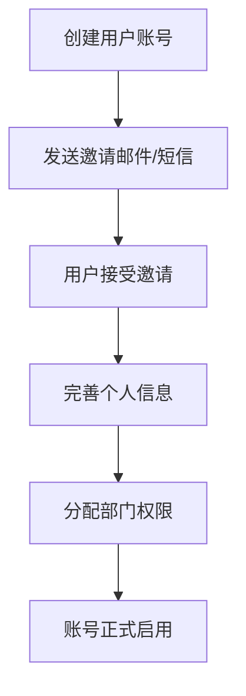
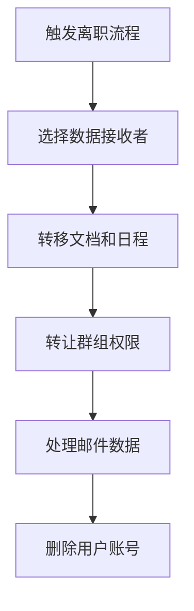
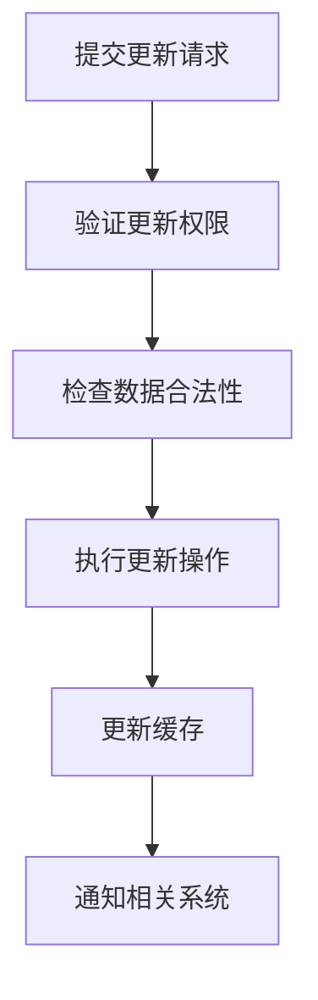

# 飞书用户管理 API 文档

## 概述

`IFeishuV3UserApi` 接口提供了飞书用户管理的功能。飞书用户是飞书通讯录中的基础资源，对应企业组织架构中的成员实体。该接口支持用户的创建、更新、查询、删除以及恢复等完整的用户生命周期管理。

**接口详细文档**：[飞书用户字段概述](https://open.feishu.cn/document/server-docs/contact-v3/user/field-overview)

---

## 1. 创建用户

### 接口名称
创建用户（员工入职）

### 飞书接口URL
```
https://open.feishu.cn/open-apis/contact/v3/users
```

### 方法
POST

### 认证
**Tenant Access Token** (租户访问令牌)

### 参数

| 参数名 | 类型 | 必填 | 默认值 | 说明 |
|--------|------|------|--------|------|
| tenant_access_token | string | 是 | - | 应用访问凭证，用于身份鉴权 |
| userModel | CreateUserRequest | 是 | - | 创建用户的请求体 |
| user_id_type | string | 否 | open_id | 用户ID类型 |
| department_id_type | string | 否 | open_department_id | 部门ID类型 |
| client_token | string | 否 | null | 用于幂等判断的客户端令牌 |

### 请求示例

#### JSON 请求体
```json
{
  "name": "张三",
  "mobile": "13800138000",
  "email": "zhangsan@example.com",
  "employee_no": "EMP001",
  "department_ids": ["od-4e6789c92a3c8e02dbe89d3f9b87c"],
  "job_title": "软件工程师",
  "city": "北京",
  "country": "CN",
  "employee_type": 1,
  "gender": 1
}
```

#### C# 调用示例
```csharp
var createUserRequest = new CreateUserRequest
{
    Name = "张三",
    Mobile = "13800138000",
    Email = "zhangsan@example.com",
    EmployeeNo = "EMP001",
    DepartmentIds = new List<string> { "od-4e6789c92a3c8e02dbe89d3f9b87c" },
    JobTitle = "软件工程师",
    City = "北京",
    Country = "CN",
    EmployeeType = 1,
    Gender = 1
};

var response = await feishuApi.CreateUserAsync(tenant_access_token, createUserRequest);
```

### 响应

#### 成功响应示例
```json
{
  "code": 0,
  "msg": "success",
  "data": {
    "user": {
      "user_id": "ou_7d8a6e9d3c2c1b882487c7398e9d8f7",
      "name": "张三"
    }
  }
}
```

#### 错误响应示例
```json
{
  "code": 21000033,
  "msg": "用户已存在",
  "data": {}
}
```

### 说明
- 成功创建用户后，系统会以短信或邮件形式向用户发送邀请
- 用户在同意邀请后方可访问企业或团队
- `client_token` 用于幂等判断，避免重复创建用户
- 当设置非中国大陆手机号时，必须同时设置邮箱

---

## 2. 更新用户信息

### 接口名称
更新用户信息

### 飞书接口URL
```
https://open.feishu.cn/open-apis/contact/v3/users/{user_id}
```

### 方法
PATCH

### 认证
**Tenant Access Token** 或 **User Access Token** (双重支持)

### 参数

| 参数名 | 类型 | 必填 | 默认值 | 说明 |
|--------|------|------|--------|------|
| access_token | string | 是 | - | 应用访问凭证，用于身份鉴权 |
| user_id | string | 是 | - | 用户ID，路径参数 |
| userModel | UpdateUserRequest | 是 | - | 更新用户的请求体 |
| user_id_type | string | 否 | open_id | 用户ID类型 |
| department_id_type | string | 否 | open_department_id | 部门ID类型 |

### 请求示例

#### JSON 请求体
```json
{
  "name": "张三（已更新）",
  "job_title": "高级软件工程师",
  "city": "上海",
  "is_frozen": false,
  "department_ids": ["od-4e6789c92a3c8e02dbe89d3f9b87c", "od-8f9a2b1c4d3e9f7c3d8e7a0b9f6c"]
}
```

#### URL 示例
```
PATCH https://open.feishu.cn/open-apis/contact/v3/users/ou_7d8a6e9d3c2c1b882487c7398e9d8f7
```

### 响应

#### 成功响应示例
```json
{
  "code": 0,
  "msg": "success",
  "data": {
    "user": {
      "user_id": "ou_7d8a6e9d3c2c1b882487c7398e9d8f7",
      "name": "张三（已更新）"
    }
  }
}
```

### 说明
- 支持更新用户的各种信息，包括名称、部门、职务等
- `is_frozen` 字段可用于冻结或解冻用户
- 更新操作会立即生效，无需用户确认

---

## 3. 更新用户ID

### 接口名称
更新用户ID

### 飞书接口URL
```
https://open.feishu.cn/open-apis/contact/v3/users/{user_id}/update_user_id
```

### 方法
PATCH

### 认证
**User Access Token** (用户访问令牌)

### 参数

| 参数名 | 类型 | 必填 | 默认值 | 说明 |
|--------|------|------|--------|------|
| user_access_token | string | 是 | - | 用户访问凭证，用于身份鉴权 |
| user_id | string | 是 | - | 用户ID，路径参数 |
| updateUserId | UpdateUserIdRequest | 是 | - | 更新用户ID的请求体 |
| user_id_type | string | 否 | open_id | 用户ID类型 |

#### UpdateUserIdRequest 参数结构

| 参数名 | 类型 | 必填 | 说明 |
|--------|------|------|------|
| new_user_id | string | 是 | 新的用户ID，长度不能超过64字符 |

### 请求示例

#### JSON 请求体
```json
{
  "new_user_id": "custom_user_id_12345"
}
```

#### URL 示例
```
PATCH https://open.feishu.cn/open-apis/contact/v3/users/ou_7d8a6e9d3c2c1b882487c7398e9d8f7/update_user_id
```

### 响应

#### 成功响应示例
```json
{
  "code": 0,
  "msg": "success",
  "data": {}
}
```

### 说明
- 新用户ID长度不能超过64字符
- 更新用户ID是敏感操作，建议谨慎执行
- 需要用户访问令牌，表示用户本人操作

---

## 4. 获取指定用户信息

### 接口名称
获取用户详情

### 飞书接口URL
```
https://open.feishu.cn/open-apis/contact/v3/users/{user_id}
```

### 方法
GET

### 认证
**Tenant Access Token** 或 **User Access Token** (双重支持)

### 参数

| 参数名 | 类型 | 必填 | 默认值 | 说明 |
|--------|------|------|--------|------|
| access_token | string | 是 | - | 应用访问凭证，用于身份鉴权 |
| user_id | string | 是 | - | 用户ID，路径参数 |
| user_id_type | string | 否 | open_id | 用户ID类型 |
| department_id_type | string | 否 | open_department_id | 部门ID类型 |

### 请求示例

#### URL 示例
```
GET https://open.feishu.cn/open-apis/contact/v3/users/ou_7d8a6e9d3c2c1b882487c7398e9d8f7?user_id_type=open_id&department_id_type=open_department_id
```

### 响应

#### 成功响应示例
```json
{
  "code": 0,
  "msg": "success",
  "data": {
    "user": {
      "user_id": "ou_7d8a6e9d3c2c1b882487c7398e9d8f7",
      "name": "张三",
      "en_name": "Zhang San",
      "email": "zhangsan@example.com",
      "mobile": "13800138000",
      "employee_no": "EMP001",
      "department_ids": ["od-4e6789c92a3c8e02dbe89d3f9b87c"],
      "job_title": "软件工程师",
      "city": "北京",
      "country": "CN",
      "employee_type": 1,
      "gender": 1,
      "status": {
        "is_activated": true,
        "is_frozen": false,
        "is_resigned": false
      }
    }
  }
}
```

### 说明
- 返回用户的完整信息，包括基本信息、部门、职务等
- 支持使用租户访问令牌或用户访问令牌
- 使用不同的令牌可能返回不同范围的数据

---

## 5. 批量获取用户信息

### 接口名称
批量获取用户信息

### 飞书接口URL
```
https://open.feishu.cn/open-apis/contact/v3/users/batch
```

### 方法
GET

### 认证
**Tenant Access Token** 或 **User Access Token** (双重支持)

### 参数

| 参数名 | 类型 | 必填 | 默认值 | 说明 |
|--------|------|------|--------|------|
| access_token | string | 是 | - | 应用访问凭证，用于身份鉴权 |
| user_ids | string[] | 是 | - | 用户ID数组，支持多个 |
| user_id_type | string | 否 | open_id | 用户ID类型 |
| department_id_type | string | 否 | open_department_id | 部门ID类型 |

### 请求示例

#### URL 示例
```
GET https://open.feishu.cn/open-apis/contact/v3/users/batch?user_ids=ou_7d8a6e9d3c2c1b882487c7398e9d8f7&user_ids=ou_8e9f7a2b1c4d3e9f7c3d8e7a0b9f6c
```

### 响应

#### 成功响应示例
```json
{
  "code": 0,
  "msg": "success",
  "data": {
    "user_list": [
      {
        "user_id": "ou_7d8a6e9d3c2c1b882487c7398e9d8f7",
        "name": "张三",
        "email": "zhangsan@example.com",
        "department_ids": ["od-4e6789c92a3c8e02dbe89d3f9b87c"]
      },
      {
        "user_id": "ou_8e9f7a2b1c4d3e9f7c3d8e7a0b9f6c",
        "name": "李四",
        "email": "lisi@example.com",
        "department_ids": ["od-8f9a2b1c4d3e9f7c3d8e7a0b9f6c"]
      }
    ]
  }
}
```

### 说明
- 支持一次性查询多个用户信息
- 最多可传入50个用户ID
- 通过多次传递同一参数名实现多用户查询

---

## 6. 获取部门用户列表

### 接口名称
获取部门用户列表

### 飞书接口URL
```
https://open.feishu.cn/open-apis/contact/v3/users/find_by_department
```

### 方法
GET

### 认证
**Tenant Access Token** 或 **User Access Token** (双重支持)

### 参数

| 参数名 | 类型 | 必填 | 默认值 | 说明 |
|--------|------|------|--------|------|
| access_token | string | 是 | - | 应用访问凭证，用于身份鉴权 |
| department_id | string | 是 | - | 部门ID，查询参数 |
| page_size | int | 否 | 10 | 分页大小 |
| page_token | string | 否 | null | 分页标记 |
| user_id_type | string | 否 | open_id | 用户ID类型 |
| department_id_type | string | 否 | open_department_id | 部门ID类型 |

### 请求示例

#### URL 示例
```
GET https://open.feishu.cn/open-apis/contact/v3/users/find_by_department?department_id=od-4e6789c92a3c8e02dbe89d3f9b87c&page_size=50
```

### 响应

#### 成功响应示例
```json
{
  "code": 0,
  "msg": "success",
  "data": {
    "user_list": [
      {
        "user_id": "ou_7d8a6e9d3c2c1b882487c7398e9d8f7",
        "name": "张三",
        "email": "zhangsan@example.com",
        "job_title": "软件工程师"
      }
    ],
    "page_token": "next_page_token_value",
    "has_more": true
  }
}
```

### 说明
- 获取指定部门的直属用户信息列表
- 支持分页查询，通过 `page_token` 实现分页遍历
- 仅返回直属用户，不包含子部门的用户

---

## 7. 通过联系方式获取用户ID

### 接口名称
批量获取用户ID

### 飞书接口URL
```
https://open.feishu.cn/open-apis/contact/v3/users/batch_get_id
```

### 方法
POST

### 认证
**Tenant Access Token** (租户访问令牌)

### 参数

| 参数名 | 类型 | 必填 | 默认值 | 说明 |
|--------|------|------|--------|------|
| tenant_access_token | string | 是 | - | 应用访问凭证，用于身份鉴权 |
| queryRequest | UserQueryRequest | 是 | - | 查询参数请求体 |
| user_id_type | string | 否 | open_id | 用户ID类型 |

#### UserQueryRequest 参数结构

| 参数名 | 类型 | 必填 | 默认值 | 说明 |
|--------|------|------|--------|------|
| emails | List&lt;string&gt; | 否 | [] | 要查询的用户邮箱，最多50条 |
| mobiles | List&lt;string&gt; | 否 | [] | 要查询的用户手机号，最多50条 |
| include_resigned | bool | 否 | false | 是否包含离职员工信息 |

### 请求示例

#### JSON 请求体
```json
{
  "emails": ["zhangsan@example.com", "lisi@example.com"],
  "mobiles": ["13800138000", "13800138001"],
  "include_resigned": false
}
```

### 响应

#### 成功响应示例
```json
{
  "code": 0,
  "msg": "success",
  "data": {
    "user_list": [
      {
        "user_id": "ou_7d8a6e9d3c2c1b882487c7398e9d8f7",
        "open_id": "ou_7d8a6e9d3c2c1b882487c7398e9d8f7",
        "union_id": "on_6f8a7b9c1d2e3f4a5b6c7d8e9f0a1b2",
        "email": "zhangsan@example.com",
        "mobile": "13800138000",
        "status": {
          "is_activated": true,
          "is_resigned": false
        }
      }
    ]
  }
}
```

### 说明
- 支持通过邮箱和手机号批量查询用户ID
- 返回包含多种ID类型的完整信息
- 可选择是否包含已离职员工的信息

---

## 8. 关键词搜索用户

### 接口名称
搜索用户

### 飞书接口URL
```
https://open.feishu.cn/open-apis/search/v1/user
```

### 方法
GET

### 认证
**User Access Token** (用户访问令牌)

### 参数

| 参数名 | 类型 | 必填 | 默认值 | 说明 |
|--------|------|------|--------|------|
| user_access_token | string | 是 | - | 用户访问凭证，用于身份鉴权 |
| query | string | 是 | - | 搜索关键词 |
| page_size | int | 否 | 10 | 分页大小 |
| page_token | string | 否 | null | 分页标记 |

### 请求示例

#### URL 示例
```
GET https://open.feishu.cn/open-apis/search/v1/user?query=张三&page_size=20
```

### 响应

#### 成功响应示例
```json
{
  "code": 0,
  "msg": "success",
  "data": {
    "user_list": [
      {
        "user_id": "ou_7d8a6e9d3c2c1b882487c7398e9d8f7",
        "name": "张三",
        "avatar": {
          "avatar_240": "https://sf3-ttcdn-tos.pstatp.com/obj/union/avatar/123.jpg",
          "avatar_640": "https://sf3-ttcdn-tos.pstatp.com/union/avatar/640/123.jpg"
        },
        "department_ids": ["od-4e6789c92a3c8e02dbe89d3f9b87c"]
      }
    ],
    "page_token": "next_page_token_value",
    "has_more": false
  }
}
```

### 说明
- 通过用户名关键词搜索其他用户
- 返回用户头像、用户名、所在部门等信息
- 需要用户访问令牌，表示用户主动搜索行为

---

## 9. 删除用户

### 接口名称
删除用户（员工离职）

### 飞书接口URL
```
https://open.feishu.cn/open-apis/contact/v3/users/{user_id}
```

### 方法
DELETE

### 认证
**User Access Token** (用户访问令牌)

### 参数

| 参数名 | 类型 | 必填 | 默认值 | 说明 |
|--------|------|------|--------|------|
| user_access_token | string | 是 | - | 用户访问凭证，用于身份鉴权 |
| user_id | string | 是 | - | 用户ID，路径参数 |
| deleteSettingsRequest | DeleteSettingsRequest | 是 | - | 用户删除参数请求体 |
| user_id_type | string | 否 | open_id | 用户ID类型 |

#### DeleteSettingsRequest 参数结构

| 参数名 | 类型 | 必填 | 说明 |
|--------|------|------|------|
| department_chat_acceptor_user_id | string | 否 | 部门群接收者用户ID |
| external_chat_acceptor_user_id | string | 否 | 外部群接收者用户ID |
| docs_acceptor_user_id | string | 否 | 文档接收者用户ID |
| calendar_acceptor_user_id | string | 否 | 日程接收者用户ID |
| application_acceptor_user_id | string | 否 | 应用接收者用户ID |
| minutes_acceptor_user_id | string | 否 | 妙记接收者用户ID |
| survey_acceptor_user_id | string | 否 | 问卷接收者用户ID |
| email_acceptor | EmailAcceptor | 否 | 邮件资源处理方式 |
| anycross_acceptor_user_id | string | 否 | 集成平台资源接收者ID |

### 请求示例

#### JSON 请求体
```json
{
  "docs_acceptor_user_id": "ou_8e9f7a2b1c4d3e9f7c3d8e7a0b9f6c",
  "calendar_acceptor_user_id": "ou_8e9f7a2b1c4d3e9f7c3d8e7a0b9f6c",
  "email_acceptor": {
    "processing_type": "1",
    "acceptor_user_id": "ou_8e9f7a2b1c4d3e9f7c3d8e7a0b9f6c"
  }
}
```

#### URL 示例
```
DELETE https://open.feishu.cn/open-apis/contact/v3/users/ou_7d8a6e9d3c2c1b882487c7398e9d8f7
```

### 响应

#### 成功响应示例
```json
{
  "code": 0,
  "msg": "success",
  "data": {}
}
```

### 说明
- 删除用户时可将用户数据转让给指定接收者
- 支持转让群组、文档、日程、应用等多种资源
- 邮件资源支持转移、保留或删除三种处理方式
- 删除操作不可逆，请谨慎执行

---

## 10. 恢复已删除用户

### 接口名称
恢复已删除用户

### 飞书接口URL
```
https://open.feishu.cn/open-apis/contact/v3/users/{user_id}/resurrect
```

### 方法
POST

### 认证
**Tenant Access Token** (租户访问令牌)

### 参数

| 参数名 | 类型 | 必填 | 默认值 | 说明 |
|--------|------|------|--------|------|
| tenant_access_token | string | 是 | - | 应用访问凭证，用于身份鉴权 |
| user_id | string | 是 | - | 用户ID，路径参数 |
| resurrectUserRequest | ResurrectUserRequest | 是 | - | 恢复用户请求体 |
| user_id_type | string | 否 | open_id | 用户ID类型 |
| department_id_type | string | 否 | open_department_id | 部门ID类型 |

#### ResurrectUserRequest 参数结构

| 参数名 | 类型 | 必填 | 说明 |
|--------|------|------|------|
| department_ids | List&lt;string&gt; | 是 | 用户所属部门ID列表 |
| employee_type | int | 否 | 员工类型（1-正式，2-实习等） |

### 请求示例

#### JSON 请求体
```json
{
  "department_ids": ["od-4e6789c92a3c8e02dbe89d3f9b87c"],
  "employee_type": 1
}
```

#### URL 示例
```
POST https://open.feishu.cn/open-apis/contact/v3/users/ou_7d8a6e9d3c2c1b882487c7398e9d8f7/resurrect
```

### 响应

#### 成功响应示例
```json
{
  "code": 0,
  "msg": "success",
  "data": {}
}
```

### 说明
- 用于恢复已删除的离职员工
- 恢复时需要指定用户所属部门
- 恢复后用户状态变为在职
- 适用于误删除或员工返聘场景

---

## 11. 获取当前用户信息

### 接口名称
获取当前用户信息

### 飞书接口URL
```
https://open.feishu.cn/open-apis/authen/v1/user_info
```

### 方法
GET

### 认证
**User Access Token** (用户访问令牌)

### 参数

| 参数名 | 类型 | 必填 | 默认值 | 说明 |
|--------|------|------|--------|------|
| user_access_token | string | 是 | - | 用户访问凭证，用于身份鉴权 |

### 请求示例

#### URL 示例
```
GET https://open.feishu.cn/open-apis/authen/v1/user_info
```

### 响应

#### 成功响应示例
```json
{
  "code": 0,
  "msg": "success",
  "data": {
    "user_id": "ou_7d8a6e9d3c2c1b882487c7398e9d8f7",
    "open_id": "ou_7d8a6e9d3c2c1b882487c7398e9d8f7",
    "union_id": "on_6f8a7b9c1d2e3f4a5b6c7d8e9f0a1b2",
    "name": "张三",
    "en_name": "Zhang San",
    "email": "zhangsan@example.com",
    "mobile": "13800138000",
    "avatar_url": "https://sf3-ttcdn-tos.pstatp.com/obj/union/avatar/123.jpg",
    "avatar_thumb": "https://sf3-ttcdn-tos.pstatp.com/obj/union/avatar/thumb/123.jpg",
    "avatar_middle": "https://sf3-ttcdn-tos.pstatp.com/obj/union/avatar/middle/123.jpg",
    "avatar_big": "https://sf3-ttcdn-tos.pstatp.com/obj/union/avatar/big/123.jpg"
  }
}
```

### 说明
- 通过用户访问令牌获取当前登录用户信息
- 返回包含多种头像尺寸的完整用户信息
- 适用于用户身份验证和个人信息展示

---

## 12. 用户退出登录

### 接口名称
退出登录

### 飞书接口URL
```
https://open.feishu.cn/open-apis/passport/v1/sessions/logout
```

### 方法
POST

### 认证
**Tenant Access Token** (租户访问令牌)

### 参数

| 参数名 | 类型 | 必填 | 默认值 | 说明 |
|--------|------|------|--------|------|
| tenant_access_token | string | 是 | - | 用户访问凭证，用于身份鉴权 |
| logoutRequest | LogoutRequest | 是 | - | 退出登录请求体 |
| user_id_type | string | 否 | open_id | 用户ID类型 |

#### LogoutRequest 参数结构

| 参数名 | 类型 | 必填 | 说明 |
|--------|------|------|------|
| user_id | string | 是 | 要退出登录的用户ID |

### 请求示例

#### JSON 请求体
```json
{
  "user_id": "ou_7d8a6e9d3c2c1b882487c7398e9d8f7"
}
```

### 响应

#### 成功响应示例
```json
{
  "code": 0,
  "msg": "success",
  "data": {}
}
```

### 说明
- 用于退出指定用户的登录状态
- 退出后用户需要重新登录才能访问系统
- 支持强制用户下线的场景

---

## 13. 获取JS API Ticket

### 接口名称
获取JS API调用凭证

### 飞书接口URL
```
https://open.feishu.cn/open-apis/jssdk/ticket/get
```

### 方法
POST

### 认证
**Tenant Access Token** (租户访问令牌)

### 参数

| 参数名 | 类型 | 必填 | 默认值 | 说明 |
|--------|------|------|--------|------|
| tenant_access_token | string | 是 | - | 应用访问凭证，用于身份鉴权 |

### 请求示例

#### URL 示例
```
POST https://open.feishu.cn/open-apis/jssdk/ticket/get
```

### 响应

#### 成功响应示例
```json
{
  "code": 0,
  "msg": "success",
  "data": {
    "ticket": "liG9NhJvtllKjFncDnlS6QwkYjUmWkSlxg09DD2a2nRQkNfSlRrlWgQyTjfA5q5A",
    "expire_in": 7200
  }
}
```

### 说明
- 返回用于调用JSAPI的临时凭证
- ticket有效期由expire_in字段表示（单位：秒）
- 使用该凭证调用JSAPI时，请求不会被拦截
- 适用于Web端集成飞书功能

---

## 数据模型

### CreateUserRequest（创建用户请求体）

继承自 `UserBaseRequest`，包含以下额外属性：

| 属性 | 类型 | 必填 | 说明 |
|------|------|------|------|
| mobile | string | 是 | 手机号 |
| employee_no | string | 否 | 工号，长度上限255 |
| enterprise_email | string | 否 | 企业邮箱 |
| geo | string | 否 | 数据驻留地 |

### UpdateUserRequest（更新用户请求体）

继承自 `UserBaseRequest`，包含以下额外属性：

| 属性 | 类型 | 必填 | 说明 |
|------|------|------|------|
| is_frozen | bool | 否 | 是否冻结状态 |

### UserBaseRequest（用户基础请求体）

| 属性 | 类型 | 必填 | 说明 |
|------|------|------|------|
| user_id | string | 否 | 自定义用户ID，长度上限64 |
| name | string | 是 | 用户名，长度上限255 |
| en_name | string | 否 | 英文名，长度上限255 |
| nickname | string | 否 | 别名，长度上限255 |
| email | string | 否 | 邮箱，租户内不可重复 |
| enterprise_email | string | 否 | 企业邮箱 |
| employee_no | string | 否 | 工号，长度上限255 |
| mobile_visible | bool | 否 | 手机号是否对其他员工可见 |
| gender | int | 否 | 性别（0-保密，1-男，2-女，3-其他） |
| avatar_key | string | 否 | 头像文件Key |
| department_ids | List&lt;string&gt; | 否 | 所属部门ID列表 |
| leader_user_id | string | 否 | 直接主管用户ID |
| city | string | 否 | 工作城市，长度上限100 |
| country | string | 否 | 国家或地区Code |
| work_station | string | 否 | 工位，长度上限255 |
| join_time | long | 否 | 入职时间（秒级时间戳） |
| employee_type | int | 否 | 员工类型（1-正式，2-实习等） |
| orders | List&lt;UserOrder&gt; | 否 | 用户排序信息列表 |
| custom_attrs | List&lt;CustomUserAttribute&gt; | 否 | 自定义字段 |
| job_title | string | 否 | 职务名称，长度上限255 |
| job_level_id | string | 否 | 职级ID |
| job_family_id | string | 否 | 序列ID |
| subscription_ids | List&lt;string&gt; | 否 | 分配给用户的席位ID列表 |
| dotted_line_leader_user_ids | List&lt;string&gt; | 否 | 虚线上级用户ID列表 |

### DeleteSettingsRequest（删除设置请求体）

| 属性 | 类型 | 必填 | 说明 |
|------|------|------|------|
| department_chat_acceptor_user_id | string | 否 | 部门群接收者ID |
| external_chat_acceptor_user_id | string | 否 | 外部群接收者ID |
| docs_acceptor_user_id | string | 否 | 文档接收者ID |
| calendar_acceptor_user_id | string | 否 | 日程接收者ID |
| application_acceptor_user_id | string | 否 | 应用接收者ID |
| minutes_acceptor_user_id | string | 否 | 妙记接收者ID |
| survey_acceptor_user_id | string | 否 | 问卷接收者ID |
| email_acceptor | EmailAcceptor | 否 | 邮件资源处理方式 |
| anycross_acceptor_user_id | string | 否 | 集成平台资源接收者ID |

### EmailAcceptor（邮件接收者）

| 属性 | 类型 | 必填 | 说明 |
|------|------|------|------|
| processing_type | string | 否 | 处理方式（1-转移，2-保留，3-删除） |
| acceptor_user_id | string | 否 | 邮件资源接收者ID |

### TicketData（JS API Ticket数据）

| 属性 | 类型 | 说明 |
|------|------|------|
| ticket | string | JSAPI调用凭证 |
| expire_in | int | ticket有效时间（秒） |

---

## 最佳实践

### 1. 用户创建和验证
```csharp
// 用户创建的完整流程
public async Task<string> CreateUserWithValidation(
    IFeishuV3UserApi api, 
    string token, 
    CreateUserRequest userRequest) {
    
    // 1. 参数验证
    if (string.IsNullOrWhiteSpace(userRequest.Mobile) && 
        string.IsNullOrWhiteSpace(userRequest.Email)) {
        throw new ArgumentException("手机号和邮箱至少提供一个");
    }
    
    // 2. 检查用户是否已存在
    try {
        var existingUsers = await api.GetBatchUsersAsync(token, new UserQueryRequest {
            Mobiles = new List<string> { userRequest.Mobile },
            Emails = new List<string> { userRequest.Email }
        });
        
        if (existingUsers.Data.UserList.Any()) {
            throw new InvalidOperationException("用户已存在");
        }
    } catch (FeishuApiException) {
        // 用户不存在，继续创建
    }
    
    // 3. 创建用户
    var response = await api.CreateUserAsync(token, userRequest);
    return response.Data.User.UserId;
}
```

### 2. 批量用户操作
```csharp
// 高效的批量操作
public class UserBatchProcessor {
    private readonly IFeishuV3UserApi _api;
    
    public async Task<Dictionary<string, bool>> BatchUpdateUsers(
        string token, 
        List<(string userId, UpdateUserRequest request)> updates) {
        
        var results = new Dictionary<string, bool>();
        var tasks = updates.Select(async update => {
            try {
                var response = await _api.UpdateUserAsync(token, update.userId, update.request);
                results[update.userId] = response.Code == 0;
            } catch (Exception ex) {
                _logger.LogError(ex, $"更新用户 {update.userId} 失败");
                results[update.userId] = false;
            }
        });
        
        await Task.WhenAll(tasks);
        return results;
    }
}
```

### 3. 用户数据迁移
```csharp
// 用户删除和数据迁移
public async Task<bool> DeleteUserWithMigration(
    string token, 
    string userId, 
    string dataAcceptorId) {
    
    var deleteSettings = new DeleteSettingsRequest {
        DocsAcceptorUserId = dataAcceptorId,
        CalendarAcceptorUserId = dataAcceptorId,
        ApplicationAcceptorUserId = dataAcceptorId,
        EmailAcceptor = new EmailAcceptor {
            ProcessingType = "1", // 转移
            AcceptorUserId = dataAcceptorId
        }
    };
    
    var response = await _api.DeleteUserByIdAsync(token, userId, deleteSettings);
    return response.Code == 0;
}
```

### 4. 分页查询优化
```csharp
// 高效的分页查询
public async Task<List<UserInfo>> GetAllDepartmentUsers(
    IFeishuV3UserApi api, 
    string token, 
    string departmentId) {
    
    var allUsers = new List<UserInfo>();
    var pageSize = 50;
    var pageToken = "";
    
    do {
        var response = await api.GetUserByDepartmentIdAsync(
            token, departmentId,
            page_size: pageSize,
            page_token: string.IsNullOrEmpty(pageToken) ? null : pageToken
        );
        
        allUsers.AddRange(response.Data.UserList);
        pageToken = response.Data.PageToken;
        
    } while (!string.IsNullOrEmpty(pageToken));
    
    return allUsers;
}
```

### 5. 用户状态管理
```csharp
// 用户状态管理
public class UserStatusManager {
    public async Task<bool> FreezeUser(string token, string userId) {
        var updateRequest = new UpdateUserRequest {
            IsFrozen = true
        };
        
        var response = await _api.UpdateUserAsync(token, userId, updateRequest);
        return response.Code == 0;
    }
    
    public async Task<bool> UnfreezeUser(string token, string userId) {
        var updateRequest = new UpdateUserRequest {
            IsFrozen = false
        };
        
        var response = await _api.UpdateUserAsync(token, userId, updateRequest);
        return response.Code == 0;
    }
}
```

---

## 业务场景和流程

### 1. 用户入职流程


### 2. 用户离职流程


### 3. 用户信息更新流程


---

## 更新记录

| 版本 | 日期 | 更新内容 |
|------|------|----------|
| v1.0.0 | 2025-11-20 | 初始版本，包含用户管理的完整接口文档 |

---

## 相关文档

- [飞书用户 API 官方文档](https://open.feishu.cn/document/server-docs/contact-v3/user/field-overview)
- [认证和权限管理文档](../Authentication-API-Documentation.md)
- [部门管理 API 文档](../IFeishuV3DepartmentsApi.md)
- [角色管理 API 文档](../IFeishuV3RoleApi.md)
- [职务管理 API 文档](../IFeishuV3JobTitleApi.md)