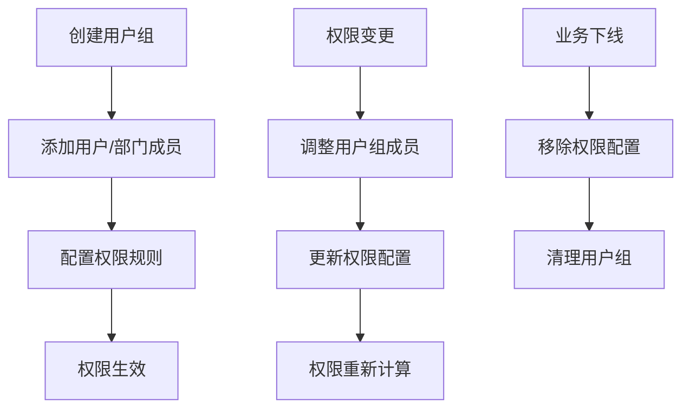
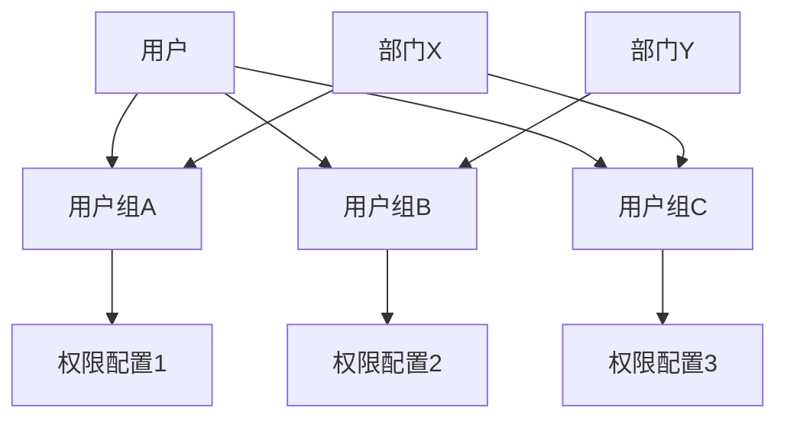

# IFeishuV3UserGroupApi API 文档

## 概述

`IFeishuV3UserGroupApi` 接口提供了飞书用户组管理的功能。用户组是飞书通讯录中基础实体之一，在用户组内可添加用户或部门资源。各类业务权限管控可以与用户组关联，从而实现高效便捷的成员权限管控。

**接口详细文档**：[飞书用户组概述](https://open.feishu.cn/document/server-docs/contact-v3/group/overview)

---

## 1. 创建用户组

### 接口名称
创建用户组

### 飞书接口URL
```
https://open.feishu.cn/open-apis/contact/v3/group
```

### 方法
POST

### 认证
**Tenant Access Token** (租户访问令牌)

### 参数

| 参数名 | 类型 | 必填 | 默认值 | 说明 |
|--------|------|------|--------|------|
| tenant_access_token | string | 是 | - | 应用访问凭证，用于身份鉴权 |
| groupInfoRequest | UserGroupInfoRequest | 是 | - | 创建用户组请求体 |
| user_id_type | string | 否 | open_id | 用户ID类型 |
| department_id_type | string | 否 | open_department_id | 部门ID类型 |

#### UserGroupInfoRequest 参数结构

| 参数名 | 类型 | 必填 | 默认值 | 说明 |
|--------|------|------|--------|------|
| name | string | 是 | - | 用户组名字，长度不能超过100字符 |
| description | string | 否 | - | 用户组描述，长度不能超过500字符 |
| type | int | 否 | 1 | 用户组类型，1表示普通用户组 |
| group_id | string | 否 | - | 自定义用户组ID |

### 请求示例

#### JSON 请求体
```json
{
  "name": "产品研发组",
  "description": "负责产品研发相关工作的用户组",
  "type": 1,
  "group_id": "custom_group_001"
}
```

#### C# 调用示例
```csharp
var groupRequest = new UserGroupInfoRequest
{
    Name = "产品研发组",
    Description = "负责产品研发相关工作的用户组",
    Type = 1,
    GroupId = "custom_group_001"
};

var response = await feishuApi.CreateUserGroupAsync(tenant_access_token, groupRequest);
```

### 响应

#### 成功响应示例
```json
{
  "code": 0,
  "msg": "success",
  "data": {
    "group_id": "grp_6991111111111111111"
  }
}
```

#### 错误响应示例
```json
{
  "code": 2100099,
  "msg": "用户组名称已存在",
  "data": {}
}
```

### 说明
- 用户组名称在企业内必须唯一，不能重复创建
- 创建成功后返回系统生成的用户组ID
- type=2 为动态用户组，当前暂不支持使用
- 自定义 group_id 时需确保企业内唯一

---

## 2. 更新用户组

### 接口名称
更新用户组

### 飞书接口URL
```
https://open.feishu.cn/open-apis/contact/v3/group/{group_id}
```

### 方法
PATCH

### 认证
**Tenant Access Token** (租户访问令牌)

### 参数

| 参数名 | 类型 | 必填 | 默认值 | 说明 |
|--------|------|------|--------|------|
| tenant_access_token | string | 是 | - | 应用访问凭证，用于身份鉴权 |
| group_id | string | 是 | - | 用户组ID，路径参数 |
| groupUpdateRequest | UserGroupUpdateRequest | 是 | - | 更新用户组请求体 |
| user_id_type | string | 否 | open_id | 用户ID类型 |
| department_id_type | string | 否 | open_department_id | 部门ID类型 |

#### UserGroupUpdateRequest 参数结构

| 参数名 | 类型 | 必填 | 默认值 | 说明 |
|--------|------|------|--------|------|
| name | string | 否 | - | 用户组名字，长度不能超过100字符 |
| description | string | 否 | - | 用户组描述，长度不能超过500字符 |

### 请求示例

#### JSON 请求体
```json
{
  "name": "产品研发中心组",
  "description": "负责产品研发和设计相关工作的用户组"
}
```

#### URL 示例
```
PATCH https://open.feishu.cn/open-apis/contact/v3/group/grp_6991111111111111111
```

### 响应

#### 成功响应示例
```json
{
  "code": 0,
  "msg": "success",
  "data": {}
}
```

#### 错误响应示例
```json
{
  "code": 2100098,
  "msg": "用户组不存在",
  "data": {}
}
```

### 说明
- 用户组名称企业内唯一，如重复设置则会更新失败
- 不传的字段表示不更新该字段
- 更新操作会立即生效

---

## 3. 获取指定用户组信息

### 接口名称
获取用户组详情

### 飞书接口URL
```
https://open.feishu.cn/open-apis/contact/v3/group/{group_id}
```

### 方法
GET

### 认证
**User Access Token** (用户访问令牌)

### 参数

| 参数名 | 类型 | 必填 | 默认值 | 说明 |
|--------|------|------|--------|------|
| user_access_token | string | 是 | - | 用户访问凭证，用于身份鉴权 |
| group_id | string | 是 | - | 用户组ID，路径参数 |
| user_id_type | string | 否 | open_id | 用户ID类型 |
| department_id_type | string | 否 | open_department_id | 部门ID类型 |

### 请求示例

#### URL 示例
```
GET https://open.feishu.cn/open-apis/contact/v3/group/grp_6991111111111111111?user_id_type=open_id&department_id_type=open_department_id
```

### 响应

#### 成功响应示例
```json
{
  "code": 0,
  "msg": "success",
  "data": {
    "group": {
      "id": "grp_6991111111111111111",
      "name": "产品研发组",
      "description": "负责产品研发相关工作的用户组",
      "member_user_count": 15,
      "member_department_count": 3,
      "type": 1
    }
  }
}
```

#### 错误响应示例
```json
{
  "code": 2100098,
  "msg": "用户组不存在",
  "data": {}
}
```

### 说明
- 返回用户组的完整基本信息
- 包含成员数量统计（用户成员数和部门成员数）
- 需要用户访问令牌，确保用户有权限查看

---

## 4. 获取用户组列表

### 接口名称
获取用户组列表

### 飞书接口URL
```
https://open.feishu.cn/open-apis/contact/v3/group/simplelist
```

### 方法
GET

### 认证
**Tenant Access Token** (租户访问令牌)

### 参数

| 参数名 | 类型 | 必填 | 默认值 | 说明 |
|--------|------|------|--------|------|
| tenant_access_token | string | 是 | - | 应用访问凭证，用于身份鉴权 |
| page_size | int | 否 | 10 | 分页大小 |
| page_token | string | 否 | null | 分页标记 |
| type | int | 否 | 1 | 用户组类型（1-普通，2-动态） |

### 请求示例

#### URL 示例
```
GET https://open.feishu.cn/open-apis/contact/v3/group/simplelist?page_size=50&type=1
```

### 响应

#### 成功响应示例
```json
{
  "code": 0,
  "msg": "success",
  "data": {
    "grouplist": [
      {
        "id": "grp_6991111111111111111",
        "name": "产品研发组",
        "description": "负责产品研发相关工作的用户组",
        "member_user_count": 15,
        "member_department_count": 3,
        "type": 1
      },
      {
        "id": "grp_6991111111111111112",
        "name": "市场营销组",
        "description": "负责市场推广和营销活动",
        "member_user_count": 8,
        "member_department_count": 1,
        "type": 1
      }
    ],
    "page_token": "next_page_token_value",
    "has_more": true
  }
}
```

### 说明
- 支持分页查询当前租户下的所有用户组
- 列表内包含用户组的 ID、名字、成员数量和类型等信息
- type=2 为动态用户组，当前暂不支持使用

---

## 5. 查询用户所属用户组

### 接口名称
获取用户所属用户组

### 飞书接口URL
```
https://open.feishu.cn/open-apis/contact/v3/group/member_belong
```

### 方法
GET

### 认证
**Tenant Access Token** (租户访问令牌)

### 参数

| 参数名 | 类型 | 必填 | 默认值 | 说明 |
|--------|------|------|--------|------|
| tenant_access_token | string | 是 | - | 应用访问凭证，用于身份鉴权 |
| member_id | string | 是 | - | 成员ID，查询参数 |
| member_id_type | string | 否 | open_id | 成员ID类型 |
| group_type | int | 否 | - | 用户组类型（1-普通，2-动态） |
| page_size | int | 否 | 10 | 分页大小 |
| page_token | string | 否 | null | 分页标记 |
| type | int | 否 | 1 | 用户组类型 |

### 请求示例

#### URL 示例
```
GET https://open.feishu.cn/open-apis/contact/v3/group/member_belong?member_id=ou_7d8a6e9d3c2c1b882487c7398e9d8f7&page_size=50
```

### 响应

#### 成功响应示例
```json
{
  "code": 0,
  "msg": "success",
  "data": {
    "group_list": [
      "grp_6991111111111111111",
      "grp_6991111111111111113",
      "grp_6991111111111111115"
    ],
    "page_token": "",
    "has_more": false
  }
}
```

### 说明
- 查询指定用户或部门所属的用户组列表
- 支持分页查询，通过 `page_token` 实现分页遍历
- 返回的是用户组ID列表，如需详细信息可进一步调用查询接口

---

## 6. 删除用户组

### 接口名称
删除用户组

### 飞书接口URL
```
https://open.feishu.cn/open-apis/contact/v3/group/{group_id}
```

### 方法
DELETE

### 认证
**Tenant Access Token** (租户访问令牌)

### 参数

| 参数名 | 类型 | 必填 | 默认值 | 说明 |
|--------|------|------|--------|------|
| tenant_access_token | string | 是 | - | 应用访问凭证，用于身份鉴权 |
| group_id | string | 是 | - | 需删除的用户组ID，路径参数 |

### 请求示例

#### URL 示例
```
DELETE https://open.feishu.cn/open-apis/contact/v3/group/grp_6991111111111111111
```

#### C# 调用示例
```csharp
var response = await feishuApi.DeleteUserGroupByIdAsync(tenant_access_token, "grp_6991111111111111111");
```

### 响应

#### 成功响应示例
```json
{
  "code": 0,
  "msg": "success",
  "data": {}
}
```

#### 错误响应示例
```json
{
  "code": 2100098,
  "msg": "用户组不存在",
  "data": {}
}
```

### 说明
- 删除用户组是不可逆操作，请谨慎执行
- 删除用户组不会删除组内的用户或部门
- 删除后相关的权限配置可能需要重新设置

---

## 数据模型

### UserGroupInfoRequest（用户组信息请求体）

| 属性 | 类型 | 必填 | 默认值 | 说明 |
|------|------|------|--------|------|
| name | string | 是 | - | 用户组名字，长度不能超过100字符 |
| description | string | 否 | - | 用户组描述，长度不能超过500字符 |
| type | int | 否 | 1 | 用户组类型，1表示普通用户组 |
| group_id | string | 否 | - | 自定义用户组ID |

### UserGroupUpdateRequest（用户组更新请求体）

| 属性 | 类型 | 必填 | 默认值 | 说明 |
|------|------|------|--------|------|
| name | string | 否 | - | 用户组名字，长度不能超过100字符 |
| description | string | 否 | - | 用户组描述，长度不能超过500字符 |

### UserGroupCreateResult（用户组创建结果）

| 属性 | 类型 | 说明 |
|------|------|------|
| group_id | string | 创建成功的用户组ID |

### UserGroupQueryResult（用户组查询结果）

| 属性 | 类型 | 说明 |
|------|------|------|
| group | UserGroupQueryDetailResult | 用户组信息 |

### UserGroupListResult（用户组列表结果）

| 属性 | 类型 | 说明 |
|------|------|------|
| grouplist | List&lt;UserGroupQueryDetailResult&gt; | 用户组列表 |
| page_token | string | 分页标记 |
| has_more | boolean | 是否有更多数据 |

### UserBelongGroupListResult（用户所属用户组结果）

| 属性 | 类型 | 说明 |
|------|------|------|
| group_list | List&lt;string&gt; | 用户所属的用户组ID列表 |
| page_token | string | 分页标记 |
| has_more | boolean | 是否有更多数据 |

### UserGroupBaseResult（用户组基础结果）

| 属性 | 类型 | 说明 |
|------|------|------|
| id | string | 用户组ID |
| name | string | 用户组名称 |
| description | string | 用户组描述 |
| member_user_count | int | 用户组成员数量 |
| member_department_count | int | 用户组部门成员数量 |
| type | int | 用户组类型 |

### UserGroupQueryDetailResult（用户组查询明细结果）

继承自 `UserGroupBaseResult`，包含完整的用户组信息。

---

## 常见错误码

| 错误码 | 说明 | 解决方案 |
|--------|------|----------|
| 99991663 | token not found | 检查访问令牌是否正确或已过期 |
| 2100098 | 用户组不存在 | 确认用户组ID是否正确，用户组是否已被删除 |
| 2100099 | 用户组名称已存在 | 使用其他用户组名称，或检查是否已存在相同名称 |
| 99991400 | 参数错误 | 检查请求参数格式，确保必填参数不为空 |
| 99991668 | 无权限访问 | 检查应用权限配置，确保具备用户组管理权限 |
| 2100096 | 用户组类型不支持 | 检查用户组类型参数，确保使用支持的类型值 |

---

## 最佳实践

### 1. 用户组创建和验证
```csharp
// 用户组创建的最佳实践
public async Task<string> CreateUserGroupWithValidation(
    IFeishuV3UserGroupApi api, 
    string token, 
    string name, 
    string? description = null, 
    string? customGroupId = null) {
    
    // 1. 参数验证
    if (string.IsNullOrWhiteSpace(name)) {
        throw new ArgumentException("用户组名称不能为空");
    }
    
    if (name.Length > 100) {
        throw new ArgumentException("用户组名称长度不能超过100字符");
    }
    
    if (!string.IsNullOrEmpty(description) && description.Length > 500) {
        throw new ArgumentException("用户组描述长度不能超过500字符");
    }
    
    // 2. 检查用户组名称是否已存在
    var existingGroups = await GetUserGroupsPaginated(api, token);
    if (existingGroups.Any(g => g.Name == name)) {
        throw new InvalidOperationException($"用户组名称 '{name}' 已存在");
    }
    
    // 3. 创建用户组
    var request = new UserGroupInfoRequest {
        Name = name,
        Description = description,
        Type = 1,
        GroupId = customGroupId
    };
    
    var response = await api.CreateUserGroupAsync(token, request);
    return response.Data.GroupId;
}
```

### 2. 用户组列表分页查询
```csharp
// 高效的分页查询实现
public async Task<List<UserGroupQueryDetailResult>> GetUserGroupsPaginated(
    IFeishuV3UserGroupApi api, 
    string token, 
    int pageSize = 100) {
    
    var allGroups = new List<UserGroupQueryDetailResult>();
    var pageToken = "";
    
    do {
        var response = await api.GetUserGroupsAsync(
            token, 
            page_size: pageSize,
            page_token: string.IsNullOrEmpty(pageToken) ? null : pageToken
        );
        
        allGroups.AddRange(response.Data.GroupList);
        pageToken = response.Data.PageToken;
        
    } while (!string.IsNullOrEmpty(pageToken));
    
    return allGroups;
}
```

### 3. 用户组成员关系查询
```csharp
// 用户组成员关系管理
public class UserGroupMemberService {
    private readonly IFeishuV3UserGroupApi _api;
    
    public async Task<List<string>> GetUserGroupsAsync(
        string token, 
        string userId, 
        bool includeDetails = false) {
        
        var allGroupIds = new List<string>();
        var pageSize = 50;
        var pageToken = "";
        
        do {
            var response = await _api.GetUserBelongGroupsAsync(
                token, userId,
                page_size: pageSize,
                page_token: string.IsNullOrEmpty(pageToken) ? null : pageToken
            );
            
            allGroupIds.AddRange(response.Data.GroupList);
            pageToken = response.Data.PageToken;
            
        } while (!string.IsNullOrEmpty(pageToken));
        
        if (includeDetails) {
            return await GetGroupDetailsAsync(token, allGroupIds);
        }
        
        return allGroupIds;
    }
    
    private async Task<List<string>> GetGroupDetailsAsync(
        string token, 
        List<string> groupIds) {
        
        var tasks = groupIds.Select(async groupId => {
            try {
                var response = await _api.GetUserGroupInfoByIdAsync(token, groupId);
                return response.Code == 0 ? response.Data.Group.Name : groupId;
            } catch {
                return groupId;
            }
        });
        
        return await Task.WhenAll(tasks);
    }
}
```

### 4. 用户组生命周期管理
```csharp
// 完整的用户组生命周期管理
public class UserGroupLifecycleManager {
    public async Task<UserGroupLifecycleResult> ManageUserGroupLifecycle(
        string token, 
        string name, 
        string description) {
        
        try {
            // 1. 创建用户组
            var groupId = await CreateUserGroupWithValidation(_api, token, name, description);
            
            // 2. 获取创建后的信息
            var groupInfo = await _api.GetUserGroupInfoByIdAsync(token, groupId);
            
            // 3. 更新用户组（如需要）
            // await UpdateUserGroupAsync(token, groupId, $"{name}_Updated", "更新后的描述");
            
            // 4. 查询用户所属用户组（用于验证）
            // var userGroups = await _api.GetUserBelongGroupsAsync(token, userId);
            
            return new UserGroupLifecycleResult {
                GroupId = groupId,
                Name = groupInfo.Data.Group.Name,
                MemberUserCount = groupInfo.Data.Group.MemberUserCount,
                MemberDepartmentCount = groupInfo.Data.Group.MemberDepartmentCount,
                Status = "Active"
            };
            
        } catch (Exception ex) {
            _logger.LogError(ex, $"用户组 '{name}' 生命周期管理失败");
            throw;
        }
    }
    
    public async Task<bool> SafeDeleteUserGroup(
        string token, 
        string groupId) {
        
        try {
            // 1. 检查用户组是否存在
            var groupInfo = await _api.GetUserGroupInfoByIdAsync(token, groupId);
            if (groupInfo.Code != 0) {
                throw new InvalidOperationException($"用户组 {groupId} 不存在");
            }
            
            // 2. 检查用户组成员（可选）
            if (groupInfo.Data.Group.MemberUserCount > 0 || 
                groupInfo.Data.Group.MemberDepartmentCount > 0) {
                _logger.LogWarning($"用户组 {groupId} 仍有成员，删除后需要重新配置权限");
            }
            
            // 3. 删除用户组
            var response = await _api.DeleteUserGroupByIdAsync(token, groupId);
            
            _logger.LogInformation($"用户组 {groupId} 删除成功");
            return response.Code == 0;
            
        } catch (Exception ex) {
            _logger.LogError(ex, $"删除用户组 {groupId} 失败");
            throw;
        }
    }
}
```

### 5. 批量操作和错误处理
```csharp
// 批量用户组操作
public class UserGroupBatchProcessor {
    public async Task<Dictionary<string, bool>> BatchCreateUserGroups(
        string token, 
        List<(string name, string? description)> groupData) {
        
        var results = new Dictionary<string, bool>();
        var tasks = groupData.Select(async data => {
            try {
                var request = new UserGroupInfoRequest {
                    Name = data.name,
                    Description = data.description,
                    Type = 1
                };
                
                var response = await _api.CreateUserGroupAsync(token, request);
                results[data.name] = response.Code == 0;
                
                if (response.Code == 0) {
                    _logger.LogInformation($"用户组 '{data.name}' 创建成功，ID: {response.Data.GroupId}");
                } else {
                    _logger.LogWarning($"用户组 '{data.name}' 创建失败：{response.Msg}");
                }
                
            } catch (Exception ex) {
                _logger.LogError(ex, $"用户组 '{data.name}' 创建异常");
                results[data.name] = false;
            }
        });
        
        await Task.WhenAll(tasks);
        return results;
    }
    
    public async Task<bool> UpdateUserGroupWithRetry(
        string token, 
        string groupId, 
        string name, 
        string description,
        int maxRetries = 3) {
        
        for (int attempt = 1; attempt <= maxRetries; attempt++) {
            try {
                var request = new UserGroupUpdateRequest {
                    Name = name,
                    Description = description
                };
                
                var response = await _api.UpdateUserGroupAsync(token, groupId, request);
                return response.Code == 0;
                
            } catch (HttpRequestException ex) when (attempt < maxRetries) {
                var delay = TimeSpan.FromSeconds(Math.Pow(2, attempt));
                _logger.LogWarning($"更新用户组 {groupId} 网络错误，第 {attempt} 次重试");
                await Task.Delay(delay);
                continue;
                
            } catch (FeishuApiException ex) when (ex.Code == 2100099) {
                _logger.LogError($"用户组名称 '{name}' 已存在");
                throw new InvalidOperationException("用户组名称已存在", ex);
            }
        }
        
        throw new InvalidOperationException($"更新用户组 {groupId} 失败，已达到最大重试次数");
    }
}
```

---

## 业务场景和流程

### 1. 用户组权限管理流程


### 2. 用户组成员关系


---

## 更新记录

| 版本 | 日期 | 更新内容 |
|------|------|----------|
| v1.0.0 | 2025-11-20 | 初始版本，包含用户组管理的完整接口文档 |

---

## 相关文档

- [飞书用户组 API 官方文档](https://open.feishu.cn/document/server-docs/contact-v3/group/overview)
- [认证和权限管理文档](../Authentication-API-Documentation.md)
- [用户管理 API 文档](../IFeishuV3UserApi.md)
- [部门管理 API 文档](../IFeishuV3DepartmentsApi.md)
- [角色管理 API 文档](../IFeishuV3RoleApi.md)