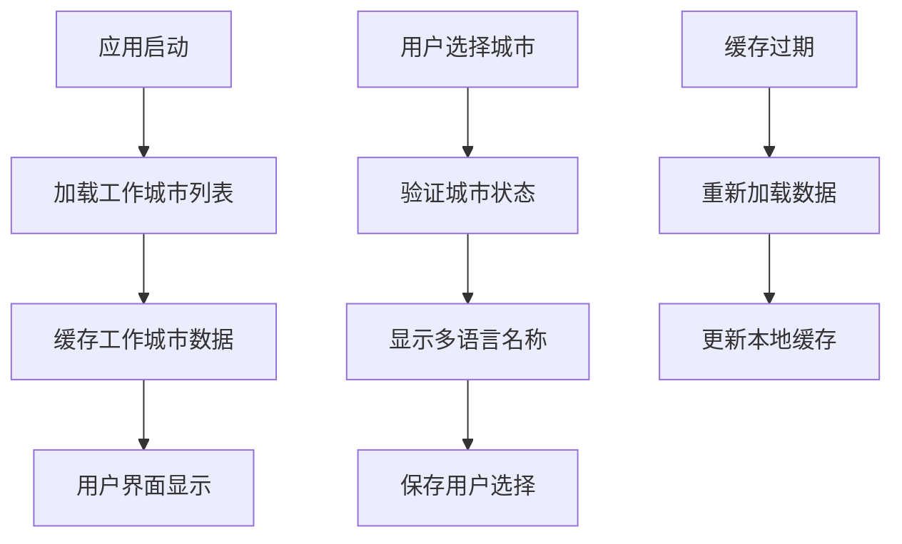
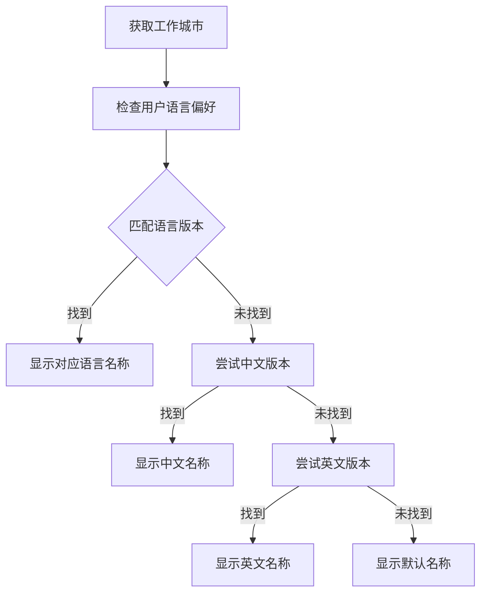

# IFeishuV3WorkCityApi API 文档

## 概述

`IFeishuV3WorkCityApi` 接口提供了飞书工作城市管理的功能。工作城市是用户属性之一，通过工作城市 API 仅支持查询工作城市信息。

工作城市通常用于标识员工的主要工作地点，便于企业进行人员管理和区域统计。该API仅提供查询功能，不支持创建、更新或删除工作城市。

**接口详细文档**：[飞书工作城市资源介绍](https://open.feishu.cn/document/contact-v3/work_city/work-city-resources-introduction)

---

## 1. 获取工作城市列表

### 接口名称
获取工作城市列表

### 飞书接口URL
```
https://open.feishu.cn/open-apis/contact/v3/work_cities
```

### 方法
GET

### 认证
**Tenant Access Token** 或 **User Access Token** (双重支持)

### 参数

| 参数名 | 类型 | 必填 | 默认值 | 说明 |
|--------|------|------|--------|------|
| access_token | string | 是 | - | 应用访问凭证，用于身份鉴权 |
| page_size | int | 否 | 10 | 分页大小，即本次请求返回的最大条目数 |
| page_token | string | 否 | null | 分页标记，首次请求不填 |

### 请求示例

#### URL 示例
```
GET https://open.feishu.cn/open-apis/contact/v3/work_cities?page_size=50
```

#### C# 调用示例
```csharp
var response = await feishuApi.GetWorkCitesListAsync(
    access_token,
    page_size: 50
);
```

### 响应

#### 成功响应示例
```json
{
  "code": 0,
  "msg": "success",
  "data": {
    "items": [
      {
        "work_city_id": "6983456743213456789",
        "name": "北京",
        "i18n_name": [
          {
            "locale": "zh_cn",
            "text": "北京"
          },
          {
            "locale": "en_us",
            "text": "Beijing"
          }
        ],
        "status": true
      },
      {
        "work_city_id": "6983456743213456790",
        "name": "上海",
        "i18n_name": [
          {
            "locale": "zh_cn",
            "text": "上海"
          },
          {
            "locale": "en_us",
            "text": "Shanghai"
          }
        ],
        "status": true
      },
      {
        "work_city_id": "6983456743213456791",
        "name": "深圳",
        "i18n_name": [
          {
            "locale": "zh_cn",
            "text": "深圳"
          },
          {
            "locale": "en_us",
            "text": "Shenzhen"
          }
        ],
        "status": false
      }
    ],
    "page_token": "next_page_token_value",
    "has_more": true
  }
}
```

#### 错误响应示例
```json
{
  "code": 99991663,
  "msg": "token not found",
  "data": {}
}
```

### 说明
- 该接口支持分页查询，通过 `page_token` 实现分页遍历
- 返回当前租户下所有工作城市的基本信息
- 支持使用租户访问令牌或用户访问令牌进行身份验证
- 只有启用状态的工作城市才能分配给用户作为工作地点

---

## 2. 获取指定工作城市信息

### 接口名称
获取工作城市详情

### 飞书接口URL
```
https://open.feishu.cn/open-apis/contact/v3/work_cities/{work_city_id}
```

### 方法
GET

### 认证
**Tenant Access Token** 或 **User Access Token** (双重支持)

### 参数

| 参数名 | 类型 | 必填 | 默认值 | 说明 |
|--------|------|------|--------|------|
| access_token | string | 是 | - | 应用访问凭证，用于身份鉴权 |
| work_city_id | string | 是 | - | 工作城市ID，路径参数 |

### 请求示例

#### URL 示例
```
GET https://open.feishu.cn/open-apis/contact/v3/work_cities/6983456743213456789
```

#### C# 调用示例
```csharp
var response = await feishuApi.GetWorkCityByIdAsync(
    access_token,
    "6983456743213456789"
);
```

### 响应

#### 成功响应示例
```json
{
  "code": 0,
  "msg": "success",
  "data": {
    "work_city": {
      "work_city_id": "6983456743213456789",
      "name": "北京",
      "i18n_name": [
        {
          "locale": "zh_cn",
          "text": "北京"
        },
        {
          "locale": "en_us",
          "text": "Beijing"
        },
        {
          "locale": "ja_jp",
          "text": "北京"
        }
      ],
      "status": true
    }
  }
}
```

#### 错误响应示例
```json
{
  "code": 2100101,
  "msg": "工作城市不存在",
  "data": {}
}
```

### 说明
- `work_city_id` 为路径参数，需要在URL中直接替换
- 返回指定工作城市的完整详细信息
- 如果工作城市不存在，会返回相应的错误码
- 响应数据被包装在 `work_city` 对象中

---

## 数据模型

### WorkCity（工作城市信息模型）

| 属性 | 类型 | 说明 |
|------|------|------|
| work_city_id | string | 工作城市的唯一标识符 |
| name | string | 工作城市的显示名称（主要语言） |
| i18n_name | List&lt;I18nContent&gt; | 工作城市的多语言名称列表 |
| status | boolean | 工作城市启用状态，true=启用，false=禁用 |

### WorkCityResult（工作城市结果包装类）

| 属性 | 类型 | 说明 |
|------|------|------|
| work_city | WorkCity | 工作城市信息对象 |

### I18nContent（多语言内容）

| 属性 | 类型 | 说明 |
|------|------|------|
| locale | string | 语言代码，如 "zh_cn", "en_us" |
| text | string | 对应语言下的文本内容 |

---

## 常见错误码

| 错误码 | 说明 | 解决方案 |
|--------|------|----------|
| 99991663 | token not found | 检查访问令牌是否正确或已过期 |
| 2100101 | 工作城市不存在 | 确认工作城市ID是否正确，工作城市是否已被删除 |
| 99991400 | 参数错误 | 检查请求参数格式和必填参数 |
| 99991668 | 无权限访问 | 检查应用权限配置，确保具备工作城市查询权限 |
| 2100102 | 分页参数错误 | 检查page_size和page_token参数格式 |

---

## 最佳实践

### 1. 分页查询优化
```csharp
// 高效的分页查询实现
public async Task<List<WorkCity>> GetAllWorkCitiesAsync(
    IFeishuV3WorkCityApi api, 
    string token, 
    int pageSize = 100) {
    
    var allWorkCities = new List<WorkCity>();
    var pageToken = "";
    
    do {
        var response = await api.GetWorkCitesListAsync(
            token, 
            page_size: pageSize,
            page_token: string.IsNullOrEmpty(pageToken) ? null : pageToken
        );
        
        allWorkCities.AddRange(response.Data.Items);
        pageToken = response.Data.PageToken;
        
    } while (!string.IsNullOrEmpty(pageToken));
    
    return allWorkCities;
}
```

### 2. 工作城市缓存管理
```csharp
// 工作城市缓存服务
public class WorkCityCacheService {
    private readonly IMemoryCache _cache;
    private readonly IFeishuV3WorkCityApi _api;
    private const string CacheKey = "feishu_work_cities";
    private const int CacheExpirationMinutes = 120; // 2小时缓存
    
    public async Task<List<WorkCity>> GetWorkCitiesAsync(string token) {
        if (_cache.TryGetValue(CacheKey, out List<WorkCity> cachedCities)) {
            return cachedCities;
        }
        
        var allCities = await GetAllWorkCitiesAsync(_api, token);
        _cache.Set(CacheKey, allCities, TimeSpan.FromMinutes(CacheExpirationMinutes));
        
        return allCities;
    }
    
    public async Task<WorkCity?> GetWorkCityByIdAsync(string token, string workCityId) {
        var cities = await GetWorkCitiesAsync(token);
        return cities.FirstOrDefault(c => c.WorkCityId == workCityId);
    }
    
    public void ClearCache() {
        _cache.Remove(CacheKey);
    }
}
```

### 3. 多语言处理
```csharp
// 智能多语言显示
public class WorkCityI18nService {
    public string GetDisplayName(WorkCity workCity, string preferredLocale = "zh_cn") {
        // 1. 尝试获取首选语言
        var localized = workCity.I18nName?.FirstOrDefault(x => x.Locale == preferredLocale);
        if (localized != null && !string.IsNullOrEmpty(localized.Text)) {
            return localized.Text;
        }
        
        // 2. 尝试获取中文（备用）
        var chinese = workCity.I18nName?.FirstOrDefault(x => x.Locale.StartsWith("zh"));
        if (chinese != null && !string.IsNullOrEmpty(chinese.Text)) {
            return chinese.Text;
        }
        
        // 3. 尝试获取英文（默认）
        var english = workCity.I18nName?.FirstOrDefault(x => x.Locale.StartsWith("en"));
        if (english != null && !string.IsNullOrEmpty(english.Text)) {
            return english.Text;
        }
        
        // 4. 返回默认名称
        return workCity.Name ?? "Unknown City";
    }
    
    public Dictionary<string, string> GetAllDisplayNames(WorkCity workCity) {
        var result = new Dictionary<string, string>();
        
        if (!string.IsNullOrEmpty(workCity.Name)) {
            result["default"] = workCity.Name;
        }
        
        if (workCity.I18nName != null) {
            foreach (var i18n in workCity.I18nName) {
                if (!string.IsNullOrEmpty(i18n.Text)) {
                    result[i18n.Locale] = i18n.Text;
                }
            }
        }
        
        return result;
    }
}
```

### 4. 工作城市筛选和验证
```csharp
// 工作城市筛选和验证服务
public class WorkCityFilterService {
    public async Task<List<WorkCity>> GetActiveWorkCitiesAsync(
        IFeishuV3WorkCityApi api, 
        string token) {
        
        var allCities = await GetAllWorkCitiesAsync(api, token);
        return allCities.Where(city => city.Status).ToList();
    }
    
    public async Task<List<WorkCity>> GetWorkCitiesByKeywordAsync(
        IFeishuV3WorkCityApi api, 
        string token, 
        string keyword) {
        
        var allCities = await GetAllWorkCitiesAsync(api, token);
        
        return allCities
            .Where(city => 
                (city.Name?.Contains(keyword, StringComparison.OrdinalIgnoreCase) ?? false) ||
                (city.I18nName?.Any(i18n => 
                    i18n.Text?.Contains(keyword, StringComparison.OrdinalIgnoreCase) ?? false) ?? false))
            .ToList();
    }
    
    public bool IsWorkCityValid(WorkCity workCity) {
        return !string.IsNullOrEmpty(workCity.WorkCityId) && 
               !string.IsNullOrEmpty(workCity.Name) && 
               workCity.Status;
    }
    
    public async Task<bool> ValidateWorkCityIdAsync(
        IFeishuV3WorkCityApi api, 
        string token, 
        string workCityId) {
        
        try {
            var response = await api.GetWorkCityByIdAsync(token, workCityId);
            return response.Code == 0 && response.Data.WorkCity?.Status == true;
        } catch {
            return false;
        }
    }
}
```

### 5. 工作城市统计分析
```csharp
// 工作城市统计分析服务
public class WorkCityAnalyticsService {
    public async Task<WorkCityStatistics> GetWorkCityStatisticsAsync(
        IFeishuV3WorkCityApi api, 
        string token) {
        
        var allCities = await GetAllWorkCitiesAsync(api, token);
        
        return new WorkCityStatistics {
            TotalCities = allCities.Count,
            ActiveCities = allCities.Count(c => c.Status),
            InactiveCities = allCities.Count(c => !c.Status),
            CitiesByLocale = GetCitiesByLocale(allCities),
            MostCommonNames = GetMostCommonNames(allCities)
        };
    }
    
    private Dictionary<string, int> GetCitiesByLocale(List<WorkCity> cities) {
        var localeCount = new Dictionary<string, int>();
        
        foreach (var city in cities) {
            if (city.I18nName != null) {
                foreach (var i18n in city.I18nName) {
                    localeCount[i18n.Locale] = localeCount.GetValueOrDefault(i18n.Locale, 0) + 1;
                }
            }
        }
        
        return localeCount;
    }
    
    private List<string> GetMostCommonNames(List<WorkCity> cities) {
        return cities
            .Where(c => !string.IsNullOrEmpty(c.Name))
            .GroupBy(c => c.Name)
            .OrderByDescending(g => g.Count())
            .Select(g => g.Key)
            .Take(10)
            .ToList();
    }
}

public class WorkCityStatistics {
    public int TotalCities { get; set; }
    public int ActiveCities { get; set; }
    public int InactiveCities { get; set; }
    public Dictionary<string, int> CitiesByLocale { get; set; } = new();
    public List<string> MostCommonNames { get; set; } = new();
}
```

### 6. 错误处理和重试机制
```csharp
// 统一的错误处理策略
public class WorkCityApiService {
    private readonly IFeishuV3WorkCityApi _api;
    private readonly ILogger _logger;
    
    public async Task<WorkCity?> GetWorkCityWithRetryAsync(
        string token, 
        string workCityId, 
        int maxRetries = 3) {
        
        for (int attempt = 1; attempt <= maxRetries; attempt++) {
            try {
                var response = await _api.GetWorkCityByIdAsync(token, workCityId);
                
                if (response.Code == 0) {
                    return response.Data.WorkCity;
                }
                
                // 业务错误不重试
                _logger.LogError($"获取工作城市失败，业务错误：{response.Code} - {response.Msg}");
                return null;
                
            } catch (HttpRequestException ex) when (attempt < maxRetries) {
                var delay = TimeSpan.FromSeconds(Math.Pow(2, attempt));
                _logger.LogWarning($"获取工作城市网络错误，第 {attempt} 次重试，延迟 {delay.TotalSeconds}s");
                await Task.Delay(delay);
                continue;
                
            } catch (Exception ex) {
                _logger.LogError(ex, $"获取工作城市 {workCityId} 发生未预期错误");
                throw;
            }
        }
        
        throw new InvalidOperationException($"获取工作城市 {workCityId} 失败，已达到最大重试次数");
    }
    
    public async Task<ApiResult<List<WorkCity>>> GetAllWorkCitiesSafeAsync(string token) {
        try {
            var cities = await GetAllWorkCitiesAsync(_api, token);
            return ApiResult<List<WorkCity>>.Success(cities);
        } catch (FeishuApiException ex) {
            _logger.LogError(ex, $"获取工作城市列表失败：{ex.Code} - {ex.Message}");
            return ApiResult<List<WorkCity>>.Failure($"API调用失败：{ex.Message}");
        } catch (Exception ex) {
            _logger.LogError(ex, "获取工作城市列表发生未预期错误");
            return ApiResult<List<WorkCity>>.Failure("系统错误");
        }
    }
}
```

---

## 业务场景和流程

### 1. 工作城市管理流程


### 2. 多语言显示流程


---

## 更新记录

| 版本 | 日期 | 更新内容 |
|------|------|----------|
| v1.0.0 | 2025-11-20 | 初始版本，包含工作城市查询的完整接口文档 |

---

## 相关文档

- [飞书工作城市 API 官方文档](https://open.feishu.cn/document/contact-v3/work_city/work-city-resources-introduction)
- [认证和权限管理文档](../Authentication-API-Documentation.md)
- [用户管理 API 文档](../IFeishuV3UserApi.md)
- [部门管理 API 文档](../IFeishuV3DepartmentsApi.md)
- [职务管理 API 文档](../IFeishuV3JobTitleApi.md)